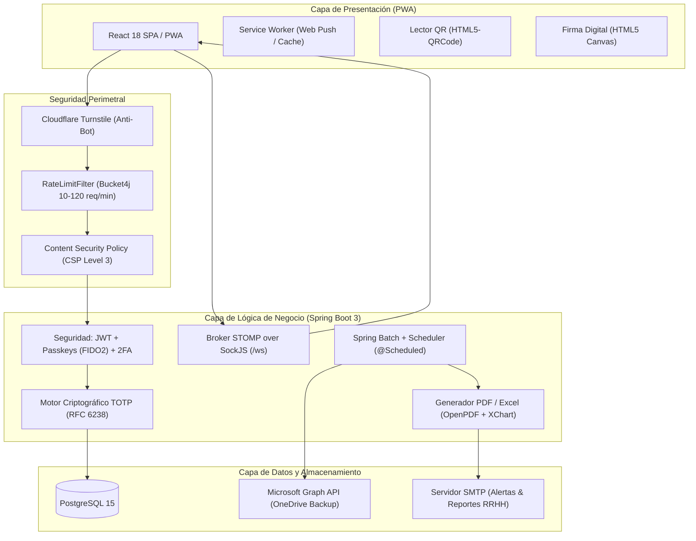

<div align="center">

# Distribution Academy — Smart Check-in System

### Sistema Empresarial de Control de Asistencia, Fichaje Seguro con QR Dinámico (TOTP) y Gestión de Formaciones

[](https://openjdk.org/)
[](https://spring.io/projects/spring-boot)
[](https://react.dev/)
[](https://www.postgresql.org/)
[](https://www.docker.com/)
[](https://playwright.dev/)
[](docs/OWASP_ASVS_v4_Matrix.md)
[](LICENSE)

<br/>

<p align="center">
  <b>Plataforma integral diseñada para entornos industriales y corporativos de alta concurrencia.</b><br/>
  Previene el fraude presencial (<i>buddy punching</i>) mediante códigos QR de un solo uso basados en algoritmos criptográficos TOTP, digitaliza el ciclo formativo corporativo y ofrece trazabilidad forense de registros laborales cumpliendo con el RGPD y normativas internacionales de auditoría.
</p>

[Portal de Documentación](docs/README.md) • [Catálogo de APIs](docs/API_DOCUMENTATION.md) • [Guía de Despliegue](docs/DEPLOYMENT_DOCKER_GUIDE.md) • [Política de Seguridad](SECURITY.md)

</div>

---

## Tabla de Contenidos

- [Visión General y Propuesta de Valor](#visión-general-y-propuesta-de-valor)
- [Arquitectura del Sistema](#arquitectura-del-sistema)
- [Características Principales](#características-principales)
- [Stack Tecnológico](#stack-tecnológico)
- [Requisitos Previos](#requisitos-previos)
- [Puesta en Marcha](#puesta-en-marcha)
  - [Opción 1: Despliegue con Docker Compose (Recomendado)](#opción-1-despliegue-con-docker-compose-recomendado)
  - [Opción 2: Desarrollo Local Nativo](#opción-2-desarrollo-local-nativo)
- [Variables de Entorno](#variables-de-entorno)
- [Estrategia de Pruebas y Calidad](#estrategia-de-pruebas-y-calidad)
- [Ciberseguridad y Cumplimiento Normativo](#ciberseguridad-y-cumplimiento-normativo)
- [Estructura del Proyecto](#estructura-del-proyecto)
- [Gobernanza y Contribución](#gobernanza-y-contribución)
- [Licencia y Autor](#licencia-y-autor)

---

## Visión General y Propuesta de Valor

En centros de producción, plataformas logísticas y organizaciones con turnos rotativos, los sistemas manuales o de tarjetas de proximidad presentan vulnerabilidades operativas de suplantación (*buddy punching*), generan cuellos de botella en los accesos y carecen de validez probatoria frente a inspecciones y auditorías.

**Distribution Academy (Smart Check-in System)** solventa esta problemática mediante:
1. **Códigos QR Dinámicos Efímeros (TOTP):** Generados y validados criptográficamente en el servidor, caducan cada 15–30 segundos impidiendo el uso de capturas de pantalla compartidas.
2. **PWA para Planta:** Experiencia de usuario ágil con soporte offline, modo de alto contraste para lectura óptica y retroalimentación táctil háptica.
3. **Conformidad Legal y Trazabilidad:** Firma digital en canvas HTML5 para confirmación de horas y exportación de auditorías firmadas criptográficamente con función hash SHA-256.

---

## Arquitectura del Sistema

El sistema implementa una arquitectura desacoplada en tres capas principales con soporte para escalado horizontal y despliegue híbrido:



---

## Características Principales

* **Fichaje Seguro Anti-Fraude:** Validación de tokens TOTP con tolerancia temporal de ventana deslizante calculada exclusivamente en servidor.
* **PWA Nativa con Soporte Web Push (VAPID):** Notificaciones nativas al sistema operativo incluso con el navegador cerrado mediante criptografía de curva elíptica `prime256v1`.
* **Autenticación Multi-Factor y Passkeys:** Soporte para contraseñas seguras con cifrado BCrypt, segundo factor TOTP (Google Authenticator) y autenticación biométrica sin contraseñas (FIDO2 / WebAuthn).
* **Firma Digital:** Captura de rúbrica en pantalla táctil con sellado temporal para registros de salida.
* **Analítica en Tiempo Real:** Panel interactivo con Recharts para seguimiento de horas trabajadas, ausentismo y distribución de personal.
* **Reportes Automatizados con Firma de Integridad:** Tareas programadas de Spring Batch que ensamblan informes ejecutivos periódicos en PDF y los despachan por correo electrónico.
* **Internacionalización Completa:** Soporte multilingüe en 8 idiomas europeos (Español, Inglés, Portugués, Francés, Alemán, Polaco, Búlgaro y Rumano).
* **Copia de Seguridad en la Nube:** Integración con Microsoft Azure AD y OneDrive para custodia de volcados de base de datos.

---

## Stack Tecnológico

| Capa / Componente | Tecnología | Versión | Propósito |
|---|---|---|---|
| **Lenguaje Backend** | Java OpenJDK | 21 LTS | Rendimiento empresarial y concurrencia moderna |
| **Framework Backend** | Spring Boot | 3.5.5 | Inyección de dependencias, seguridad y controladores REST |
| **Seguridad Backend** | Spring Security | 6.x | Control de acceso basado en roles (RBAC) y filtros JWT |
| **Base de Datos** | PostgreSQL | 15 | Persistencia relacional transaccional ACID |
| **Librería Frontend** | React | 18.2.0 | Interfaz de usuario reactiva basada en componentes |
| **Estilos Frontend** | TailwindCSS + Framer Motion | 3.4 / 13.x | Diseño adaptativo con estética Liquid Glassmorphism |
| **WebSockets** | Spring STOMP + SockJS | 7.x | Distribución en tiempo real de tokens QR y alertas críticas |
| **Testing Backend** | JUnit 5 + Mockito + MockMvc | 5.10 / 5.2 | Pruebas unitarias, de integración y no funcionales |
| **Testing E2E** | Microsoft Playwright | 1.62 | Pruebas de extremo a extremo automatizadas en navegadores |
| **Pruebas de Carga** | Grafana k6 | Latest | Simulación de concurrencia en cambios de turno |
| **Contenedores** | Docker & Docker Compose | 24.0+ | Empaquetado reproducible y orquestación local/servidor |

---

## Requisitos Previos

Antes de comenzar, asegúrate de contar con el siguiente software instalado en tu entorno de desarrollo:

- **Git** (v2.30 o superior)
- **Java Development Kit (JDK)**: Versión **21 LTS** ([Eclipse Temurin u OpenJDK](https://adoptium.net/))
- **Node.js**: Versión **18 LTS** o **20 LTS** ([Node.js](https://nodejs.org/)) con **npm** (v9+)
- **Docker Engine** (v24.0+) y **Docker Compose** (v2.0+) *(opcional para ejecución nativa, obligatorio para despliegue en contenedor)*

---

## Puesta en Marcha

### Opción 1: Despliegue con Docker Compose (Recomendado)

Levanta la arquitectura completa (Base de datos PostgreSQL + Backend Spring Boot + Frontend React compilado) mediante Docker Compose:

```bash
# 1. Clonar el repositorio
git clone https://github.com/jfpaardoo/smart-checkin-system.git
cd smart-checkin-system

# 2. Configurar las variables de entorno
cp .env.example .env

# 3. Construir y levantar los contenedores en segundo plano
docker-compose up -d --build

# 4. Verificar el estado de los servicios
docker-compose ps
```

* **Aplicación Web:** `http://localhost:8080`
* **Consola Swagger UI (Admin):** `http://localhost:8080/swagger-ui/index.html`

---

### Opción 2: Desarrollo Local Nativo

Si deseas trabajar sobre el código fuente con recarga en caliente (*hot-reloading*):

#### Paso 1: Iniciar la Base de Datos PostgreSQL
```bash
docker-compose up -d db
```

#### Paso 2: Iniciar el Backend (Spring Boot)
En una terminal:
```bash
# Windows
.\mvnw.cmd spring-boot:run

# Linux / macOS
./mvnw spring-boot:run
```
El servidor backend escuchará en `http://localhost:8080`.

#### Paso 3: Iniciar el Frontend (React PWA)
En una segunda terminal:
```bash
cd frontend
npm install
npm start
```
La interfaz de desarrollo se abrirá en `http://localhost:3000` con proxy configurado hacia el backend en el puerto 8080.

---

## Variables de Entorno

Copia el archivo de plantilla `.env.example` como `.env` en la raíz del proyecto y ajusta los parámetros de seguridad:

```bash
# Credenciales del Administrador del Sistema
ADMIN_USERNAME=admin
ADMIN_PASSWORD=change_this_admin_password

# Seguridad Criptográfica (Mínimo 32 caracteres para HS256)
JWT_SECRET=your_super_secret_jwt_key_that_is_at_least_32_chars_long
TOTP_SECRET=JBSWY3DPEHPK3PXP
ENCRYPTION_SECRET=your_super_secret_encryption_key_at_least_16_chars

# Notificaciones Web Push (VAPID)
VAPID_PUBLIC_KEY=your_vapid_public_key
VAPID_PRIVATE_KEY=your_vapid_private_key

# Configuración de Base de Datos PostgreSQL
POSTGRES_DB=smartcheckin
POSTGRES_USER=checkin_user
POSTGRES_PASSWORD=your_secure_postgres_password

# Servidor SMTP (Informes y Restablecimiento de Claves)
MAIL_HOST=smtp.gmail.com
MAIL_PORT=587
MAIL_USERNAME=your_email@example.com
MAIL_PASSWORD=your_app_password
```

Consulta el archivo [`.env.example`](.env.example) para el listado completo de configuraciones de Azure AD y Cloudflare Turnstile.

---

## Estrategia de Pruebas y Calidad

El proyecto dispone de una batería automatizada con **más de 330 casos de prueba** distribuidos en todos los niveles de la pirámide de testing:

### 1. Pruebas de Backend (Unitarias, Integración y Concurrencia)
```bash
# Ejecutar toda la suite de pruebas del backend
./mvnw clean test

# Ejecutar una prueba específica (ej. concurrencia de fichajes)
./mvnw test -Dtest=ConcurrentCheckinConcurrencyTests
```

### 2. Pruebas Unitarias del Frontend
```bash
cd frontend
npm test -- --watchAll=false
```

### 3. Pruebas End-to-End (E2E) con Playwright
```bash
cd frontend
npm run test:e2e
```

### 4. Pruebas de Carga y Concurrencia (k6)
```bash
k6 run k6/load-test.js
```

Para consultar la matriz completa de cobertura y resultados, dirígete al [Plan de Pruebas](docs/plan_de_pruebas.md) y al [Informe de Pruebas E2E](docs/e2e_testing_report.md).

---

## Ciberseguridad y Cumplimiento Normativo

La plataforma ha sido auditada bajo los estándares de la industria:
- **OWASP ASVS v4.0 (Nivel L3):** Protección de cookies con `HttpOnly`, `SameSite=Strict`, prevención de inyección SQL mediante consultas parametrizadas JPA, y rate limiting por IP.
- **Modelado de Amenazas STRIDE:** Mitigación documentada de vectores de suplantación (*spoofing*), manipulación (*tampering*) y denegación de servicio (*DoS*).
- **Conformidad RGPD:** Análisis formal de impacto (DPIA/EIPD) y Registro de Actividades de Tratamiento (RAT) según el Art. 30 del RGPD.
- **Inmutabilidad Forense:** Los registros de auditoría y reportes se firman criptográficamente mediante funciones hash **SHA-256**.

Consulta la documentación técnica de ciberseguridad en:
* [Threat Modeling STRIDE](docs/Threat_Modeling_STRIDE.md)
* [Matriz OWASP ASVS v4.0](docs/OWASP_ASVS_v4_Matrix.md)
* [Evaluación de Impacto RGPD (DPIA)](docs/DPIA_RGPD_Assessment.md)

---

## Estructura del Proyecto

```text
smart-checkin-system/
├── .github/                 # Workflows de CI/CD (CodeQL, SonarCloud, Trivy, Gitleaks) y plantillas
├── docs/                    # Centro de documentación técnica de ingeniería de software
├── frontend/                # Aplicación Web Progresiva (React 18 PWA, TailwindCSS, Jest, Playwright)
│   ├── e2e/                 # Suites de pruebas End-to-End con Playwright
│   ├── public/              # Manifiesto PWA, iconos y Service Worker
│   └── src/                 # Componentes, vistas, hooks, contextos y servicios
├── k6/                      # Escenarios de pruebas de carga y estrés con Grafana k6
├── src/                     # Backend monolítico modular (Spring Boot 3 / Java 21)
│   ├── main/java/...        # Controladores, servicios, repositorios, entidades y seguridad
│   ├── main/resources/      # Perfiles application.properties y scripts SQL
│   └── test/java/...        # Pruebas unitarias, de integración, metamórficas y de concurrencia
├── docker-compose.yml       # Orquestación de contenedores (Frontend, Backend, PostgreSQL)
├── Dockerfile               # Construcción multicapa optimizada para producción
└── pom.xml                  # Definición de dependencias Maven y plugins de empaquetado
```

---

## Gobernanza y Contribución

Se aceptan contribuciones orientadas a mejorar la plataforma. Antes de enviar un Pull Request, revisa las siguientes directrices:
- [Guía de Contribución (CONTRIBUTING.md)](CONTRIBUTING.md)
- [Código de Conducta (CODE_OF_CONDUCT.md)](CODE_OF_CONDUCT.md)
- [Historial de Cambios (CHANGELOG.md)](CHANGELOG.md)

---

## Licencia y Autor

* **Autor:** Juan Felipe Pardo Carrillo
* **Licencia:** Este proyecto se distribuye bajo los términos de la Licencia MIT. Consulta el archivo [LICENSE](LICENSE) para más detalles.
