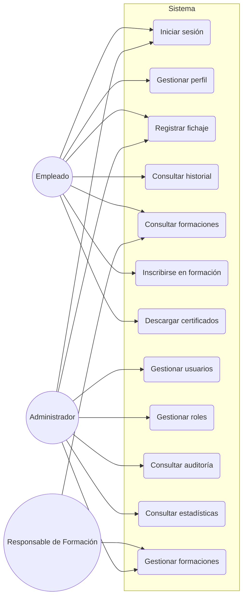
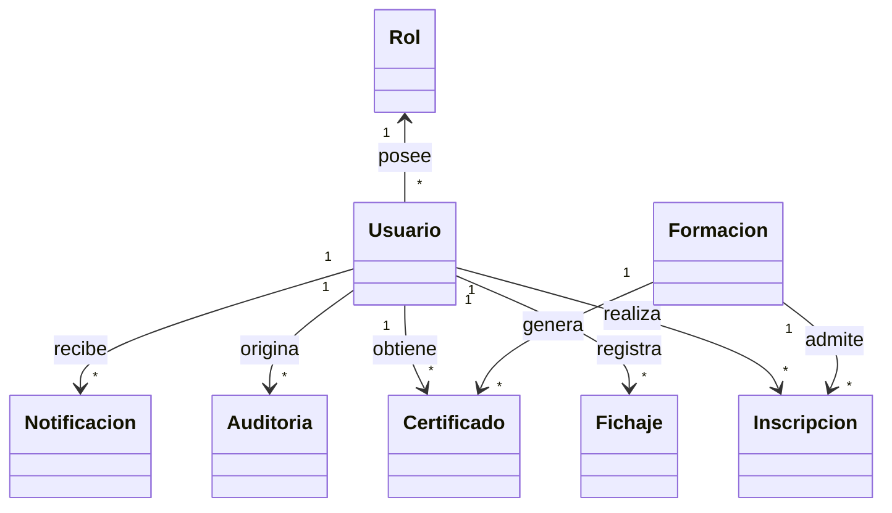

# Documento de Análisis de Requisitos del Sistema

**Nombre del proyecto:** Distribution Academy – Smart Check-in System

**Repositorio:** https://github.com/jfpaardoo/smart-checkin-system

**Autor:** Juan Felipe Pardo Carrillo

---

# 1. Introducción

## 1.1 Descripción general

Distribution Academy – Smart Check-in System es una aplicación web desarrollada para digitalizar la gestión del control de asistencia y el seguimiento de la formación interna de los empleados de la empresa. La plataforma sustituye los procedimientos manuales tradicionales por un sistema centralizado que permite registrar la actividad de los usuarios de forma segura, mantener un histórico completo de la información y facilitar la gestión administrativa asociada a los procesos de formación corporativa.

El sistema está orientado principalmente a tres áreas funcionales: la gestión de usuarios, el registro de fichajes y la administración de formaciones. A través de estos módulos, la organización puede controlar el acceso de los empleados a la plataforma, registrar la asistencia mediante mecanismos de validación seguros y gestionar el ciclo de vida completo de las formaciones impartidas dentro de la empresa.

Además de las funcionalidades principales, la aplicación incorpora mecanismos de auditoría, generación de certificados, obtención de estadísticas y administración de la información, proporcionando una solución integral para el seguimiento de la actividad de los empleados.

---

## 1.2 Objetivos

El objetivo principal del sistema es proporcionar una plataforma que permita gestionar de forma centralizada el control horario y las actividades formativas de los empleados, garantizando la integridad de la información registrada y facilitando las tareas administrativas asociadas.

De este objetivo general se derivan los siguientes objetivos específicos:

- Digitalizar el proceso de registro de asistencia de los empleados.
- Reducir los errores asociados a los procesos manuales de control horario.
- Garantizar que únicamente los usuarios autorizados puedan acceder a la plataforma.
- Facilitar la gestión de usuarios y permisos por parte de los administradores.
- Gestionar el catálogo de acciones formativas de la organización.
- Registrar la participación de los empleados en las distintas formaciones.
- Permitir la emisión de certificados asociados a las formaciones completadas.
- Disponer de un registro histórico de la actividad realizada en el sistema.
- Facilitar la obtención de información estadística para apoyar la toma de decisiones.
- Mejorar la trazabilidad de las operaciones realizadas sobre la plataforma.

---

## 1.3 Alcance

El sistema contempla la gestión completa del proceso de control horario y de las acciones formativas realizadas dentro de la organización.

Entre las funcionalidades incluidas dentro del alcance del proyecto se encuentran:

- Gestión de usuarios.
- Gestión de roles y permisos.
- Autenticación de usuarios.
- Administración de perfiles.
- Registro de entradas y salidas.
- Consulta del historial de fichajes.
- Gestión de formaciones.
- Inscripción de empleados en acciones formativas.
- Registro de asistencia.
- Emisión de certificados.
- Consulta de estadísticas.
- Gestión de auditorías.
- Exportación de información administrativa.

El sistema constituye una herramienta de apoyo a la gestión interna de la organización y no sustituye otras aplicaciones corporativas especializadas en recursos humanos o gestión empresarial.

---

## 1.4 Limitaciones

El presente sistema ha sido diseñado para cubrir exclusivamente las necesidades relacionadas con el control horario y la gestión de la formación interna de la organización.

Por tanto, quedan fuera del alcance de esta aplicación funcionalidades como:

- Gestión de nóminas.
- Planificación de vacaciones.
- Gestión contractual de empleados.
- Evaluación del desempeño.
- Gestión económica de la empresa.
- Administración financiera.
- Gestión de inventario.
- Planificación de producción.

Estas funcionalidades pertenecen a otros sistemas corporativos independientes.

---

## 1.5 Valor aportado

La implantación del sistema aporta beneficios tanto a los empleados como al personal encargado de la administración de la plataforma.

Desde el punto de vista organizativo, la aplicación permite centralizar toda la información relacionada con el control de asistencia y la formación de los empleados, reduciendo la duplicidad de información y facilitando su consulta.

Para los empleados, el sistema simplifica el proceso de registro de la jornada laboral, proporciona acceso inmediato a su historial de actividad y permite consultar la información relativa a las acciones formativas en las que participan.

Para los administradores, la plataforma facilita la gestión de usuarios, el seguimiento de la actividad realizada por los empleados, la generación de informes y la supervisión del cumplimiento de las políticas internas de formación.

En conjunto, la solución mejora la trazabilidad de la información, reduce el esfuerzo administrativo y proporciona una visión global de la actividad desarrollada dentro de la organización.

---

## 1.6 Funcionamiento general

El funcionamiento habitual del sistema comienza cuando un usuario autorizado accede a la plataforma mediante sus credenciales personales.

Una vez autenticado, el sistema adapta las funcionalidades disponibles al rol asignado al usuario. Los empleados pueden registrar sus formaciones, consultar su historial de asistencias, acceder a las formaciones disponibles y descargar la documentación asociada a aquellas actividades que hayan completado.

Los administradores disponen adicionalmente de herramientas para gestionar usuarios, supervisar los registros de actividad, administrar las acciones formativas, consultar la auditoría del sistema y obtener información estadística que facilite la gestión de la organización.

Todas las operaciones relevantes realizadas por los usuarios quedan registradas por el sistema, permitiendo mantener un histórico de actividad que facilita tanto la trazabilidad de la información como el seguimiento de los procesos internos.

# 2. Tipos de Usuarios / Roles

El sistema establece un modelo de control de acceso basado en roles (Role-Based Access Control, RBAC), mediante el cual las funcionalidades disponibles para cada usuario dependen de los permisos asociados al rol que tenga asignado. Este modelo garantiza que cada usuario únicamente pueda acceder a aquellas operaciones necesarias para el desempeño de sus funciones, preservando la seguridad, la confidencialidad y la integridad de la información gestionada.

Durante el análisis del sistema se han identificado los siguientes tipos de usuarios.

---

## 2.1 Empleado

El empleado constituye el principal usuario de la plataforma. Su actividad se centra en el registro de la formación, la consulta de información personal y la participación en las acciones formativas organizadas por la empresa.

### Descripción

El empleado utiliza la aplicación como herramienta de trabajo para registrar su asistencia, consultar su actividad y acceder a la formación disponible.

### Responsabilidades

- Acceder al sistema mediante sus credenciales personales.
- Registrar el inicio y la finalización de la jornada laboral.
- Consultar el historial de fichajes realizados.
- Consultar y actualizar la información autorizada de su perfil.
- Acceder al catálogo de formaciones disponibles.
- Inscribirse en acciones formativas.
- Registrar su asistencia cuando corresponda.
- Descargar certificados de las formaciones completadas.
- Consultar sus estadísticas personales.

### Permisos

El empleado podrá:

- Consultar exclusivamente la información asociada a su cuenta.
- Registrar fichajes.
- Consultar su historial de actividad.
- Gestionar los datos personales autorizados.
- Acceder a sus certificados.
- Participar en las acciones formativas disponibles.

### Restricciones

El empleado no podrá:

- Acceder a información perteneciente a otros usuarios.
- Gestionar usuarios.
- Crear, modificar o eliminar formaciones.
- Consultar la auditoría del sistema.
- Acceder a estadísticas globales.
- Modificar la configuración de la plataforma.

---

## 2.2 Administrador

El administrador es el responsable de la gestión integral de la plataforma y dispone de los permisos necesarios para administrar los distintos módulos funcionales del sistema.

### Descripción

Su función principal consiste en garantizar el correcto funcionamiento de la aplicación, administrar los usuarios y supervisar toda la información registrada.

### Responsabilidades

- Gestionar usuarios.
- Aprobar nuevas cuentas registradas.
- Asignar roles y permisos.
- Gestionar las acciones formativas.
- Supervisar los registros de fichaje.
- Consultar la auditoría del sistema.
- Obtener estadísticas e informes.
- Configurar determinados parámetros de funcionamiento.
- Gestionar la documentación generada por la plataforma.

### Permisos

El administrador podrá:

- Consultar toda la información almacenada.
- Crear, modificar y eliminar usuarios.
- Gestionar las formaciones.
- Acceder a la auditoría.
- Consultar estadísticas globales.
- Exportar información.
- Configurar parámetros administrativos del sistema.

### Restricciones

El administrador deberá respetar las reglas de negocio establecidas por la organización y garantizar la conservación de la información histórica cuando así lo requiera el sistema.

---

## 2.3 Responsable de Formación

El responsable de formación coordina y supervisa las acciones formativas desarrolladas dentro de la organización.

### Descripción

Este usuario gestiona el desarrollo de las actividades formativas y realiza el seguimiento de los empleados participantes.

### Responsabilidades

- Gestionar las formaciones asignadas.
- Consultar el listado de participantes.
- Supervisar la asistencia.
- Validar la finalización de las formaciones.
- Autorizar la emisión de certificados cuando corresponda.

### Permisos

El responsable de formación podrá:

- Consultar las formaciones bajo su responsabilidad.
- Gestionar la información relacionada con dichas formaciones.
- Consultar los participantes inscritos.
- Acceder a estadísticas relacionadas con las acciones formativas.

### Restricciones

El responsable de formación no podrá:

- Gestionar usuarios.
- Modificar roles.
- Acceder a la configuración general del sistema.
- Consultar información administrativa ajena al ámbito de formación.

---

## 2.4 Sistema

Además de los usuarios humanos, el análisis identifica la existencia de procesos automáticos ejecutados por la propia aplicación. Estos procesos realizan tareas internas necesarias para el funcionamiento de la plataforma y no requieren intervención directa de los usuarios.

### Responsabilidades

Entre las principales funciones del sistema se encuentran:

- Validar las credenciales de autenticación.
- Verificar la validez de los códigos utilizados durante el proceso de fichaje.
- Registrar automáticamente las operaciones de auditoría.
- Generar certificados.
- Calcular indicadores y estadísticas.
- Ejecutar tareas automáticas de mantenimiento.
- Gestionar el envío de notificaciones cuando corresponda.

Estos procesos garantizan el correcto funcionamiento de la plataforma y la consistencia de la información almacenada.

---

## 2.5 Resumen de Roles

| Funcionalidad | Empleado | Responsable de Formación | Administrador |
|---------------|:--------:|:------------------------:|:-------------:|
| Iniciar sesión | Sí | Sí | Sí |
| Gestionar perfil propio | Sí | Sí | Sí |
| Registrar fichajes | Sí | Sí | Sí |
| Consultar historial de fichajes | Sí | Sí | Sí |
| Consultar catálogo de formaciones | Sí | Sí | Sí |
| Inscribirse en formaciones | Sí | Sí | Sí |
| Gestionar formaciones | No | Sí | Sí |
| Gestionar usuarios | No | No | Sí |
| Gestionar roles | No | No | Sí |
| Consultar auditoría | No | No | Sí |
| Consultar estadísticas globales | No | No | Sí |
| Exportar informes | No | No | Sí |
| Configurar el sistema | No | No | Sí |

---

La definición de roles constituye uno de los elementos fundamentales del sistema, ya que permite distribuir las responsabilidades entre los distintos perfiles de usuario y garantizar que cada uno de ellos únicamente pueda acceder a las funcionalidades necesarias para desarrollar su actividad. Esta separación de responsabilidades favorece la seguridad, facilita la administración de la plataforma y contribuye a mantener la integridad de la información gestionada.

# 3. Historias de Usuario

Las historias de usuario recogen las necesidades funcionales identificadas durante el análisis del sistema desde el punto de vista de los diferentes tipos de usuarios. Cada historia describe una funcionalidad concreta utilizando el formato:

> **Como** <rol>, **quiero** <funcionalidad>, **para** <beneficio u objetivo>.

Estas historias constituyen una descripción de alto nivel del comportamiento esperado de la aplicación y sirven como base para la definición de los requisitos funcionales y los casos de uso.

---

## HU-01. Iniciar sesión

| Campo | Descripción |
|------|-------------|
| **Actor** | Empleado, Responsable de Formación, Administrador |
| **Descripción** | Como usuario registrado quiero iniciar sesión en el sistema para acceder a las funcionalidades correspondientes a mi rol. |
| **Prioridad** | Alta |
| **Precondiciones** | El usuario dispone de una cuenta activa y credenciales válidas. |
| **Postcondiciones** | El sistema crea una sesión autenticada y concede acceso a las funcionalidades autorizadas. |
| **Criterios de aceptación** | <ul><li>El sistema valida las credenciales introducidas.</li><li>Solo los usuarios autorizados pueden acceder.</li><li>En caso de error se informa al usuario sin revelar información sensible.</li></ul> |

---

## HU-02. Registrarse en la plataforma

| Campo | Descripción |
|------|-------------|
| **Actor** | Empleado |
| **Descripción** | Como empleado quiero solicitar una cuenta de acceso para poder utilizar la plataforma. |
| **Prioridad** | Alta |
| **Precondiciones** | El usuario aún no dispone de una cuenta registrada. |
| **Postcondiciones** | La solicitud queda registrada pendiente de aprobación. |
| **Criterios de aceptación** | <ul><li>Los datos obligatorios deben completarse correctamente.</li><li>El sistema informa de que la cuenta queda pendiente de aprobación.</li></ul> |

---

## HU-03. Aprobar usuarios

| Campo | Descripción |
|------|-------------|
| **Actor** | Administrador |
| **Descripción** | Como administrador quiero aprobar nuevas cuentas para autorizar el acceso de los usuarios a la plataforma. |
| **Prioridad** | Alta |
| **Precondiciones** | Existen solicitudes pendientes de aprobación. |
| **Postcondiciones** | El usuario cambia a estado activo o rechazado. |
| **Criterios de aceptación** | <ul><li>Solo los administradores pueden realizar esta operación.</li><li>La decisión queda registrada.</li></ul> |

---

## HU-04. Cambiar contraseña

| Campo | Descripción |
|------|-------------|
| **Actor** | Usuario autenticado |
| **Descripción** | Como usuario quiero modificar mi contraseña para mantener la seguridad de mi cuenta. |
| **Prioridad** | Alta |
| **Precondiciones** | El usuario ha iniciado sesión. |
| **Postcondiciones** | La nueva contraseña sustituye a la anterior. |
| **Criterios de aceptación** | <ul><li>Debe introducirse la contraseña actual.</li><li>La nueva contraseña debe cumplir los requisitos establecidos.</li></ul> |

---

## HU-05. Configurar autenticación en dos pasos

| Campo | Descripción |
|------|-------------|
| **Actor** | Usuario autenticado |
| **Descripción** | Como usuario quiero activar o desactivar la autenticación en dos pasos para aumentar la seguridad de mi cuenta. |
| **Prioridad** | Media |
| **Precondiciones** | El usuario ha iniciado sesión. |
| **Postcondiciones** | La configuración de seguridad queda actualizada. |
| **Criterios de aceptación** | <ul><li>El sistema valida el proceso de activación.</li><li>Los cambios quedan almacenados.</li></ul> |

---

## HU-06. Cerrar sesión

| Campo | Descripción |
|------|-------------|
| **Actor** | Usuario autenticado |
| **Descripción** | Como usuario quiero cerrar mi sesión para impedir accesos no autorizados desde el dispositivo utilizado. |
| **Prioridad** | Alta |
| **Precondiciones** | Existe una sesión autenticada. |
| **Postcondiciones** | La sesión queda finalizada. |
| **Criterios de aceptación** | <ul><li>El usuario deja de estar autenticado.</li><li>Es necesario volver a iniciar sesión para acceder nuevamente.</li></ul> |

---

## HU-07. Consultar perfil

| Campo | Descripción |
|------|-------------|
| **Actor** | Usuario autenticado |
| **Descripción** | Como usuario quiero consultar la información de mi perfil para verificar que mis datos son correctos. |
| **Prioridad** | Media |
| **Precondiciones** | El usuario ha iniciado sesión. |
| **Postcondiciones** | Se muestra la información personal registrada. |
| **Criterios de aceptación** | <ul><li>Solo se muestran los datos correspondientes al usuario autenticado.</li></ul> |

---

## HU-08. Consultar historial de fichajes

| Campo | Descripción |
|------|-------------|
| **Actor** | Empleado |
| **Descripción** | Como empleado quiero consultar el historial de mis registros para revisar mi actividad laboral. |
| **Prioridad** | Alta |
| **Precondiciones** | Existen registros asociados al usuario. |
| **Postcondiciones** | El sistema muestra el historial solicitado. |
| **Criterios de aceptación** | <ul><li>Los registros pueden consultarse cronológicamente.</li><li>Es posible filtrar por fechas.</li></ul> |

---

## HU-09. Escanear código QR

| Campo | Descripción |
|------|-------------|
| **Actor** | Empleado |
| **Descripción** | Como empleado quiero escanear un código QR para iniciar el proceso de registro de asistencia. |
| **Prioridad** | Alta |
| **Precondiciones** | El código QR se encuentra disponible y vigente. |
| **Postcondiciones** | El sistema procesa la información contenida en el código. |
| **Criterios de aceptación** | <ul><li>El código debe ser válido.</li><li>El sistema informa de cualquier incidencia durante la lectura.</li></ul> |

---

## HU-10. Registrar entrada

| Campo | Descripción |
|------|-------------|
| **Actor** | Empleado |
| **Descripción** | Como empleado quiero registrar el inicio de la formación para dejar constancia de mi hora de entrada. |
| **Prioridad** | Alta |
| **Precondiciones** | El usuario está autenticado y dispone de un código QR válido. |
| **Postcondiciones** | Se registra un nuevo fichaje de entrada asociado al usuario. |
| **Criterios de aceptación** | <ul><li>No puede existir otra entrada abierta.</li><li>La fecha y la hora quedan registradas automáticamente.</li><li>El registro queda asociado al empleado.</li></ul> |

---

## HU-11. Registrar salida

| Campo | Descripción |
|------|-------------|
| **Actor** | Empleado |
| **Descripción** | Como empleado quiero registrar el final de la formación para dejar constancia de mi hora de salida. |
| **Prioridad** | Alta |
| **Precondiciones** | Existe un registro de entrada previo sin una salida asociada. |
| **Postcondiciones** | La jornada laboral queda finalizada. |
| **Criterios de aceptación** | <ul><li>No es posible registrar una salida sin una entrada previa.</li><li>La hora de salida queda registrada automáticamente.</li></ul> |

---

## HU-12. Firmar digitalmente el fichaje

| Campo | Descripción |
|------|-------------|
| **Actor** | Empleado |
| **Descripción** | Como empleado quiero firmar digitalmente determinadas operaciones de fichaje para confirmar la autenticidad del registro realizado. |
| **Prioridad** | Media |
| **Precondiciones** | El proceso de fichaje requiere confirmación mediante firma. |
| **Postcondiciones** | La firma queda asociada al registro correspondiente. |
| **Criterios de aceptación** | <ul><li>La firma únicamente se almacena cuando el proceso finaliza correctamente.</li><li>Debe mantenerse vinculada al fichaje correspondiente.</li></ul> |

---

## HU-13. Consultar estado de la jornada

| Campo | Descripción |
|------|-------------|
| **Actor** | Empleado |
| **Descripción** | Como empleado quiero conocer el estado actual de mi jornada laboral para evitar errores al registrar nuevos fichajes. |
| **Prioridad** | Media |
| **Precondiciones** | El usuario ha iniciado sesión. |
| **Postcondiciones** | El sistema informa si el usuario se encuentra dentro o fuera de su jornada laboral. |
| **Criterios de aceptación** | <ul><li>El estado mostrado coincide con el último registro válido.</li><li>La información se actualiza tras cada fichaje.</li></ul> |

---

# Módulo de Gestión de Formación

## HU-14. Crear una formación

| Campo | Descripción |
|------|-------------|
| **Actor** | Administrador, Responsable de Formación |
| **Descripción** | Como responsable de formación quiero crear una nueva acción formativa para ponerla a disposición de los empleados. |
| **Prioridad** | Alta |
| **Precondiciones** | El usuario dispone de permisos para gestionar formaciones. |
| **Postcondiciones** | La nueva formación queda registrada en el sistema. |
| **Criterios de aceptación** | <ul><li>Todos los datos obligatorios deben cumplimentarse.</li><li>La formación queda disponible para su gestión.</li></ul> |

---

## HU-15. Modificar una formación

| Campo | Descripción |
|------|-------------|
| **Actor** | Administrador, Responsable de Formación |
| **Descripción** | Como responsable de formación quiero modificar la información de una acción formativa para mantenerla actualizada. |
| **Prioridad** | Alta |
| **Precondiciones** | La formación existe en el sistema. |
| **Postcondiciones** | La información queda actualizada. |
| **Criterios de aceptación** | <ul><li>Solo los usuarios autorizados pueden modificar una formación.</li><li>Las modificaciones quedan registradas.</li></ul> |

---

## HU-16. Eliminar una formación

| Campo | Descripción |
|------|-------------|
| **Actor** | Administrador |
| **Descripción** | Como administrador quiero eliminar una formación para retirar aquellas acciones formativas que ya no deban estar disponibles. |
| **Prioridad** | Media |
| **Precondiciones** | La formación existe y puede eliminarse conforme a las reglas de negocio. |
| **Postcondiciones** | La formación deja de estar disponible. |
| **Criterios de aceptación** | <ul><li>El sistema solicita confirmación antes de eliminar la información.</li><li>La operación queda registrada en la auditoría.</li></ul> |

---

## HU-17. Inscribirse en una formación

| Campo | Descripción |
|------|-------------|
| **Actor** | Empleado |
| **Descripción** | Como empleado quiero inscribirme en una acción formativa para participar en ella. |
| **Prioridad** | Alta |
| **Precondiciones** | La formación admite nuevas inscripciones. |
| **Postcondiciones** | El empleado queda inscrito en la formación seleccionada. |
| **Criterios de aceptación** | <ul><li>Un empleado no puede inscribirse más de una vez en la misma formación.</li><li>La inscripción queda registrada correctamente.</li></ul> |

---

## HU-18. Registrar asistencia a una formación

| Campo | Descripción |
|------|-------------|
| **Actor** | Empleado |
| **Descripción** | Como empleado quiero registrar mi asistencia a una formación para que quede constancia de mi participación en la actividad formativa. |
| **Prioridad** | Alta |
| **Precondiciones** | El empleado está inscrito en la formación correspondiente y la sesión se encuentra disponible para registrar la asistencia. |
| **Postcondiciones** | La asistencia queda registrada y asociada al empleado y a la formación. |
| **Criterios de aceptación** | <ul><li>Solo pueden registrar asistencia los empleados inscritos.</li><li>El registro queda asociado a la sesión correspondiente.</li><li>La información puede consultarse posteriormente.</li></ul> |

---

## HU-19. Descargar un certificado

| Campo | Descripción |
|------|-------------|
| **Actor** | Empleado |
| **Descripción** | Como empleado quiero descargar el certificado de una formación completada para acreditar mi participación en la actividad formativa. |
| **Prioridad** | Media |
| **Precondiciones** | El empleado ha completado satisfactoriamente la formación y el certificado se encuentra disponible. |
| **Postcondiciones** | El certificado queda descargado por el usuario. |
| **Criterios de aceptación** | <ul><li>Solo pueden descargarse certificados de formaciones finalizadas.</li><li>El certificado corresponde al empleado autenticado.</li></ul> |

---

## HU-20. Consultar participantes de una formación

| Campo | Descripción |
|------|-------------|
| **Actor** | Administrador, Responsable de Formación |
| **Descripción** | Como responsable de formación quiero consultar el listado de participantes para realizar el seguimiento de la actividad formativa. |
| **Prioridad** | Media |
| **Precondiciones** | La formación dispone de empleados inscritos. |
| **Postcondiciones** | El sistema muestra el listado actualizado de participantes. |
| **Criterios de aceptación** | <ul><li>Es posible consultar el estado de participación de cada empleado.</li><li>La información refleja los registros almacenados en el sistema.</li></ul> |

---

# Módulo de Administración

## HU-21. Gestionar usuarios

| Campo | Descripción |
|------|-------------|
| **Actor** | Administrador |
| **Descripción** | Como administrador quiero gestionar los usuarios registrados para mantener actualizada la información del sistema. |
| **Prioridad** | Alta |
| **Precondiciones** | El administrador ha iniciado sesión. |
| **Postcondiciones** | La información de usuarios queda actualizada. |
| **Criterios de aceptación** | <ul><li>El administrador puede crear, consultar, modificar y eliminar usuarios cuando las reglas de negocio lo permitan.</li><li>Todas las operaciones quedan registradas.</li></ul> |

---

## HU-22. Gestionar roles

| Campo | Descripción |
|------|-------------|
| **Actor** | Administrador |
| **Descripción** | Como administrador quiero asignar y modificar los roles de los usuarios para controlar el acceso a las distintas funcionalidades del sistema. |
| **Prioridad** | Alta |
| **Precondiciones** | El usuario existe y el administrador dispone de permisos suficientes. |
| **Postcondiciones** | El rol del usuario queda actualizado. |
| **Criterios de aceptación** | <ul><li>Solo los administradores pueden modificar roles.</li><li>Los cambios se aplican inmediatamente.</li></ul> |

---

## HU-23. Consultar la auditoría

| Campo | Descripción |
|------|-------------|
| **Actor** | Administrador |
| **Descripción** | Como administrador quiero consultar los registros de auditoría para supervisar la actividad realizada en el sistema. |
| **Prioridad** | Alta |
| **Precondiciones** | Existen registros de auditoría almacenados. |
| **Postcondiciones** | El sistema muestra la información solicitada. |
| **Criterios de aceptación** | <ul><li>Es posible filtrar la información por distintos criterios.</li><li>Los registros son únicamente de consulta.</li></ul> |

---

## HU-24. Consultar estadísticas

| Campo | Descripción |
|------|-------------|
| **Actor** | Administrador |
| **Descripción** | Como administrador quiero consultar estadísticas de utilización para facilitar el seguimiento de la actividad del sistema. |
| **Prioridad** | Media |
| **Precondiciones** | Existen datos suficientes para generar indicadores. |
| **Postcondiciones** | Se muestran las estadísticas solicitadas. |
| **Criterios de aceptación** | <ul><li>Los indicadores se calculan utilizando la información registrada.</li><li>Las estadísticas pueden consultarse por distintos periodos temporales.</li></ul> |

---

## HU-25. Exportar información

| Campo | Descripción |
|------|-------------|
| **Actor** | Administrador |
| **Descripción** | Como administrador quiero exportar información para generar informes y facilitar su tratamiento externo. |
| **Prioridad** | Media |
| **Precondiciones** | El administrador dispone de permisos de exportación. |
| **Postcondiciones** | El sistema genera el fichero correspondiente. |
| **Criterios de aceptación** | <ul><li>La información exportada coincide con los datos almacenados.</li><li>La operación queda registrada.</li></ul> |

---

## HU-26. Configurar el almacenamiento documental

| Campo | Descripción |
|------|-------------|
| **Actor** | Administrador |
| **Descripción** | Como administrador quiero configurar el almacenamiento de la documentación generada para facilitar su gestión y conservación. |
| **Prioridad** | Media |
| **Precondiciones** | El administrador dispone de permisos de configuración. |
| **Postcondiciones** | La configuración queda almacenada en el sistema. |
| **Criterios de aceptación** | <ul><li>Los parámetros introducidos son válidos.</li><li>La configuración queda disponible para futuras operaciones.</li></ul> |

---

## HU-27. Gestionar copias de seguridad

| Campo | Descripción |
|------|-------------|
| **Actor** | Administrador |
| **Descripción** | Como administrador quiero gestionar las copias de seguridad para garantizar la conservación de la información almacenada. |
| **Prioridad** | Media |
| **Precondiciones** | El administrador dispone de permisos suficientes. |
| **Postcondiciones** | La copia de seguridad se genera correctamente o queda programada para su ejecución. |
| **Criterios de aceptación** | <ul><li>La operación informa de su resultado.</li><li>La ejecución queda registrada en el sistema.</li></ul> |

---

## HU-28. Recibir notificaciones

| Campo | Descripción |
|------|-------------|
| **Actor** | Usuario autenticado |
| **Descripción** | Como usuario quiero recibir notificaciones del sistema para mantenerme informado sobre eventos relevantes relacionados con mi actividad. |
| **Prioridad** | Media |
| **Precondiciones** | El usuario ha autorizado la recepción de notificaciones. |
| **Postcondiciones** | El usuario recibe las notificaciones generadas por el sistema. |
| **Criterios de aceptación** | <ul><li>Solo se envían notificaciones a usuarios autorizados.</li><li>Las notificaciones contienen información relevante para el usuario.</li></ul> |

---

## HU-29. Cambiar el idioma de la aplicación

| Campo | Descripción |
|------|-------------|
| **Actor** | Usuario autenticado |
| **Descripción** | Como usuario quiero seleccionar el idioma de la interfaz para utilizar la aplicación en el idioma que me resulte más cómodo. |
| **Prioridad** | Baja |
| **Precondiciones** | El usuario ha iniciado sesión. |
| **Postcondiciones** | La interfaz se muestra en el idioma seleccionado. |
| **Criterios de aceptación** | <ul><li>El cambio de idioma se aplica inmediatamente.</li><li>La preferencia queda almacenada para futuras sesiones.</li></ul> |

---

## HU-30. Acceder a la aplicación

| Campo | Descripción |
|------|-------------|
| **Actor** | Usuario autenticado |
| **Descripción** | Como usuario quiero acceder a la aplicación para utilizar sus funcionalidades. |
| **Prioridad** | Baja |
| **Precondiciones** | El usuario ha introducido credenciales válidas y dispone de una sesión activa. |
| **Postcondiciones** | El usuario accede a la interfaz principal de la aplicación. |
| **Criterios de aceptación** | <ul><li>El sistema valida las credenciales y otorga acceso si son correctas.</li><li>La sesión se mantiene activa durante el tiempo configurado.</li><li>La interfaz muestra las opciones disponibles según el rol del usuario.</li></ul> |

---

## HU-31. Consultar estadísticas personales

| Campo | Descripción |
|------|-------------|
| **Actor** | Empleado |
| **Descripción** | Como empleado quiero consultar mis estadísticas personales para conocer la evolución de mi actividad dentro de la plataforma. |
| **Prioridad** | Baja |
| **Precondiciones** | Existen registros asociados al usuario. |
| **Postcondiciones** | El sistema muestra los indicadores personales disponibles. |
| **Criterios de aceptación** | <ul><li>Las estadísticas se calculan utilizando únicamente la información del empleado autenticado.</li><li>Los datos mostrados son consistentes con los registros almacenados.</li></ul> |

---

## HU-32. Generar un código QR

| Campo | Descripción |
|------|-------------|
| **Actor** | Administrador |
| **Descripción** | Como administrador quiero generar un código QR para permitir que los empleados puedan registrar su asistencia de forma segura. |
| **Prioridad** | Alta |
| **Precondiciones** | El administrador dispone de permisos para gestionar el proceso de fichaje. |
| **Postcondiciones** | El sistema genera un nuevo código QR válido durante el periodo establecido. |
| **Criterios de aceptación** | <ul><li>El código generado dispone de un periodo de validez limitado.</li><li>Los códigos caducados dejan de ser válidos automáticamente.</li></ul> |

---

## HU-33. Buscar información

| Campo | Descripción |
|------|-------------|
| **Actor** | Administrador |
| **Descripción** | Como administrador quiero localizar rápidamente usuarios, formaciones y registros para facilitar las tareas de gestión. |
| **Prioridad** | Media |
| **Precondiciones** | Existen datos almacenados en el sistema. |
| **Postcondiciones** | El sistema muestra los resultados correspondientes a la búsqueda realizada. |
| **Criterios de aceptación** | <ul><li>La búsqueda admite diferentes criterios.</li><li>Los resultados corresponden a la información almacenada.</li></ul> |

---

## HU-34. Consultar actividad reciente

| Campo | Descripción |
|------|-------------|
| **Actor** | Administrador |
| **Descripción** | Como administrador quiero consultar la actividad reciente del sistema para supervisar las últimas operaciones realizadas. |
| **Prioridad** | Baja |
| **Precondiciones** | Existen registros de actividad. |
| **Postcondiciones** | El sistema muestra las operaciones más recientes. |
| **Criterios de aceptación** | <ul><li>La actividad aparece ordenada cronológicamente.</li><li>La información coincide con los registros almacenados.</li></ul> |

---

## HU-35. Acceder al panel principal

| Campo | Descripción |
|------|-------------|
| **Actor** | Usuario autenticado |
| **Descripción** | Como usuario quiero acceder a un panel principal para consultar de forma rápida la información más relevante relacionada con mi actividad en la plataforma. |
| **Prioridad** | Alta |
| **Precondiciones** | El usuario ha iniciado sesión correctamente. |
| **Postcondiciones** | El sistema muestra el panel principal correspondiente al rol del usuario. |
| **Criterios de aceptación** | <ul><li>La información presentada depende del rol del usuario.</li><li>El panel proporciona acceso directo a las funcionalidades más utilizadas.</li></ul> |

---

# 4. Casos de Uso

Los casos de uso describen las principales interacciones entre los actores identificados y el sistema, especificando el comportamiento esperado desde el punto de vista funcional. Constituyen una representación de alto nivel de las operaciones que la aplicación debe ofrecer para satisfacer las necesidades descritas mediante las historias de usuario.

A diferencia de las historias de usuario, los casos de uso describen el flujo de interacción entre el usuario y el sistema, definiendo las precondiciones, el escenario principal y las posibles alternativas.

---

## Diagrama general de Casos de Uso

---

## CU-01. Autenticarse en el sistema

### Objetivo

Permitir que un usuario registrado acceda a la plataforma utilizando sus credenciales.

### Actores

- Empleado
- Responsable de Formación
- Administrador

### Precondiciones

- El usuario dispone de una cuenta activa.
- El usuario conoce sus credenciales.

### Flujo principal

1. El usuario accede a la pantalla de autenticación.
2. Introduce sus credenciales.
3. El sistema valida la información recibida.
4. Si las credenciales son correctas, se inicia la sesión.
5. El sistema carga el panel correspondiente al rol del usuario.

### Flujos alternativos

**A1. Credenciales incorrectas**

- El sistema informa del error.
- El usuario permanece en la pantalla de autenticación.

**A2. Usuario no autorizado**

- El acceso es rechazado.
- El sistema informa de la incidencia.

### Postcondiciones

El usuario dispone de una sesión autenticada.

---

## CU-02. Registrar un fichaje

### Objetivo

Registrar el inicio o finalización de la jornada laboral de un empleado.

### Actor principal

Empleado.

### Precondiciones

- El usuario ha iniciado sesión.
- Existe un código QR válido.

### Flujo principal

1. El usuario escanea el código QR.
2. Introduce su código personal.
3. El sistema valida la información.
4. Se determina si corresponde registrar una entrada o una salida.
5. Se almacena el registro.
6. El sistema actualiza el estado de la jornada.

### Flujos alternativos

**A1. Código QR inválido**

El registro es rechazado.

**A2. Código personal incorrecto**

El proceso finaliza sin registrar el fichaje.

### Postcondiciones

El fichaje queda almacenado correctamente.

---

## CU-03. Consultar historial de fichajes

### Objetivo

Permitir al empleado consultar todos los registros asociados a su jornada laboral.

### Actor principal

Empleado.

### Precondiciones

El usuario ha iniciado sesión.

### Flujo principal

1. El usuario accede al historial.
2. El sistema recupera los registros.
3. Se muestran ordenados cronológicamente.
4. El usuario puede aplicar filtros de búsqueda.

### Postcondiciones

No se modifica ninguna información.

---

## CU-04. Gestionar usuarios

### Objetivo

Administrar las cuentas registradas en la plataforma.

### Actor principal

Administrador.

### Precondiciones

El administrador dispone de permisos suficientes.

### Flujo principal

1. Accede al módulo de usuarios.
2. Consulta el listado.
3. Crea, modifica o elimina usuarios.
4. El sistema valida la operación.
5. La información queda actualizada.

### Postcondiciones

Los cambios quedan almacenados.

---

## CU-05. Gestionar formaciones

### Objetivo

Administrar las acciones formativas disponibles.

### Actores

- Administrador.
- Responsable de Formación.

### Precondiciones

El usuario dispone de permisos de gestión.

### Flujo principal

1. Accede al catálogo.
2. Selecciona una formación.
3. Crea, modifica o elimina información.
4. El sistema valida los cambios.
5. La información queda almacenada.

### Postcondiciones

El catálogo queda actualizado.

---

## CU-06. Inscribirse en una formación

### Objetivo

Permitir que un empleado participe en una acción formativa.

### Actor principal

Empleado.

### Precondiciones

La formación admite nuevas inscripciones.

### Flujo principal

1. El empleado consulta el catálogo.
2. Selecciona una formación.
3. Solicita la inscripción.
4. El sistema verifica los requisitos.
5. Se registra la inscripción.

### Flujos alternativos

**A1. Ya inscrito**

El sistema informa de que la inscripción ya existe.

**A2. Formación cerrada**

La inscripción no puede realizarse.

### Postcondiciones

El empleado queda asociado a la formación.

---

## CU-07. Descargar un certificado

### Objetivo

Permitir la obtención del certificado de una formación completada.

### Actor principal

Empleado.

### Precondiciones

Existe un certificado asociado al usuario.

### Flujo principal

1. El usuario accede a sus certificados.
2. Selecciona el certificado deseado.
3. Solicita la descarga.
4. El sistema genera o recupera el documento.
5. El usuario obtiene el certificado.

### Postcondiciones

No se modifica la información almacenada.

---

## CU-08. Consultar estadísticas

### Objetivo

Facilitar la supervisión de la actividad registrada.

### Actor principal

Administrador.

### Precondiciones

Existen datos suficientes para generar indicadores.

### Flujo principal

1. El administrador accede al panel de estadísticas.
2. Selecciona el periodo de consulta.
3. El sistema calcula los indicadores.
4. Se muestran los resultados.

### Postcondiciones

No se modifica la información almacenada.

---

## CU-09. Consultar auditoría

### Objetivo

Permitir el seguimiento de todas las operaciones relevantes realizadas en la plataforma.

### Actor principal

Administrador.

### Precondiciones

Existen registros de auditoría.

### Flujo principal

1. El administrador accede al módulo.
2. El sistema recupera los registros.
3. Se muestran ordenados cronológicamente.
4. El administrador puede aplicar filtros de búsqueda.

### Postcondiciones

La auditoría permanece inalterada.

---

## Resumen de Casos de Uso

| Código | Caso de Uso | Actor principal |
|----------|------------------------------|---------------------------|
| CU-01 | Autenticarse | Usuario |
| CU-02 | Registrar fichaje | Empleado |
| CU-03 | Consultar historial | Empleado |
| CU-04 | Gestionar usuarios | Administrador |
| CU-05 | Gestionar formaciones | Administrador / Responsable |
| CU-06 | Inscribirse en formación | Empleado |
| CU-07 | Descargar certificado | Empleado |
| CU-08 | Consultar estadísticas | Administrador |
| CU-09 | Consultar auditoría | Administrador |

Los casos de uso descritos representan las funcionalidades principales identificadas durante el análisis de requisitos. En conjunto, definen el comportamiento esperado del sistema desde la perspectiva de los distintos actores y constituyen la base para la especificación de los requisitos funcionales que se presentan en el siguiente apartado.

---

# 5. Diagrama Conceptual del Sistema

El modelo conceptual representa los principales conceptos del dominio identificados durante el análisis de requisitos y las relaciones existentes entre ellos. Este diagrama constituye una abstracción del negocio, por lo que únicamente refleja las entidades conceptuales necesarias para comprender el funcionamiento del sistema, sin incorporar detalles propios de la implementación, tales como tipos de datos, claves primarias, tecnologías utilizadas o relaciones derivadas de la persistencia.

El objetivo de este modelo es proporcionar una visión global de la información gestionada por la plataforma y servir de base para las fases posteriores de diseño e implementación.

## Diagrama conceptual

---

## Descripción de las entidades conceptuales

### Usuario

Representa cualquier persona registrada en la plataforma con capacidad para acceder al sistema según los permisos asociados a su rol.

El usuario constituye la entidad principal del dominio, ya que la mayor parte de las operaciones realizadas en la aplicación están asociadas a un usuario autenticado.

**Responsabilidades principales**

- Acceder al sistema.
- Registrar fichajes.
- Participar en formaciones.
- Consultar información personal.
- Obtener certificados.

---

### Rol

Define el conjunto de permisos asignados a un usuario.

Cada usuario posee un único rol activo, mientras que un mismo rol puede estar asociado a múltiples usuarios.

Los roles identificados durante el análisis son:

- Empleado.
- Responsable de Formación.
- Administrador.

---

### Fichaje

Representa cada registro asociado al control horario de un empleado.

Cada fichaje queda asociado a un único usuario y almacena la información necesaria para reconstruir el historial de actividad laboral.

---

### Formación

Representa una acción formativa ofrecida por la organización.

Una formación puede admitir múltiples participantes y generar certificados para aquellos empleados que cumplan los criterios establecidos.

---

### Inscripción

Representa la participación de un usuario en una acción formativa.

Esta entidad relaciona empleados y formaciones, permitiendo conocer qué usuarios participan en cada actividad.

---

### Certificado

Representa el documento acreditativo emitido tras la finalización satisfactoria de una formación.

Cada certificado está asociado simultáneamente a un usuario y a una formación.

---

### Auditoría

Representa el registro histórico de las operaciones relevantes realizadas sobre el sistema.

La auditoría garantiza la trazabilidad de las acciones ejecutadas por los distintos usuarios.

---

### Notificación

Representa las comunicaciones enviadas por la plataforma para informar a los usuarios sobre eventos relevantes, como nuevas formaciones, incidencias o cambios relacionados con su actividad.

---

## Relaciones del dominio

Las relaciones identificadas entre las entidades principales son las siguientes:

| Relación | Descripción |
|----------|-------------|
| Usuario – Rol | Cada usuario dispone de un rol que determina sus permisos dentro del sistema. |
| Usuario – Fichaje | Un usuario puede registrar múltiples fichajes a lo largo del tiempo. |
| Usuario – Formación | La participación en una formación se realiza mediante una inscripción. |
| Formación – Inscripción | Una formación puede admitir múltiples empleados inscritos. |
| Usuario – Certificado | Un usuario puede obtener varios certificados correspondientes a distintas formaciones. |
| Formación – Certificado | Una formación puede generar certificados para sus participantes. |
| Usuario – Auditoría | Las operaciones realizadas por un usuario generan registros de auditoría. |
| Usuario – Notificación | Un usuario puede recibir múltiples notificaciones del sistema. |

---

## Restricciones conceptuales

Durante el análisis se han identificado las siguientes restricciones asociadas al modelo del dominio:

- Todo usuario debe tener asignado un único rol.
- Un fichaje siempre pertenece a un único usuario.
- Un usuario puede realizar múltiples fichajes.
- Un usuario no puede estar inscrito más de una vez en la misma formación.
- Una formación puede tener múltiples participantes.
- Un certificado únicamente puede estar asociado a una formación completada.
- Los registros de auditoría no pueden eliminarse ni modificarse.
- Las notificaciones siempre pertenecen a un usuario concreto.

Estas restricciones representan reglas del dominio del problema y serán desarrolladas con mayor detalle en el apartado de Reglas de Negocio.

---

El modelo conceptual presentado proporciona una visión simplificada del dominio del problema y establece los conceptos fundamentales sobre los que se construyen el resto de requisitos del sistema. Su finalidad es facilitar la comprensión del negocio sin incorporar detalles propios del diseño software, los cuales serán abordados en el documento de diseño del sistema.

---

# 6. Reglas de Negocio

Las reglas de negocio establecen las restricciones y condiciones que deben cumplirse para garantizar el correcto funcionamiento del sistema y la consistencia de la información gestionada. Estas reglas representan el comportamiento esperado de la plataforma desde el punto de vista del dominio del problema y son independientes de la tecnología utilizada para su implementación.

Las reglas descritas a continuación han sido obtenidas a partir del análisis funcional del sistema y constituyen restricciones que deberán respetarse durante toda la vida útil de la aplicación.

---

## RN-01. Un usuario debe estar autenticado

Únicamente los usuarios autenticados podrán acceder a las funcionalidades protegidas del sistema.

---

## RN-02. Las credenciales deben ser válidas

El acceso a la plataforma solo será autorizado cuando las credenciales proporcionadas por el usuario sean correctas y la cuenta se encuentre activa.

---

## RN-03. Cada usuario dispone de un único rol

Todo usuario registrado deberá tener asignado un único rol activo que determine los permisos disponibles durante su sesión.

---

## RN-04. Los permisos dependen del rol

Las operaciones que un usuario puede realizar estarán limitadas por los permisos asociados a su rol.

---

## RN-05. Los usuarios solo pueden acceder a su información

Un usuario únicamente podrá consultar o modificar la información personal que le pertenezca, salvo que disponga de privilegios administrativos.

---

## RN-06. El registro de fichaje requiere validación

Para registrar un fichaje será necesario superar el proceso de validación definido por el sistema.

---

## RN-07. Los códigos QR poseen una validez limitada

Los códigos utilizados para registrar fichajes únicamente podrán utilizarse durante el periodo de tiempo para el que hayan sido generados.

Una vez transcurrido dicho periodo dejarán de ser válidos automáticamente.

---

## RN-08. El código personal identifica al empleado

Cada empleado dispondrá de un código personal único utilizado para confirmar su identidad durante el proceso de fichaje.

---

## RN-09. No pueden existir dos entradas consecutivas

Un empleado no podrá registrar una nueva entrada mientras exista una jornada abierta sin registrar la salida correspondiente.

---

## RN-10. No puede registrarse una salida sin una entrada previa

El sistema impedirá registrar una salida cuando no exista previamente un registro de entrada pendiente de cierre.

---

## RN-11. Cada fichaje pertenece a un único usuario

Todo registro de fichaje deberá estar asociado exclusivamente a un único empleado.

---

## RN-12. Los fichajes son históricos

Una vez registrados, los fichajes pasarán a formar parte del historial del empleado.

Su modificación estará restringida según las políticas establecidas por la organización.

---

## RN-13. Las formaciones deben existir previamente

No será posible realizar operaciones sobre una formación inexistente.

---

## RN-14. Una formación puede admitir múltiples participantes

Cada acción formativa podrá disponer de uno o varios empleados inscritos.

---

## RN-15. Un empleado no puede inscribirse dos veces

Un empleado únicamente podrá disponer de una inscripción activa para una misma formación.

---

## RN-16. Solo pueden registrarse asistentes inscritos

El registro de asistencia únicamente podrá realizarse para empleados previamente inscritos en la formación correspondiente.

---

## RN-17. La inscripción requiere disponibilidad

Una inscripción solo podrá realizarse cuando la formación admita nuevas incorporaciones.

---

## RN-18. El certificado requiere completar la formación

Los certificados únicamente podrán emitirse cuando el empleado haya completado satisfactoriamente la acción formativa.

---

## RN-19. Cada certificado pertenece a un único empleado

Un certificado acreditará exclusivamente la participación de un único empleado en una determinada formación.

---

## RN-20. Los certificados son consultables

Los certificados emitidos permanecerán disponibles para su consulta y descarga por parte de su propietario.

---

## RN-21. Toda operación relevante genera auditoría

Las operaciones administrativas y aquellas consideradas relevantes por el sistema deberán generar automáticamente un registro de auditoría.

---

## RN-22. La auditoría es inalterable

Los registros de auditoría no podrán ser modificados ni eliminados por los usuarios.

---

## RN-23. La auditoría conserva el historial

La información registrada en la auditoría deberá mantenerse para garantizar la trazabilidad de las operaciones realizadas.

---

## RN-24. Las estadísticas utilizan información consolidada

Los indicadores mostrados por el sistema deberán calcularse utilizando exclusivamente información válida y almacenada.

---

## RN-25. Las operaciones administrativas requieren autorización

Las funciones de administración únicamente podrán ejecutarse por usuarios con permisos suficientes.

---

## RN-26. La gestión de usuarios está restringida

La creación, modificación y eliminación de usuarios será una operación exclusiva de los administradores.

---

## RN-27. La asignación de roles está controlada

Solo los administradores podrán modificar el rol asignado a un usuario.

---

## RN-28. La configuración del sistema está protegida

Los parámetros generales de funcionamiento únicamente podrán modificarse por usuarios autorizados.

---

## RN-29. La información exportada debe ser consistente

Los informes y exportaciones deberán reflejar fielmente la información almacenada en el sistema en el momento de su generación.

---

## RN-30. Las notificaciones pertenecen a un usuario

Toda notificación generada por la plataforma estará asociada a un usuario concreto.

---

## RN-31. El historial debe mantenerse íntegro

La eliminación o modificación de información histórica no podrá comprometer la integridad de los registros asociados al sistema.

---

## RN-32. Las operaciones deben ser trazables

Las acciones realizadas por los usuarios deberán poder reconstruirse posteriormente mediante la información almacenada por el sistema.

---

## RN-33. La información debe mantenerse consistente

Ninguna operación podrá dejar el sistema en un estado inconsistente o que incumpla las reglas definidas para el dominio.

---

## RN-34. Las operaciones fallidas no modificarán el estado del sistema

Cuando una operación no supere las validaciones correspondientes, no deberá producirse ninguna modificación permanente sobre la información almacenada.

---

## RN-35. La disponibilidad de la información dependerá de los permisos

Toda consulta realizada por un usuario estará limitada a la información para la que disponga de autorización suficiente.

---

Las reglas de negocio descritas en este apartado definen las restricciones fundamentales del dominio y sirven como referencia para la especificación de los requisitos funcionales del sistema. Su cumplimiento garantiza la coherencia de la información, la correcta aplicación de las políticas de la organización y el comportamiento esperado de la plataforma independientemente de la tecnología empleada para su implementación.

---

# 7. Requisitos Funcionales

Los requisitos funcionales describen los servicios y funcionalidades que el sistema debe proporcionar para satisfacer las necesidades identificadas durante el análisis. Estos requisitos especifican el comportamiento esperado de la aplicación desde el punto de vista del usuario, sin hacer referencia a aspectos concretos de implementación.

Cada requisito funcional se identifica mediante un código único para facilitar su trazabilidad con las historias de usuario y los casos de uso descritos anteriormente.

---

## 7.1 Gestión de autenticación

### RF-01. Inicio de sesión

El sistema deberá permitir que los usuarios registrados inicien sesión mediante sus credenciales.

---

### RF-02. Validación de credenciales

El sistema deberá comprobar la validez de las credenciales antes de conceder acceso.

---

### RF-03. Cierre de sesión

El sistema deberá permitir finalizar la sesión activa en cualquier momento.

---

### RF-04. Registro de usuarios

El sistema deberá permitir registrar nuevos usuarios cuando el proceso de alta lo requiera.

---

### RF-05. Aprobación de usuarios

El sistema deberá permitir a los administradores aprobar o rechazar nuevas cuentas.

---

### RF-06. Recuperación de acceso

El sistema deberá permitir recuperar el acceso cuando un usuario no pueda autenticarse mediante sus credenciales habituales.

---

### RF-07. Cambio de contraseña

El sistema deberá permitir modificar la contraseña de acceso.

---

### RF-08. Gestión de autenticación reforzada

El sistema deberá permitir activar y desactivar mecanismos adicionales de autenticación cuando estén disponibles.

---

## 7.2 Gestión de usuarios

### RF-09. Consulta de perfil

El sistema deberá permitir consultar la información asociada al usuario autenticado.

---

### RF-10. Actualización del perfil

El sistema deberá permitir modificar los datos personales autorizados.

---

### RF-11. Gestión de usuarios

El sistema deberá permitir crear, consultar, modificar y eliminar usuarios autorizados.

---

### RF-12. Gestión de roles

El sistema deberá permitir asignar y modificar los roles de los usuarios.

---

### RF-13. Gestión de permisos

El sistema deberá controlar el acceso a las funcionalidades según el rol del usuario.

---

## 7.3 Control horario

### RF-14. Generación de códigos QR

El sistema deberá generar códigos QR destinados al proceso de registro de asistencia.

---

### RF-15. Validación de códigos QR

El sistema deberá comprobar la validez de los códigos utilizados durante el proceso de fichaje.

---

### RF-16. Validación del código personal

El sistema deberá verificar la identidad del empleado mediante su código personal.

---

### RF-17. Registro de entrada

El sistema deberá registrar el inicio de la jornada laboral.

---

### RF-18. Registro de salida

El sistema deberá registrar la finalización de la jornada laboral.

---

### RF-19. Consulta del historial de fichajes

El sistema deberá permitir consultar el historial de registros realizados por cada empleado.

---

### RF-20. Consulta del estado de la jornada

El sistema deberá informar del estado actual de la jornada laboral del usuario.

---

### RF-21. Registro de incidencias

El sistema deberá detectar e informar de incidencias producidas durante el proceso de fichaje.

---

## 7.4 Gestión de formación

### RF-22. Gestión de formaciones

El sistema deberá permitir crear, modificar y eliminar acciones formativas.

---

### RF-23. Consulta del catálogo

El sistema deberá mostrar el catálogo actualizado de formaciones disponibles.

---

### RF-24. Inscripción en formaciones

El sistema deberá permitir la inscripción de empleados en las acciones formativas.

---

### RF-25. Gestión de participantes

El sistema deberá permitir consultar los participantes asociados a cada formación.

---

### RF-26. Registro de asistencia

El sistema deberá registrar la asistencia de los empleados a las formaciones.

---

### RF-27. Consulta de formación

El sistema deberá permitir consultar toda la información asociada a una formación.

---

### RF-28. Finalización de formación

El sistema deberá permitir registrar la finalización de una acción formativa.

---

## 7.5 Certificados

### RF-29. Generación de certificados

El sistema deberá generar certificados para las formaciones completadas.

---

### RF-30. Consulta de certificados

El sistema deberá permitir consultar los certificados disponibles.

---

### RF-31. Descarga de certificados

El sistema deberá permitir descargar los certificados emitidos.

---

## 7.6 Administración

### RF-32. Gestión de auditoría

El sistema deberá registrar las operaciones relevantes realizadas por los usuarios.

---

### RF-33. Consulta de auditoría

El sistema deberá permitir consultar el historial de auditoría.

---

### RF-34. Consulta de estadísticas

El sistema deberá proporcionar información estadística sobre la actividad registrada.

---

### RF-35. Exportación de información

El sistema deberá permitir exportar la información autorizada.

---

### RF-36. Gestión documental

El sistema deberá administrar la documentación generada por la plataforma.

---

### RF-37. Gestión de notificaciones

El sistema deberá generar y distribuir notificaciones dirigidas a los usuarios.

---

### RF-38. Gestión de configuración

El sistema deberá permitir configurar los parámetros generales autorizados.

---

### RF-39. Consulta de actividad

El sistema deberá mostrar la actividad reciente registrada por la plataforma.

---

### RF-40. Búsqueda de información

El sistema deberá permitir localizar usuarios, formaciones y registros mediante distintos criterios de búsqueda.

---

## 7.7 Requisitos funcionales transversales

### RF-41. Validación de datos

El sistema deberá validar toda la información introducida antes de almacenarla.

---

### RF-42. Integridad de la información

El sistema deberá garantizar la coherencia de los datos gestionados.

---

### RF-43. Persistencia de la información

El sistema deberá conservar permanentemente la información registrada hasta que una operación autorizada indique lo contrario.

---

### RF-44. Registro de errores

El sistema deberá registrar las incidencias producidas durante la ejecución de las operaciones.

---

### RF-45. Control de acceso

El sistema deberá impedir el acceso a funcionalidades para las que el usuario no disponga de autorización.

---

### RF-46. Gestión de sesiones

El sistema deberá controlar el ciclo de vida de las sesiones de usuario.

---

### RF-47. Consulta de información personal

El sistema deberá permitir que cada usuario consulte exclusivamente la información que le corresponda.

---

### RF-48. Actualización automática de indicadores

El sistema deberá actualizar los indicadores y estadísticas cuando la información almacenada cambie.

---

### RF-49. Conservación del histórico

El sistema deberá mantener un histórico de la información relevante para garantizar la trazabilidad de las operaciones.

---

### RF-50. Trazabilidad de operaciones

El sistema deberá conservar la información necesaria para reconstruir las operaciones realizadas por los usuarios.

---

## Resumen

Los requisitos funcionales descritos anteriormente especifican el conjunto de servicios que deberá proporcionar la plataforma para satisfacer las necesidades identificadas durante el análisis del sistema. Cada requisito mantiene su correspondencia con las historias de usuario, los casos de uso y las reglas de negocio previamente definidas, permitiendo establecer una trazabilidad completa entre las necesidades de los usuarios y el comportamiento esperado de la aplicación.

---

# 8. Requisitos No Funcionales

Los requisitos no funcionales describen las características de calidad que deberá cumplir el sistema para garantizar un funcionamiento adecuado. A diferencia de los requisitos funcionales, estos requisitos no especifican qué operaciones realiza la aplicación, sino las condiciones bajo las cuales dichas operaciones deben ejecutarse.

Los requisitos definidos en este apartado establecen criterios relacionados con la seguridad, el rendimiento, la disponibilidad, la usabilidad y otros atributos de calidad que condicionan el comportamiento global del sistema.

---

# 8.1 Seguridad

## RNF-01. Autenticación

El sistema deberá exigir la autenticación de todos los usuarios antes de acceder a cualquier funcionalidad protegida.

---

## RNF-02. Autorización

El acceso a las funcionalidades deberá depender del rol asignado al usuario.

---

## RNF-03. Protección de la información

Los datos gestionados por la plataforma deberán almacenarse de forma que se preserve su confidencialidad e integridad.

---

## RNF-04. Gestión segura de sesiones

Las sesiones deberán finalizar cuando el usuario cierre sesión o cuando se detecte un periodo prolongado de inactividad.

---

## RNF-05. Protección frente a accesos no autorizados

El sistema deberá impedir el acceso a recursos para los que el usuario no disponga de permisos suficientes.

---

## RNF-06. Trazabilidad

Las operaciones relevantes deberán quedar registradas para permitir su posterior revisión.

---

# 8.2 Rendimiento

## RNF-07. Tiempo de respuesta

Las operaciones habituales deberán completarse en un tiempo que permita una utilización fluida de la aplicación.

---

## RNF-08. Procesamiento concurrente

La plataforma deberá permitir que múltiples usuarios utilicen el sistema simultáneamente sin afectar al funcionamiento general.

---

## RNF-09. Escalabilidad

El sistema deberá poder adaptarse al incremento del número de usuarios y de la información gestionada sin comprometer su funcionamiento.

---

# 8.3 Disponibilidad

## RNF-10. Continuidad del servicio

La aplicación deberá permanecer disponible durante los periodos normales de utilización por parte de la organización.

---

## RNF-11. Recuperación ante fallos

El sistema deberá disponer de mecanismos que permitan recuperar el servicio tras producirse un fallo.

---

## RNF-12. Conservación de la información

La pérdida de información deberá minimizarse mediante mecanismos adecuados de persistencia y recuperación.

---

# 8.4 Usabilidad

## RNF-13. Facilidad de aprendizaje

La interfaz deberá permitir que los usuarios puedan utilizar las principales funcionalidades sin necesidad de formación especializada.

---

## RNF-14. Consistencia de la interfaz

La navegación y los elementos de la interfaz deberán mantener un comportamiento homogéneo en toda la aplicación.

---

## RNF-15. Retroalimentación

Todas las operaciones realizadas por el usuario deberán proporcionar información clara sobre su resultado.

---

## RNF-16. Prevención de errores

El sistema deberá minimizar la posibilidad de errores mediante validaciones y mensajes informativos.

---

# 8.5 Accesibilidad

## RNF-17. Compatibilidad

La aplicación deberá ser accesible desde los principales navegadores compatibles.

---

## RNF-18. Adaptabilidad

La interfaz deberá adaptarse correctamente a diferentes tamaños de pantalla.

---

## RNF-19. Legibilidad

Los elementos visuales deberán facilitar la lectura y comprensión de la información mostrada.

---

# 8.6 Fiabilidad

## RNF-20. Consistencia de los datos

Las operaciones realizadas no deberán dejar el sistema en un estado inconsistente.

---

## RNF-21. Integridad

La información almacenada deberá mantenerse íntegra durante todo su ciclo de vida.

---

## RNF-22. Exactitud

Los resultados proporcionados por la aplicación deberán corresponderse con la información almacenada.

---

# 8.7 Mantenibilidad

## RNF-23. Modularidad

La solución deberá organizarse de forma que facilite su mantenimiento y evolución.

---

## RNF-24. Reutilización

Las funcionalidades comunes deberán favorecer la reutilización de componentes.

---

## RNF-25. Evolución

La incorporación de nuevas funcionalidades deberá realizarse minimizando el impacto sobre las existentes.

---

# 8.8 Portabilidad

## RNF-26. Independencia del dispositivo

El sistema deberá poder utilizarse desde diferentes tipos de dispositivos compatibles.

---

## RNF-27. Independencia del navegador

La plataforma deberá funcionar correctamente en los navegadores soportados.

---

# 8.9 Calidad de los datos

## RNF-28. Validación

Toda la información introducida por los usuarios deberá validarse antes de ser almacenada.

---

## RNF-29. Unicidad

El sistema deberá impedir la creación de registros duplicados cuando las reglas del dominio así lo establezcan.

---

## RNF-30. Coherencia

Las relaciones existentes entre los distintos elementos del dominio deberán mantenerse consistentes durante toda la vida útil de la aplicación.

---

# 8.10 Auditoría

## RNF-31. Registro de operaciones

Las operaciones relevantes deberán quedar registradas automáticamente.

---

## RNF-32. Conservación del histórico

Los registros históricos deberán mantenerse disponibles para su consulta cuando la normativa o las políticas de la organización así lo requieran.

---

## RNF-33. Inmutabilidad

Los registros de auditoría no deberán poder modificarse por los usuarios.

---

# 8.11 Internacionalización

## RNF-34. Idioma

La aplicación deberá permitir mostrar la interfaz en los idiomas soportados por la organización.

---

## RNF-35. Formatos regionales

Las fechas, horas y demás formatos deberán mostrarse conforme a la configuración regional correspondiente.

---

# 8.12 Privacidad

## RNF-36. Protección de datos personales

El tratamiento de la información personal deberá respetar la normativa vigente aplicable en materia de protección de datos.

---

## RNF-37. Minimización de datos

Únicamente se almacenará aquella información necesaria para el funcionamiento del sistema.

---

## RNF-38. Acceso restringido

Los datos personales únicamente podrán consultarse por usuarios autorizados.

---

## Resumen

Los requisitos no funcionales definidos en este apartado establecen los criterios de calidad que deberá satisfacer la plataforma para garantizar un funcionamiento seguro, fiable y eficiente. Su cumplimiento resulta imprescindible para asegurar que las funcionalidades descritas en los apartados anteriores puedan ofrecerse con el nivel de calidad esperado por la organización y por los distintos tipos de usuarios.

---

# 9. Diccionario del Dominio

El diccionario del dominio recoge los principales conceptos identificados durante el análisis de requisitos y proporciona una definición funcional de cada uno de ellos. Su objetivo es establecer un vocabulario común que facilite la comprensión del sistema por parte de todos los participantes del proyecto, evitando ambigüedades durante las fases posteriores del ciclo de vida del software.

Las definiciones incluidas en este apartado describen los elementos del dominio desde una perspectiva funcional, sin hacer referencia a aspectos de implementación o persistencia.

---

## 9.1 Usuario

Representa a cualquier persona registrada en la plataforma con capacidad para interactuar con el sistema.

Los usuarios acceden a la aplicación mediante un proceso de autenticación y disponen de un conjunto de funcionalidades determinado por el rol asignado.

### Responsabilidades

- Acceder al sistema.
- Gestionar su perfil.
- Registrar fichajes.
- Participar en acciones formativas.
- Consultar información personal.
- Descargar certificados.

### Relaciones

- Tiene asignado un rol.
- Registra fichajes.
- Participa en formaciones.
- Recibe notificaciones.
- Genera registros de auditoría.

---

## 9.2 Rol

Representa el conjunto de permisos que determinan las operaciones que un usuario puede realizar dentro del sistema.

Los roles permiten aplicar un modelo de control de acceso basado en responsabilidades.

### Roles identificados

- Empleado.
- Responsable de Formación.
- Administrador.

### Relaciones

- Un rol puede estar asociado a múltiples usuarios.
- Cada usuario dispone de un único rol activo.

---

## 9.3 Fichaje

Representa el registro asociado al inicio o finalización de la jornada laboral de un empleado.

Cada fichaje forma parte del historial laboral del usuario y permite reconstruir su actividad temporal.

### Información asociada

- Usuario.
- Fecha.
- Hora.
- Tipo de registro.
- Estado del registro.

### Relaciones

- Pertenece a un único usuario.

---

## 9.4 Formación

Representa una acción formativa ofrecida por la organización.

Las formaciones permiten organizar actividades destinadas al desarrollo profesional de los empleados.

### Información asociada

- Denominación.
- Descripción.
- Estado.
- Participantes.

### Relaciones

- Admite múltiples participantes.
- Puede generar certificados.

---

## 9.5 Inscripción

Representa la participación de un empleado en una acción formativa.

Su finalidad es relacionar usuarios y formaciones.

### Relaciones

- Pertenece a un usuario.
- Está asociada a una formación.

---

## 9.6 Certificado

Representa el documento emitido para acreditar la participación satisfactoria de un empleado en una formación.

### Relaciones

- Pertenece a un usuario.
- Está asociado a una formación.

---

## 9.7 Auditoría

Representa el conjunto de registros históricos generados automáticamente por el sistema para mantener la trazabilidad de las operaciones realizadas.

### Finalidad

- Registrar operaciones relevantes.
- Facilitar el seguimiento de la actividad.
- Permitir revisiones posteriores.

### Relaciones

- Está asociada a los usuarios que originan cada operación.

---

## 9.8 Notificación

Representa una comunicación enviada por la plataforma a uno o varios usuarios para informar sobre eventos relevantes.

### Finalidad

- Informar sobre novedades.
- Comunicar incidencias.
- Recordar acciones pendientes.

### Relaciones

- Pertenece a uno o varios usuarios.

---

## 9.9 Estadística

Representa un conjunto de indicadores calculados a partir de la información almacenada por el sistema.

Las estadísticas permiten resumir la actividad desarrollada por los usuarios y facilitar la toma de decisiones.

---

## 9.10 Historial

Representa el conjunto de registros históricos asociados a un usuario.

Puede incluir:

- Historial de fichajes.
- Historial de formaciones.
- Historial de certificados.
- Historial de actividad.

---

## 9.11 Sesión

Representa el periodo comprendido entre la autenticación de un usuario y el cierre de su sesión en la plataforma.

Durante este intervalo el sistema identifica al usuario y aplica los permisos correspondientes a su rol.

---

## 9.12 Permiso

Representa la autorización necesaria para ejecutar una determinada operación dentro del sistema.

Los permisos se asignan indirectamente mediante los roles definidos por la organización.

---

## Resumen del dominio

| Concepto | Descripción |
|----------|-------------|
| Usuario | Persona registrada en la plataforma. |
| Rol | Conjunto de permisos asignados a un usuario. |
| Fichaje | Registro de entrada o salida de la jornada laboral. |
| Formación | Acción formativa ofrecida por la organización. |
| Inscripción | Relación entre un empleado y una formación. |
| Certificado | Documento acreditativo de una formación completada. |
| Auditoría | Historial de operaciones realizadas sobre el sistema. |
| Notificación | Comunicación emitida por la plataforma. |
| Estadística | Indicadores calculados a partir de la información registrada. |
| Historial | Conjunto de registros asociados a un usuario. |
| Sesión | Periodo durante el cual un usuario permanece autenticado. |
| Permiso | Autorización para realizar una operación determinada. |

---

El diccionario del dominio constituye la referencia terminológica del proyecto y establece el significado de los principales conceptos utilizados a lo largo del documento de análisis de requisitos. La utilización de una terminología homogénea facilita la comunicación entre usuarios, analistas y desarrolladores, además de servir como base para la elaboración del modelo de diseño del sistema.

---

# 10. Trazabilidad de Requisitos

La trazabilidad permite establecer la relación entre las necesidades identificadas por los usuarios, las funcionalidades del sistema y las restricciones del dominio. Su principal objetivo es garantizar que todos los requisitos definidos durante el análisis puedan justificarse mediante una necesidad real y, a su vez, comprobar que todas las necesidades identificadas se encuentran cubiertas por el sistema.

La matriz de trazabilidad constituye además una herramienta fundamental durante las fases de diseño, implementación y pruebas, ya que facilita la verificación del cumplimiento de los requisitos especificados.

---

# 10.1 Trazabilidad entre Historias de Usuario y Casos de Uso

| Historia de Usuario | Caso de Uso relacionado |
|---------------------|-------------------------|
| HU-01 Iniciar sesión | CU-01 Autenticarse |
| HU-02 Registrarse | CU-01 Autenticarse |
| HU-03 Aprobar usuarios | CU-04 Gestionar usuarios |
| HU-04 Cambiar contraseña | CU-01 Autenticarse |
| HU-05 Configurar autenticación | CU-01 Autenticarse |
| HU-06 Cerrar sesión | CU-01 Autenticarse |
| HU-07 Consultar perfil | CU-01 / CU-04 |
| HU-08 Modificar perfil | CU-04 Gestionar usuarios |
| HU-09 Consultar historial | CU-03 Consultar historial |
| HU-10 Escanear código QR | CU-02 Registrar fichaje |
| HU-11 Introducir código personal | CU-02 Registrar fichaje |
| HU-12 Registrar entrada | CU-02 Registrar fichaje |
| HU-13 Registrar salida | CU-02 Registrar fichaje |
| HU-14 Firmar fichaje | CU-02 Registrar fichaje |
| HU-15 Consultar estado de jornada | CU-03 Consultar historial |
| HU-16 Crear formación | CU-05 Gestionar formaciones |
| HU-17 Modificar formación | CU-05 Gestionar formaciones |
| HU-18 Eliminar formación | CU-05 Gestionar formaciones |
| HU-19 Consultar catálogo | CU-05 Gestionar formaciones |
| HU-20 Inscribirse | CU-06 Inscribirse en formación |
| HU-21 Registrar asistencia | CU-06 Inscribirse en formación |
| HU-22 Descargar certificado | CU-07 Descargar certificado |
| HU-23 Consultar participantes | CU-05 Gestionar formaciones |
| HU-24 Gestionar usuarios | CU-04 Gestionar usuarios |
| HU-25 Gestionar roles | CU-04 Gestionar usuarios |
| HU-26 Consultar auditoría | CU-09 Consultar auditoría |
| HU-27 Consultar estadísticas | CU-08 Consultar estadísticas |
| HU-28 Exportar información | CU-08 Consultar estadísticas |
| HU-29 Configurar almacenamiento | CU-04 Gestionar usuarios |
| HU-30 Gestionar copias | CU-04 Gestionar usuarios |
| HU-31 Recibir notificaciones | CU-01 |
| HU-32 Cambiar idioma | CU-01 |
| HU-33 Instalar aplicación | CU-01 |
| HU-34 Consultar estadísticas personales | CU-08 |
| HU-35 Generar código QR | CU-02 |
| HU-36 Consultar incidencias | CU-09 |
| HU-37 Buscar información | CU-04 |
| HU-38 Consultar actividad | CU-09 |
| HU-39 Configurar preferencias | CU-01 |
| HU-40 Acceder al panel principal | CU-01 |

---

# 10.2 Trazabilidad entre Casos de Uso y Requisitos Funcionales

| Caso de Uso | Requisitos Funcionales |
|--------------|------------------------|
| CU-01 Autenticarse | RF-01 a RF-13 |
| CU-02 Registrar fichaje | RF-14 a RF-21 |
| CU-03 Consultar historial | RF-19, RF-20 |
| CU-04 Gestionar usuarios | RF-09 a RF-13, RF-32 a RF-40 |
| CU-05 Gestionar formaciones | RF-22 a RF-28 |
| CU-06 Inscribirse | RF-24 a RF-28 |
| CU-07 Descargar certificado | RF-29 a RF-31 |
| CU-08 Consultar estadísticas | RF-34, RF-48 |
| CU-09 Consultar auditoría | RF-32, RF-33, RF-50 |

---

# 10.3 Trazabilidad entre Reglas de Negocio y Requisitos

| Regla de negocio | Requisitos relacionados |
|------------------|-------------------------|
| RN-01 | RF-01 |
| RN-02 | RF-02 |
| RN-03 | RF-12 |
| RN-04 | RF-13 |
| RN-06 | RF-15, RF-16 |
| RN-07 | RF-15 |
| RN-08 | RF-16 |
| RN-09 | RF-17 |
| RN-10 | RF-18 |
| RN-15 | RF-24 |
| RN-16 | RF-26 |
| RN-18 | RF-29 |
| RN-21 | RF-32 |
| RN-22 | RF-33 |
| RN-25 | RF-13 |
| RN-29 | RF-35 |
| RN-35 | RF-45 |

---

# 10.4 Cobertura del análisis

La revisión realizada durante el análisis permite comprobar que:

- Todos los actores identificados poseen historias de usuario asociadas.
- Todas las historias de usuario quedan cubiertas mediante uno o varios casos de uso.
- Cada caso de uso implementa uno o varios requisitos funcionales.
- Las reglas de negocio respaldan las restricciones funcionales más importantes.
- Los requisitos no funcionales complementan el comportamiento del sistema garantizando atributos de calidad como seguridad, disponibilidad, rendimiento y mantenibilidad.

De este modo se asegura una correspondencia completa entre las necesidades del usuario, las funcionalidades del sistema y las restricciones propias del dominio.

---

# 11. Conclusiones

El presente documento recoge el análisis de requisitos del sistema, identificando los actores, funcionalidades, restricciones y elementos conceptuales que conforman la plataforma. A partir del estudio del dominio se han definido las historias de usuario, los casos de uso, el modelo conceptual, las reglas de negocio y los requisitos funcionales y no funcionales que servirán de base para el desarrollo de la aplicación.

La especificación realizada permite disponer de una visión global del sistema antes de iniciar las fases de diseño e implementación, facilitando la comunicación entre todos los miembros del equipo y proporcionando un marco común para el desarrollo del proyecto.

Asimismo, la estructura del documento favorece la trazabilidad entre los distintos artefactos generados durante el análisis, permitiendo verificar que todas las necesidades identificadas disponen de una solución funcional y que las decisiones adoptadas pueden justificarse a partir de los requisitos establecidos.

Este documento constituye, por tanto, la referencia principal para la elaboración del diseño arquitectónico y del diseño detallado del sistema, así como para la planificación de las pruebas que validarán el correcto funcionamiento de la aplicación.

# 12. Suposiciones y Restricciones

Durante la elaboración del presente documento se han asumido una serie de hipótesis derivadas del alcance actual del proyecto y de la información disponible en el repositorio.

## Suposiciones

- Todos los usuarios disponen de un dispositivo compatible con la aplicación web.
- Los empleados poseen credenciales válidas proporcionadas por la organización.
- La infraestructura necesaria para el almacenamiento de la información se encuentra disponible.
- La generación de códigos QR es responsabilidad de la organización y se realiza previamente al proceso de fichaje.
- Los responsables de formación mantienen actualizada la información relativa a las acciones formativas.

## Restricciones

- El acceso a las funcionalidades depende del rol asignado al usuario.
- La plataforma requiere conexión con los servicios de autenticación y almacenamiento utilizados por la organización.
- Los registros de auditoría no podrán modificarse ni eliminarse.
- La información gestionada deberá cumplir la normativa vigente en materia de protección de datos personales.
- El sistema se desarrollará utilizando las tecnologías definidas por el proyecto y descritas posteriormente en el documento de diseño.

---

# 13. Glosario de Acrónimos

| Acrónimo | Significado |
|----------|-------------|
| API | Application Programming Interface |
| CRUD | Create, Read, Update and Delete |
| JWT | JSON Web Token |
| MFA | Multi-Factor Authentication |
| QR | Quick Response |
| PWA | Progressive Web Application |
| UI | User Interface |
| UX | User Experience |
| UML | Unified Modeling Language |
| HTTPS | HyperText Transfer Protocol Secure |

---

# 14. Referencias

La elaboración del presente documento se basa en las siguientes fuentes de información:

1. Repositorio oficial del proyecto.
2. Código fuente de la aplicación.
3. Historias de usuario e incidencias registradas en GitHub.
4. Documentación técnica existente en el repositorio.
5. Material docente de la asignatura Diseño y Pruebas (Grado en Ingeniería del Software, Universidad de Sevilla).
6. Especificación UML (Object Management Group).
7. Guía de elaboración de documentos de análisis de requisitos proporcionada por la asignatura.

---