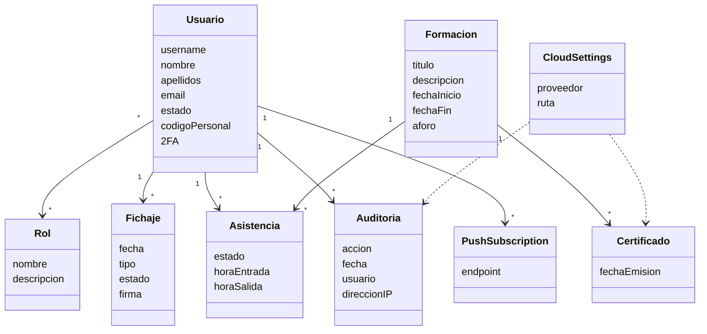

# Documento de análisis de requisitos del sistema

**Asignatura:** Diseño y Pruebas (Grado en Ingeniería del Software, Universidad de Sevilla)  
**Curso académico:** 2025/2026  
**Grupo/Equipo:** <!-- Completar -->  
**Nombre del proyecto:** Distribution Academy – Smart Check-in System  
**Repositorio:** https://github.com/jfpaardoo/smart-checkin-system  
**Integrantes (máx. 6):** Juan Felipe Pardo Carrillo

---

# Introducción

## Descripción general

Distribution Academy – Smart Check-in System es una plataforma web destinada a digitalizar el control de asistencia y la gestión de acciones formativas de los empleados de la empresa. El sistema sustituye los procesos manuales de fichaje por un mecanismo seguro basado en códigos QR dinámicos y autenticación temporal mediante algoritmos TOTP, reduciendo el fraude asociado al intercambio de credenciales y mejorando la trazabilidad de la actividad de los empleados.

La aplicación se compone de un backend desarrollado con Spring Boot, responsable de la lógica de negocio, autenticación, persistencia de datos y exposición de una API REST, y de un frontend implementado en React como Progressive Web Application (PWA), optimizado para su uso tanto en equipos de escritorio como en dispositivos móviles utilizados en entornos industriales.

Además del control horario, el sistema incorpora un módulo completo de gestión de formaciones corporativas, permitiendo registrar la asistencia de los empleados, generar certificados, consultar estadísticas e integrar la documentación con servicios de almacenamiento en la nube.

## Objetivos

Los principales objetivos del sistema son:

- Digitalizar el proceso de fichaje de empleados.
- Evitar el fraude mediante códigos QR temporales y validación TOTP.
- Centralizar la gestión de usuarios y permisos.
- Gestionar acciones formativas corporativas.
- Registrar auditorías de operaciones sensibles.
- Facilitar la explotación de datos mediante paneles analíticos.
- Exportar información para su integración con herramientas de RRHH.
- Mejorar la experiencia de uso mediante una PWA instalable.

## Valor aportado

La implantación del sistema aporta las siguientes ventajas:

- Eliminación del registro manual de asistencia.
- Reducción del tiempo necesario para realizar el fichaje.
- Mayor seguridad frente a suplantaciones de identidad.
- Centralización de la información de empleados y formaciones.
- Obtención de indicadores en tiempo real.
- Integración con herramientas corporativas de almacenamiento.
- Facilita el cumplimiento de políticas internas de seguimiento y formación.

## Funcionamiento general

El flujo habitual de utilización del sistema es el siguiente:

1. El usuario inicia sesión mediante sus credenciales.
2. El sistema autentica al usuario y genera un token JWT.
3. El empleado accede al módulo de fichaje.
4. Se escanea un código QR temporal generado por el administrador.
5. El usuario introduce su código personal.
6. El backend valida el QR y el código utilizando algoritmos TOTP.
7. Se registra la entrada o salida correspondiente.
8. El sistema actualiza las estadísticas y registra la operación en la auditoría.
9. Si el usuario participa en una formación, podrá registrar igualmente su asistencia y descargar posteriormente el certificado correspondiente.

---

# Tipos de Usuarios / Roles

## Administrador

Usuario responsable de la administración global del sistema.

Entre sus responsabilidades se encuentran:

- Gestión de usuarios.
- Aprobación de nuevos registros.
- Administración de roles.
- Creación y mantenimiento de formaciones.
- Generación de códigos QR.
- Consulta de auditorías.
- Exportación de informes.
- Configuración de almacenamiento en la nube.
- Supervisión de estadísticas e indicadores.

---

## Empleado

Usuario que utiliza la plataforma para registrar su jornada laboral y participar en acciones formativas.

Sus principales funcionalidades son:

- Iniciar sesión.
- Modificar su perfil.
- Cambiar contraseña.
- Activar autenticación de doble factor.
- Escanear códigos QR.
- Registrar entradas y salidas.
- Consultar su historial.
- Consultar formaciones.
- Descargar certificados.

---

## Responsable de Recursos Humanos

Perfil encargado del seguimiento de la actividad de los empleados.

Puede:

- Consultar asistencia.
- Gestionar acciones formativas.
- Obtener estadísticas.
- Exportar informes.
- Consultar certificados.
- Supervisar el cumplimiento formativo.

---

# Historias de Usuario

Las siguientes historias de usuario representan las funcionalidades identificadas durante el análisis del repositorio. Cada una de ellas se encuentra asociada a uno o varios módulos implementados en el sistema.

## HU-01: Inicio de sesión

| Campo | Descripción |
|------|-------------|
| **Descripción** | Como empleado quiero iniciar sesión mediante mis credenciales para acceder al sistema de control horario y formación. |
| **Mockup** | Pantalla de autenticación con usuario, contraseña y acceso al segundo factor cuando esté habilitado. |
| **Interacción** | El usuario introduce sus credenciales, el sistema las valida y genera un token JWT. Si el usuario tiene activado TOTP, deberá introducir el código temporal antes de acceder a la aplicación. |

---

## HU-02: Registro de empleado

| Campo | Descripción |
|------|-------------|
| **Descripción** | Como nuevo empleado quiero solicitar una cuenta para poder utilizar la plataforma. |
| **Mockup** | Formulario de alta de usuario. |
| **Interacción** | El usuario completa el formulario de registro. La cuenta queda en estado pendiente hasta que un administrador la apruebe. |

---

## HU-03: Aprobar usuarios

| Campo | Descripción |
|------|-------------|
| **Descripción** | Como administrador quiero aprobar solicitudes pendientes para permitir el acceso de nuevos empleados. |
| **Mockup** | Tabla con usuarios pendientes y acciones Aprobar/Rechazar. |
| **Interacción** | El administrador revisa la solicitud y decide aprobar o rechazar el registro. |

---

## HU-04: Cambiar contraseña

| Campo | Descripción |
|------|-------------|
| **Descripción** | Como usuario autenticado quiero cambiar mi contraseña para mantener la seguridad de mi cuenta. |
| **Mockup** | Formulario con contraseña actual y nueva contraseña. |
| **Interacción** | El sistema valida la contraseña actual antes de guardar la nueva contraseña cifrada. |

---

## HU-05: Activar autenticación en dos pasos

| Campo | Descripción |
|------|-------------|
| **Descripción** | Como usuario quiero activar el doble factor de autenticación para aumentar la seguridad de mi cuenta. |
| **Mockup** | Pantalla con código QR y campo para verificar el código TOTP. |
| **Interacción** | El sistema genera un secreto TOTP, muestra un QR y solicita un código de verificación para completar la activación. |

---

## HU-06: Cerrar sesión

| Campo | Descripción |
|------|-------------|
| **Descripción** | Como usuario autenticado quiero cerrar mi sesión para impedir accesos no autorizados desde el dispositivo que estoy utilizando. |
| **Mockup** | Opción "Cerrar sesión" disponible en el menú principal del usuario. |
| **Interacción** | El usuario selecciona la opción de cierre de sesión. El sistema invalida el JWT, elimina la información almacenada localmente y redirige a la pantalla de autenticación. |

---

## HU-07: Consultar perfil personal

| Campo | Descripción |
|------|-------------|
| **Descripción** | Como empleado quiero consultar mi perfil para verificar que mis datos personales son correctos. |
| **Mockup** | Pantalla de perfil con información personal y opciones de edición. |
| **Interacción** | El usuario accede al apartado "Mi Perfil", donde visualiza toda la información registrada en el sistema. |

---

## HU-08: Editar perfil

| Campo | Descripción |
|------|-------------|
| **Descripción** | Como empleado quiero actualizar determinados datos de mi perfil para mantener mi información actualizada. |
| **Mockup** | Formulario editable con los datos autorizados. |
| **Interacción** | El usuario modifica la información permitida y guarda los cambios. El sistema valida los datos antes de almacenarlos. |

---

## HU-09: Consultar historial de fichajes

| Campo | Descripción |
|------|-------------|
| **Descripción** | Como empleado quiero consultar mi historial de entradas y salidas para revisar mi jornada laboral. |
| **Mockup** | Tabla cronológica con filtros por fecha y estado. |
| **Interacción** | El usuario selecciona un intervalo temporal y el sistema muestra todos los registros almacenados correspondientes a dicho periodo. |

---

## HU-10: Escanear código QR

| Campo | Descripción |
|------|-------------|
| **Descripción** | Como empleado quiero escanear un código QR para iniciar el proceso de fichaje. |
| **Mockup** | Vista de cámara integrada en la aplicación. |
| **Interacción** | El usuario concede permiso para utilizar la cámara y escanea el código QR mostrado por la organización. |

---

## HU-11: Introducir código personal

| Campo | Descripción |
|------|-------------|
| **Descripción** | Como empleado quiero introducir mi código personal para confirmar mi identidad durante el fichaje. |
| **Mockup** | Campo numérico mostrado tras la lectura del QR. |
| **Interacción** | El sistema solicita el código personal y valida conjuntamente el QR y el código introducido. |

---

## HU-12: Registrar entrada

| Campo | Descripción |
|------|-------------|
| **Descripción** | Como empleado quiero registrar mi entrada para comenzar oficialmente mi jornada laboral. |
| **Mockup** | Confirmación del fichaje con fecha y hora registradas. |
| **Interacción** | Tras validar QR y código personal, el sistema almacena un registro de entrada y actualiza el estado del empleado. |

---

## HU-13: Registrar salida

| Campo | Descripción |
|------|-------------|
| **Descripción** | Como empleado quiero registrar mi salida para finalizar mi jornada laboral. |
| **Mockup** | Pantalla de confirmación de salida. |
| **Interacción** | El sistema valida la operación y registra la hora de finalización de la jornada. |

---

## HU-14: Firmar digitalmente una salida

| Campo | Descripción |
|------|-------------|
| **Descripción** | Como empleado quiero firmar digitalmente determinadas operaciones para confirmar su autenticidad. |
| **Mockup** | Lienzo para capturar la firma manuscrita. |
| **Interacción** | El usuario realiza su firma mediante el dispositivo táctil y el sistema la almacena asociada al registro correspondiente. |

---

## HU-15: Consultar estado actual

| Campo | Descripción |
|------|-------------|
| **Descripción** | Como empleado quiero conocer si actualmente me encuentro dentro o fuera de mi jornada laboral para evitar errores de fichaje. |
| **Mockup** | Indicador visual de estado en el panel principal. |
| **Interacción** | El sistema consulta el último registro válido del usuario y muestra su estado actual. |

---

## HU-16: Crear formación

| Campo | Descripción |
|------|-------------|
| **Descripción** | Como administrador quiero crear nuevas acciones formativas para organizar la formación de los empleados. |
| **Mockup** | Formulario de creación de formación. |
| **Interacción** | El administrador introduce la información de la formación y el sistema valida los datos antes de almacenarlos. |

---

## HU-17: Modificar formación

| Campo | Descripción |
|------|-------------|
| **Descripción** | Como administrador quiero editar una formación existente para actualizar su información. |
| **Mockup** | Formulario de edición con los datos actuales. |
| **Interacción** | El administrador modifica la información necesaria y guarda los cambios realizados. |

---

## HU-18: Eliminar formación

| Campo | Descripción |
|------|-------------|
| **Descripción** | Como administrador quiero eliminar una formación cuando deje de ser necesaria. |
| **Mockup** | Diálogo de confirmación de eliminación. |
| **Interacción** | El sistema solicita confirmación antes de eliminar definitivamente la formación. |

---

## HU-19: Consultar catálogo de formaciones

| Campo | Descripción |
|------|-------------|
| **Descripción** | Como empleado quiero consultar las formaciones disponibles para conocer la oferta formativa existente. |
| **Mockup** | Listado de cursos con filtros y buscador. |
| **Interacción** | El usuario navega por el catálogo y consulta el detalle de cada formación disponible. |

---

## HU-20: Inscribirse en una formación

| Campo | Descripción |
|------|-------------|
| **Descripción** | Como empleado quiero inscribirme en una formación para participar en ella. |
| **Mockup** | Botón de inscripción en la ficha de la formación. |
| **Interacción** | El sistema registra la inscripción y actualiza el número de plazas disponibles. |

---

## HU-21: Registrar asistencia a una formación

| Campo | Descripción |
|------|-------------|
| **Descripción** | Como empleado quiero registrar mi asistencia para que quede constancia de mi participación. |
| **Mockup** | Confirmación de asistencia desde la formación. |
| **Interacción** | El sistema registra la asistencia y la vincula con el usuario y la formación correspondiente. |

---

## HU-22: Descargar certificado

| Campo | Descripción |
|------|-------------|
| **Descripción** | Como empleado quiero descargar un certificado de una formación finalizada para acreditar mi participación. |
| **Mockup** | Botón de descarga disponible en el historial de formaciones completadas. |
| **Interacción** | El sistema genera el certificado y permite descargarlo en formato PDF. |

---

## HU-23: Consultar asistentes de una formación

| Campo | Descripción |
|------|-------------|
| **Descripción** | Como administrador quiero consultar el listado de asistentes de una formación para controlar la participación de los empleados. |
| **Mockup** | Tabla con asistentes, estado y porcentaje de asistencia. |
| **Interacción** | El administrador accede a una formación y visualiza todos los empleados inscritos y su estado de participación. |

---

## HU-24: Gestionar usuarios

| Campo | Descripción |
|------|-------------|
| **Descripción** | Como administrador quiero gestionar los usuarios registrados para mantener actualizada la información del sistema. |
| **Mockup** | Panel administrativo con listado de usuarios y acciones CRUD. |
| **Interacción** | El administrador puede buscar, crear, editar, suspender o eliminar usuarios desde una única interfaz. |

---

## HU-25: Gestionar roles

| Campo | Descripción |
|------|-------------|
| **Descripción** | Como administrador quiero asignar y modificar los roles de los usuarios para controlar el acceso a las funcionalidades disponibles. |
| **Mockup** | Selector de roles asociado a cada usuario. |
| **Interacción** | El administrador modifica el rol del usuario y el sistema actualiza automáticamente sus permisos efectivos. |

---

## HU-26: Consultar auditoría

| Campo | Descripción |
|------|-------------|
| **Descripción** | Como administrador quiero consultar los registros de auditoría para supervisar todas las operaciones relevantes realizadas en el sistema. |
| **Mockup** | Tabla de auditoría con filtros por usuario, fecha, módulo y tipo de operación. |
| **Interacción** | El administrador aplica filtros y consulta el detalle completo de cada evento registrado. |

---

## HU-27: Consultar estadísticas

| Campo | Descripción |
|------|-------------|
| **Descripción** | Como administrador quiero visualizar estadísticas de utilización para facilitar la toma de decisiones. |
| **Mockup** | Dashboard con gráficos de asistencia, actividad y evolución temporal. |
| **Interacción** | El sistema calcula automáticamente los indicadores utilizando la información almacenada en la base de datos. |

---

## HU-28: Exportar informes

| Campo | Descripción |
|------|-------------|
| **Descripción** | Como administrador quiero exportar información para compartirla con el departamento de Recursos Humanos. |
| **Mockup** | Menú de exportación con selección de formato. |
| **Interacción** | El administrador selecciona los datos, el formato de salida y descarga el documento generado. |

---

## HU-29: Configurar almacenamiento en la nube

| Campo | Descripción |
|------|-------------|
| **Descripción** | Como administrador quiero configurar la integración con Microsoft OneDrive para almacenar automáticamente documentación generada por la aplicación. |
| **Mockup** | Pantalla de configuración cloud con estado de la conexión. |
| **Interacción** | El administrador introduce la configuración necesaria y el sistema verifica la conectividad antes de almacenarla. |

---

## HU-30: Gestionar copias de seguridad

| Campo | Descripción |
|------|-------------|
| **Descripción** | Como administrador quiero ejecutar copias de seguridad para garantizar la recuperación de la información. |
| **Mockup** | Panel de administración de copias de seguridad. |
| **Interacción** | El sistema genera una copia de la base de datos y registra la operación en la auditoría. |

---

## HU-31: Recibir notificaciones Push

| Campo | Descripción |
|------|-------------|
| **Descripción** | Como usuario quiero recibir notificaciones incluso cuando la aplicación no está abierta para conocer información importante. |
| **Mockup** | Diálogo de aceptación de notificaciones del navegador. |
| **Interacción** | El usuario acepta la suscripción y el sistema registra el endpoint asociado a su dispositivo. |

---

## HU-32: Cambiar idioma

| Campo | Descripción |
|------|-------------|
| **Descripción** | Como usuario quiero seleccionar el idioma de la interfaz para utilizar la aplicación en mi idioma preferido. |
| **Mockup** | Selector de idioma disponible desde el menú principal. |
| **Interacción** | El usuario selecciona un idioma y la interfaz actualiza inmediatamente todos los textos sin necesidad de reiniciar la aplicación. |

---

## HU-33: Instalar la aplicación

| Campo | Descripción |
|------|-------------|
| **Descripción** | Como usuario quiero instalar la aplicación como PWA para acceder más rápidamente desde mi dispositivo. |
| **Mockup** | Aviso de instalación de aplicación. |
| **Interacción** | El navegador muestra la opción de instalación y el usuario incorpora la aplicación a su dispositivo como si fuera una aplicación nativa. |

---

## HU-34: Consultar estadísticas personales

| Campo | Descripción |
|------|-------------|
| **Descripción** | Como empleado quiero consultar mis estadísticas personales para conocer mi evolución y cumplimiento horario. |
| **Mockup** | Panel personal con indicadores y gráficos. |
| **Interacción** | El sistema muestra resúmenes de horas trabajadas, asistencia y participación en formaciones. |

---

## HU-35: Generar código QR temporal

| Campo | Descripción |
|------|-------------|
| **Descripción** | Como administrador quiero generar un código QR temporal para que los empleados puedan registrar sus fichajes de forma segura. |
| **Mockup** | Pantalla de generación de QR con temporizador visible. |
| **Interacción** | El administrador genera el código y este permanece válido únicamente durante el intervalo temporal establecido. |

---

## HU-36: Consultar registros pendientes

| Campo | Descripción |
|------|-------------|
| **Descripción** | Como administrador quiero consultar operaciones pendientes de revisión para mantener la consistencia de la información registrada. |
| **Mockup** | Listado de incidencias pendientes. |
| **Interacción** | El administrador revisa las incidencias y toma las acciones oportunas. |

---

## HU-37: Buscar información

| Campo | Descripción |
|------|-------------|
| **Descripción** | Como administrador quiero localizar rápidamente usuarios, formaciones y registros utilizando filtros avanzados. |
| **Mockup** | Buscador global con filtros dinámicos. |
| **Interacción** | El sistema filtra la información conforme el usuario introduce criterios de búsqueda. |

---

## HU-38: Consultar actividad reciente

| Campo | Descripción |
|------|-------------|
| **Descripción** | Como administrador quiero visualizar las últimas operaciones realizadas para supervisar el funcionamiento del sistema. |
| **Mockup** | Panel de actividad reciente. |
| **Interacción** | El sistema muestra cronológicamente los eventos más recientes registrados por la auditoría. |

---

## HU-39: Gestionar preferencias personales

| Campo | Descripción |
|------|-------------|
| **Descripción** | Como usuario quiero configurar determinadas preferencias para adaptar la aplicación a mis necesidades. |
| **Mockup** | Pantalla de configuración del usuario. |
| **Interacción** | El usuario modifica sus preferencias y el sistema las conserva para futuras sesiones. |

---

## HU-40: Consultar panel principal

| Campo | Descripción |
|------|-------------|
| **Descripción** | Como usuario quiero acceder a un panel resumen para consultar rápidamente la información más relevante de mi actividad. |
| **Mockup** | Dashboard principal personalizado según el rol del usuario. |
| **Interacción** | Tras autenticarse, el sistema muestra un panel adaptado a los permisos del usuario con acceso directo a las funcionalidades más utilizadas. |

---

# Diagrama conceptual del sistema

Tras el análisis del dominio implementado en la aplicación se identifican las siguientes entidades principales:

- Usuario
- Rol
- Fichaje
- Formación
- Asistencia
- Certificado
- Auditoría
- Configuración Cloud
- Suscripción Push

El siguiente diagrama representa las relaciones conceptuales existentes entre ellas.

---

# Reglas de Negocio

Las reglas de negocio representan las restricciones funcionales que deben cumplirse para garantizar el correcto funcionamiento de la plataforma. Estas reglas se han obtenido a partir del análisis del dominio y serán refinadas durante el desarrollo conforme se complete la implementación de todos los módulos.

---

## RN-01. Un usuario debe estar aprobado para acceder al sistema

Únicamente los usuarios cuyo estado sea **ACTIVO** podrán autenticarse en la plataforma.

Los usuarios pendientes de aprobación o deshabilitados no podrán iniciar sesión.

---

## RN-02. El correo electrónico debe ser único

No podrán existir dos usuarios registrados con la misma dirección de correo electrónico.

Esta restricción garantiza la identificación inequívoca de cada empleado.

---

## RN-03. El nombre de usuario será único

Cada usuario dispondrá de un nombre de usuario exclusivo dentro del sistema.

---

## RN-04. Las contraseñas nunca se almacenarán en texto plano

Todas las contraseñas deberán almacenarse utilizando algoritmos de hash seguros.

---

## RN-05. El cambio de contraseña requerirá autenticación previa

Para modificar la contraseña será obligatorio introducir la contraseña actual.

---

## RN-06. Un usuario únicamente podrá modificar su propio perfil

Los usuarios no podrán modificar información perteneciente a otros empleados.

---

## RN-07. Los administradores podrán modificar cualquier usuario

Los administradores tendrán permisos para editar la información de cualquier cuenta registrada.

---

## RN-08. El código personal será único

Cada empleado tendrá asignado un único código personal utilizado durante el proceso de fichaje.

---

## RN-09. Los códigos QR tendrán un tiempo limitado de validez

Los códigos QR dejarán de ser válidos automáticamente una vez superado el intervalo temporal establecido.

---

## RN-10. No podrán utilizarse códigos QR caducados

El sistema rechazará cualquier intento de fichaje utilizando un código expirado.

---

## RN-11. El algoritmo TOTP validará la autenticidad del QR

El contenido del código QR deberá ser compatible con el algoritmo de generación temporal implementado por el sistema.

---

## RN-12. Cada fichaje deberá estar asociado a un único usuario

No podrán existir registros sin usuario asociado.

---

## RN-13. No podrán registrarse dos entradas consecutivas

Un empleado deberá registrar una salida antes de poder volver a registrar una nueva entrada.

---

## RN-14. No podrán registrarse dos salidas consecutivas

El sistema comprobará la secuencia lógica de los fichajes.

---

## RN-15. Toda salida deberá estar precedida por una entrada válida

No será posible finalizar una jornada que no haya sido iniciada previamente.

---

## RN-16. Todo fichaje registrará fecha y hora

La información temporal será obtenida desde el servidor para evitar manipulaciones.

---

## RN-17. Las operaciones críticas generarán un registro de auditoría

Las siguientes acciones quedarán registradas:

- autenticación;
- cambio de contraseña;
- creación de usuarios;
- modificación de usuarios;
- eliminación de usuarios;
- creación de formaciones;
- eliminación de formaciones;
- exportaciones;
- configuración del sistema.

---

## RN-18. La auditoría no podrá modificarse desde la interfaz

Los registros de auditoría únicamente podrán consultarse.

---

## RN-19. Los certificados únicamente podrán emitirse tras completar la formación

No podrán descargarse certificados de acciones formativas incompletas.

---

## RN-20. Toda formación tendrá un responsable

Cada acción formativa estará asociada a un usuario responsable de su gestión.

---

## RN-21. Una formación tendrá una capacidad máxima

No podrán admitirse más asistentes que plazas disponibles.

---

## RN-22. Los empleados únicamente podrán inscribirse una vez

No será posible duplicar la inscripción de un mismo empleado en la misma formación.

---

## RN-23. Las estadísticas utilizarán únicamente datos válidos

Los registros anulados o inconsistentes no participarán en el cálculo de indicadores.

---

## RN-24. Las exportaciones requerirán permisos administrativos

Únicamente los usuarios autorizados podrán generar informes.

---

## RN-25. Toda notificación deberá estar asociada a una suscripción válida

El sistema verificará que el usuario mantiene una suscripción Push activa.

---

## RN-26. Los documentos almacenados en la nube deberán asociarse a un recurso existente

No podrán almacenarse documentos huérfanos.

---

## RN-27. Los JWT expirados serán rechazados

Toda petición realizada con un token expirado será respondida con un error de autenticación.

---

## RN-28. El cierre de sesión invalidará el JWT

Un token invalidado no podrá reutilizarse posteriormente.

---

## RN-29. El sistema conservará la integridad referencial

No podrán existir registros asociados a usuarios inexistentes.

---

## RN-30. Todas las comunicaciones deberán realizarse mediante conexiones seguras

En producción todas las comunicaciones deberán realizarse utilizando HTTPS.

---

# Suposiciones del Sistema

Durante el análisis se han identificado las siguientes hipótesis de funcionamiento:

- Todos los empleados disponen de credenciales personales.
- Los dispositivos utilizados permiten acceder mediante navegador web moderno.
- Los administradores disponen de permisos suficientes para gestionar la información.
- La organización dispone de conexión permanente con el servidor.
- Los empleados poseen acceso al código QR mostrado durante el proceso de fichaje.

---

# Restricciones del Sistema

## Restricciones tecnológicas

La implementación estará basada en las siguientes tecnologías:

- Java 21
- Spring Boot
- Spring Security
- Spring Data JPA
- PostgreSQL
- React
- Docker
- Maven

---

## Restricciones de seguridad

La plataforma deberá cumplir las siguientes restricciones:

- Autenticación mediante JWT.
- Contraseñas cifradas.
- Control de acceso basado en roles.
- Protección frente a accesos no autorizados.
- Registro de auditoría.
- Validación de datos de entrada.

---

## Restricciones legales

La plataforma deberá respetar el Reglamento General de Protección de Datos (RGPD), garantizando:

- confidencialidad;
- integridad;
- disponibilidad;
- derecho de rectificación;
- derecho de supresión;
- protección de datos personales.

---

## Restricciones operativas

- El sistema requiere conexión con el servidor para validar los fichajes.
- Los códigos QR tienen un periodo de validez limitado.
- El usuario deberá disponer de un dispositivo con cámara para utilizar el fichaje mediante QR.
- La autenticación en dos pasos requiere una aplicación compatible con TOTP.

---

# Requisitos No Funcionales

## RNF-01 Seguridad

El sistema garantizará la confidencialidad e integridad de la información almacenada.

---

## RNF-02 Disponibilidad

La plataforma deberá permanecer disponible durante el horario laboral.

---

## RNF-03 Escalabilidad

La arquitectura permitirá incrementar el número de usuarios sin modificar el diseño general del sistema.

---

## RNF-04 Mantenibilidad

El software estará organizado en módulos independientes siguiendo una arquitectura por capas.

---

## RNF-05 Usabilidad

La interfaz deberá ser intuitiva y minimizar el número de pasos necesarios para realizar un fichaje.

---

## RNF-06 Rendimiento

Las operaciones habituales deberán completarse en tiempos compatibles con un uso interactivo.

---

## RNF-07 Compatibilidad

La aplicación deberá ejecutarse correctamente en los principales navegadores modernos.

---

## RNF-08 Portabilidad

El sistema podrá desplegarse mediante contenedores Docker.

---

## RNF-09 Accesibilidad

La interfaz deberá ser compatible con diferentes resoluciones y dispositivos.

---

## RNF-10 Internacionalización

La aplicación permitirá seleccionar distintos idiomas sin reiniciar la sesión.

---

# Reglas de Negocio

Las reglas de negocio representan las restricciones funcionales que deben cumplirse para garantizar el correcto funcionamiento de la plataforma. Estas reglas se han obtenido a partir del análisis del dominio y serán refinadas durante el desarrollo conforme se complete la implementación de todos los módulos.

---

## RN-01. Un usuario debe estar aprobado para acceder al sistema

Únicamente los usuarios cuyo estado sea **ACTIVO** podrán autenticarse en la plataforma.

Los usuarios pendientes de aprobación o deshabilitados no podrán iniciar sesión.

---

## RN-02. El correo electrónico debe ser único

No podrán existir dos usuarios registrados con la misma dirección de correo electrónico.

Esta restricción garantiza la identificación inequívoca de cada empleado.

---

## RN-03. El nombre de usuario será único

Cada usuario dispondrá de un nombre de usuario exclusivo dentro del sistema.

---

## RN-04. Las contraseñas nunca se almacenarán en texto plano

Todas las contraseñas deberán almacenarse utilizando algoritmos de hash seguros.

---

## RN-05. El cambio de contraseña requerirá autenticación previa

Para modificar la contraseña será obligatorio introducir la contraseña actual.

---

## RN-06. Un usuario únicamente podrá modificar su propio perfil

Los usuarios no podrán modificar información perteneciente a otros empleados.

---

## RN-07. Los administradores podrán modificar cualquier usuario

Los administradores tendrán permisos para editar la información de cualquier cuenta registrada.

---

## RN-08. El código personal será único

Cada empleado tendrá asignado un único código personal utilizado durante el proceso de fichaje.

---

## RN-09. Los códigos QR tendrán un tiempo limitado de validez

Los códigos QR dejarán de ser válidos automáticamente una vez superado el intervalo temporal establecido.

---

## RN-10. No podrán utilizarse códigos QR caducados

El sistema rechazará cualquier intento de fichaje utilizando un código expirado.

---

## RN-11. El algoritmo TOTP validará la autenticidad del QR

El contenido del código QR deberá ser compatible con el algoritmo de generación temporal implementado por el sistema.

---

## RN-12. Cada fichaje deberá estar asociado a un único usuario

No podrán existir registros sin usuario asociado.

---

## RN-13. No podrán registrarse dos entradas consecutivas

Un empleado deberá registrar una salida antes de poder volver a registrar una nueva entrada.

---

## RN-14. No podrán registrarse dos salidas consecutivas

El sistema comprobará la secuencia lógica de los fichajes.

---

## RN-15. Toda salida deberá estar precedida por una entrada válida

No será posible finalizar una jornada que no haya sido iniciada previamente.

---

## RN-16. Todo fichaje registrará fecha y hora

La información temporal será obtenida desde el servidor para evitar manipulaciones.

---

## RN-17. Las operaciones críticas generarán un registro de auditoría

Las siguientes acciones quedarán registradas:

- autenticación;
- cambio de contraseña;
- creación de usuarios;
- modificación de usuarios;
- eliminación de usuarios;
- creación de formaciones;
- eliminación de formaciones;
- exportaciones;
- configuración del sistema.

---

## RN-18. La auditoría no podrá modificarse desde la interfaz

Los registros de auditoría únicamente podrán consultarse.

---

## RN-19. Los certificados únicamente podrán emitirse tras completar la formación

No podrán descargarse certificados de acciones formativas incompletas.

---

## RN-20. Toda formación tendrá un responsable

Cada acción formativa estará asociada a un usuario responsable de su gestión.

---

## RN-21. Una formación tendrá una capacidad máxima

No podrán admitirse más asistentes que plazas disponibles.

---

## RN-22. Los empleados únicamente podrán inscribirse una vez

No será posible duplicar la inscripción de un mismo empleado en la misma formación.

---

## RN-23. Las estadísticas utilizarán únicamente datos válidos

Los registros anulados o inconsistentes no participarán en el cálculo de indicadores.

---

## RN-24. Las exportaciones requerirán permisos administrativos

Únicamente los usuarios autorizados podrán generar informes.

---

## RN-25. Toda notificación deberá estar asociada a una suscripción válida

El sistema verificará que el usuario mantiene una suscripción Push activa.

---

## RN-26. Los documentos almacenados en la nube deberán asociarse a un recurso existente

No podrán almacenarse documentos huérfanos.

---

## RN-27. Los JWT expirados serán rechazados

Toda petición realizada con un token expirado será respondida con un error de autenticación.

---

## RN-28. El cierre de sesión invalidará el JWT

Un token invalidado no podrá reutilizarse posteriormente.

---

## RN-29. El sistema conservará la integridad referencial

No podrán existir registros asociados a usuarios inexistentes.

---

## RN-30. Todas las comunicaciones deberán realizarse mediante conexiones seguras

En producción todas las comunicaciones deberán realizarse utilizando HTTPS.

---

# Suposiciones del Sistema

Durante el análisis se han identificado las siguientes hipótesis de funcionamiento:

- Todos los empleados disponen de credenciales personales.
- Los dispositivos utilizados permiten acceder mediante navegador web moderno.
- Los administradores disponen de permisos suficientes para gestionar la información.
- La organización dispone de conexión permanente con el servidor.
- Los empleados poseen acceso al código QR mostrado durante el proceso de fichaje.

---

# Restricciones del Sistema

## Restricciones tecnológicas

La implementación estará basada en las siguientes tecnologías:

- Java 21
- Spring Boot
- Spring Security
- Spring Data JPA
- PostgreSQL
- React
- Docker
- Maven

---

## Restricciones de seguridad

La plataforma deberá cumplir las siguientes restricciones:

- Autenticación mediante JWT.
- Contraseñas cifradas.
- Control de acceso basado en roles.
- Protección frente a accesos no autorizados.
- Registro de auditoría.
- Validación de datos de entrada.

---

## Restricciones legales

La plataforma deberá respetar el Reglamento General de Protección de Datos (RGPD), garantizando:

- confidencialidad;
- integridad;
- disponibilidad;
- derecho de rectificación;
- derecho de supresión;
- protección de datos personales.

---

## Restricciones operativas

- El sistema requiere conexión con el servidor para validar los fichajes.
- Los códigos QR tienen un periodo de validez limitado.
- El usuario deberá disponer de un dispositivo con cámara para utilizar el fichaje mediante QR.
- La autenticación en dos pasos requiere una aplicación compatible con TOTP.

---

# Requisitos No Funcionales

## RNF-01 Seguridad

El sistema garantizará la confidencialidad e integridad de la información almacenada.

---

## RNF-02 Disponibilidad

La plataforma deberá permanecer disponible durante el horario laboral.

---

## RNF-03 Escalabilidad

La arquitectura permitirá incrementar el número de usuarios sin modificar el diseño general del sistema.

---

## RNF-04 Mantenibilidad

El software estará organizado en módulos independientes siguiendo una arquitectura por capas.

---

## RNF-05 Usabilidad

La interfaz deberá ser intuitiva y minimizar el número de pasos necesarios para realizar un fichaje.

---

## RNF-06 Rendimiento

Las operaciones habituales deberán completarse en tiempos compatibles con un uso interactivo.

---

## RNF-07 Compatibilidad

La aplicación deberá ejecutarse correctamente en los principales navegadores modernos.

---

## RNF-08 Portabilidad

El sistema podrá desplegarse mediante contenedores Docker.

---

## RNF-09 Accesibilidad

La interfaz deberá ser compatible con diferentes resoluciones y dispositivos.

---

## RNF-10 Internacionalización

La aplicación permitirá seleccionar distintos idiomas sin reiniciar la sesión.

---

# Casos de Uso

Los siguientes casos de uso describen las principales interacciones entre los actores del sistema y la plataforma. Se han obtenido a partir del análisis del repositorio, identificando los distintos módulos funcionales implementados y las operaciones expuestas mediante la API REST y la interfaz de usuario.

---

# CU-01 Autenticarse en el sistema

## Actores

- Empleado
- Administrador
- Responsable de RRHH

## Objetivo

Permitir que un usuario autorizado acceda a la aplicación.

## Precondiciones

- El usuario debe estar registrado.
- La cuenta debe encontrarse activa.
- El usuario dispone de credenciales válidas.

## Flujo principal

1. El usuario accede a la pantalla de autenticación.
2. Introduce usuario y contraseña.
3. El sistema valida las credenciales.
4. Si el usuario tiene habilitado el segundo factor, solicita un código TOTP.
5. El sistema genera un JWT.
6. El usuario accede al panel principal.

## Flujos alternativos

### A1. Credenciales incorrectas

El sistema muestra un mensaje indicando que la autenticación ha fallado.

### A2. Usuario pendiente de aprobación

El sistema impide el acceso e informa del estado de la cuenta.

### A3. Código TOTP inválido

El acceso queda denegado.

## Postcondiciones

- El usuario dispone de una sesión autenticada.
- Se registra la operación en la auditoría.

---

# CU-02 Registrar entrada

## Actores

- Empleado

## Objetivo

Registrar el inicio de la jornada laboral.

## Precondiciones

- Usuario autenticado.
- Código QR vigente.
- Código personal válido.

## Flujo principal

1. El usuario selecciona "Registrar entrada".
2. Escanea el código QR.
3. Introduce su código personal.
4. El sistema valida ambas credenciales.
5. Se crea un registro de entrada.
6. El estado del usuario pasa a "Trabajando".

## Flujos alternativos

### A1. QR caducado

La operación se cancela.

### A2. Código personal incorrecto

El sistema rechaza el fichaje.

### A3. Ya existe una entrada abierta

No se permite registrar otra entrada.

## Postcondiciones

- Entrada almacenada.
- Auditoría actualizada.

---

# CU-03 Registrar salida

## Actores

- Empleado

## Objetivo

Finalizar la jornada laboral.

## Flujo principal

1. El usuario selecciona "Registrar salida".
2. Escanea el QR.
3. Introduce su código personal.
4. Firma digitalmente si procede.
5. El sistema registra la salida.

## Postcondiciones

- Jornada finalizada.
- Historial actualizado.

---

# CU-04 Gestionar usuarios

## Actores

- Administrador

## Objetivo

Administrar la información de usuarios.

## Flujo principal

1. Accede al panel de administración.
2. Consulta el listado.
3. Busca un usuario.
4. Crea, modifica o elimina información.
5. Guarda los cambios.

## Postcondiciones

- Información actualizada.
- Registro de auditoría generado.

---

# CU-05 Aprobar usuarios

## Actores

- Administrador

## Objetivo

Autorizar nuevas cuentas registradas.

## Flujo principal

1. Consulta usuarios pendientes.
2. Selecciona una solicitud.
3. Revisa la información.
4. Aprueba o rechaza la solicitud.

---

# CU-06 Gestionar formaciones

## Actores

- Administrador
- Responsable RRHH

## Objetivo

Administrar las acciones formativas.

## Flujo principal

1. Crear formación.
2. Modificar datos.
3. Publicar formación.
4. Gestionar asistentes.
5. Finalizar formación.

---

# CU-07 Inscribirse en una formación

## Actores

- Empleado

## Objetivo

Participar en una acción formativa.

## Flujo principal

1. Consultar catálogo.
2. Seleccionar formación.
3. Confirmar inscripción.
4. El sistema registra la participación.

---

# CU-08 Descargar certificado

## Actores

- Empleado

## Objetivo

Obtener un certificado de asistencia.

## Precondición

La formación debe haberse completado correctamente.

---

# CU-09 Consultar estadísticas

## Actores

- Administrador
- RRHH

## Objetivo

Visualizar indicadores de utilización.

---

# CU-10 Exportar información

## Actores

- Administrador

## Objetivo

Generar informes PDF, Excel o CSV.

---

# CU-11 Consultar auditoría

## Actores

- Administrador

## Objetivo

Revisar las operaciones realizadas sobre la plataforma.

---

# CU-12 Configurar almacenamiento cloud

## Actores

- Administrador

## Objetivo

Configurar la integración con OneDrive para el almacenamiento automático de documentos.

---

# CU-13 Gestionar notificaciones

## Actores

- Administrador

## Objetivo

Enviar notificaciones Push a los usuarios suscritos.

---

# CU-14 Gestionar preferencias

## Actores

- Usuario

## Objetivo

Modificar idioma, configuración y preferencias personales.

---

# CU-15 Cerrar sesión

## Actores

- Todos los usuarios

## Objetivo

Finalizar la sesión de trabajo invalidando el token JWT.

---

# Requisitos Funcionales

Los siguientes requisitos funcionales se han identificado durante el análisis del repositorio y describen el comportamiento esperado del sistema.

## RF-01 Gestión de autenticación

El sistema permitirá autenticar usuarios mediante credenciales personales.

---

## RF-02 Gestión de sesiones

El sistema utilizará JWT para mantener la sesión autenticada.

---

## RF-03 Registro de usuarios

Permitirá registrar nuevas cuentas pendientes de aprobación.

---

## RF-04 Aprobación administrativa

Las cuentas deberán ser aprobadas por un administrador antes de acceder al sistema.

---

## RF-05 Gestión del doble factor

Los usuarios podrán activar y desactivar autenticación TOTP.

---

## RF-06 Gestión de perfiles

Cada usuario podrá consultar y actualizar la información autorizada de su perfil.

---

## RF-07 Cambio de contraseña

Los usuarios podrán modificar su contraseña autenticándose previamente.

---

## RF-08 Gestión de roles

Los administradores podrán asignar diferentes roles.

---

## RF-09 Gestión de permisos

Los permisos estarán determinados por el rol asignado.

---

## RF-10 Generación de códigos QR

El sistema generará códigos QR temporales para registrar fichajes.

---

## RF-11 Validación criptográfica del QR

El servidor validará que el QR recibido sea auténtico y no haya expirado.

---

## RF-12 Registro de entrada

El sistema permitirá registrar el inicio de la jornada laboral.

---

## RF-13 Registro de salida

El sistema permitirá registrar la finalización de la jornada laboral.

---

## RF-14 Validación de secuencia

No podrán registrarse dos entradas consecutivas ni dos salidas consecutivas.

---

## RF-15 Firma digital

El sistema permitirá almacenar firmas digitales asociadas al fichaje.

---

## RF-16 Consulta de historial

Los usuarios podrán consultar el historial completo de sus registros.

---

## RF-17 Gestión de formaciones

Los administradores podrán crear, editar y eliminar acciones formativas.

---

## RF-18 Gestión de inscripciones

Los empleados podrán inscribirse en formaciones disponibles.

---

## RF-19 Registro de asistencia

El sistema registrará la asistencia a las sesiones formativas.

---

## RF-20 Generación de certificados

Tras completar una formación el sistema permitirá generar certificados en formato PDF.

---

## RF-21 Gestión de asistentes

El sistema permitirá a los administradores consultar el listado completo de asistentes a cada acción formativa, incluyendo su estado de participación, asistencia registrada y certificado emitido.

---

## RF-22 Consulta del catálogo de formaciones

Los empleados podrán consultar todas las formaciones disponibles mediante un catálogo organizado, permitiendo acceder a la información detallada de cada una de ellas.

---

## RF-23 Gestión de certificados

El sistema almacenará los certificados generados y permitirá su descarga posterior por parte del empleado autorizado.

---

## RF-24 Auditoría automática

Toda operación considerada crítica será registrada automáticamente mediante el subsistema de auditoría.

Entre ellas se incluyen:

- Inicio y cierre de sesión.
- Creación, modificación y eliminación de usuarios.
- Gestión de formaciones.
- Cambios de permisos.
- Exportaciones.
- Configuración del sistema.
- Operaciones administrativas.

---

## RF-25 Consulta de auditoría

Los administradores podrán consultar el historial completo de auditoría utilizando filtros por:

- Usuario.
- Fecha.
- Tipo de operación.
- Módulo.
- Resultado de la operación.

---

## RF-26 Registro de errores

Las operaciones que produzcan errores deberán quedar registradas para facilitar su posterior análisis.

---

## RF-27 Dashboard administrativo

El sistema proporcionará un panel de control con indicadores de utilización y estado general de la plataforma.

---

## RF-28 Estadísticas de asistencia

La plataforma calculará automáticamente estadísticas relacionadas con:

- Entradas.
- Salidas.
- Horas trabajadas.
- Asistencia a formaciones.
- Participación por departamentos.

---

## RF-29 Estadísticas personales

Cada empleado podrá consultar indicadores relacionados exclusivamente con su propia actividad.

---

## RF-30 Estadísticas temporales

Será posible consultar estadísticas agrupadas por:

- Día.
- Semana.
- Mes.
- Año.

---

## RF-31 Exportación PDF

El sistema permitirá generar informes en formato PDF.

---

## RF-32 Exportación Excel

Los administradores podrán exportar información en formato Excel.

---

## RF-33 Exportación CSV

Los datos podrán descargarse en formato CSV para facilitar su integración con herramientas externas.

---

## RF-34 Configuración del almacenamiento cloud

La plataforma permitirá configurar el proveedor de almacenamiento utilizado para la gestión documental.

---

## RF-35 Integración con OneDrive

El sistema permitirá almacenar automáticamente certificados e informes en Microsoft OneDrive cuando la integración se encuentre habilitada.

---

## RF-36 Validación de la conexión cloud

Antes de utilizar el almacenamiento remoto, el sistema comprobará la conectividad con el servicio configurado.

---

## RF-37 Gestión de copias de seguridad

El sistema permitirá ejecutar procesos de copia de seguridad de la información almacenada.

---

## RF-38 Gestión de notificaciones Push

Los usuarios podrán registrar dispositivos compatibles para recibir notificaciones.

---

## RF-39 Envío de notificaciones

Los administradores podrán enviar notificaciones a usuarios individuales o grupos de usuarios.

---

## RF-40 Gestión de preferencias

Cada usuario podrá configurar sus preferencias personales dentro de la aplicación.

---

## RF-41 Cambio dinámico de idioma

La interfaz permitirá modificar el idioma sin necesidad de cerrar la sesión.

---

## RF-42 Persistencia del idioma

El idioma seleccionado permanecerá asociado al usuario para futuras sesiones.

---

## RF-43 Progressive Web App

La aplicación podrá instalarse como una Progressive Web Application compatible con dispositivos móviles y equipos de escritorio.

---

## RF-44 Funcionamiento adaptativo

La interfaz se adaptará automáticamente al tamaño de pantalla del dispositivo utilizado.

---

## RF-45 Gestión de permisos

El acceso a cada funcionalidad estará condicionado por los permisos asociados al rol del usuario.

---

## RF-46 Validación de datos

Toda la información introducida por los usuarios será validada antes de almacenarse.

---

## RF-47 Integridad referencial

La plataforma garantizará la coherencia entre todas las entidades almacenadas en la base de datos.

---

## RF-48 Gestión de incidencias

Las operaciones inconsistentes podrán marcarse para su revisión administrativa.

---

## RF-49 Programación de tareas

El sistema ejecutará automáticamente determinadas tareas programadas relacionadas con mantenimiento, estadísticas y gestión de información.

---

## RF-50 Gestión de configuraciones

Los administradores podrán modificar parámetros generales del sistema desde la interfaz administrativa.

---

## RF-51 Registro de actividad reciente

El panel administrativo mostrará las operaciones más recientes realizadas sobre la plataforma.

---

## RF-52 Búsqueda global

El sistema ofrecerá mecanismos de búsqueda sobre usuarios, formaciones y registros.

---

## RF-53 Filtrado avanzado

Las tablas permitirán aplicar múltiples filtros simultáneamente para localizar información.

---

## RF-54 Ordenación de resultados

Los listados podrán ordenarse utilizando distintos criterios.

---

## RF-55 Paginación

Las consultas con grandes volúmenes de información utilizarán paginación para mejorar el rendimiento.

---

## RF-56 Gestión documental

Los documentos asociados a formaciones y certificados podrán gestionarse desde la plataforma.

---

## RF-57 Configuración de seguridad

Los administradores podrán modificar determinados parámetros relacionados con la seguridad de la aplicación.

---

## RF-58 Monitorización

El sistema ofrecerá información sobre el estado general de los servicios disponibles.

---

## RF-59 Registro histórico

La información relevante permanecerá disponible para consultas históricas conforme a las políticas de conservación establecidas.

---

## RF-60 Arquitectura modular

Todas las funcionalidades estarán organizadas en módulos independientes que permitan facilitar la evolución y mantenimiento del sistema.

---

# Matriz de Trazabilidad

La matriz de trazabilidad relaciona los principales requisitos funcionales con las historias de usuario y los casos de uso definidos durante el análisis. Su objetivo es garantizar que cada funcionalidad implementada pueda vincularse con una necesidad concreta del sistema.

| Requisito | Historia(s) de Usuario | Caso(s) de Uso |
|-----------|------------------------|----------------|
| RF-01 | HU-01 | CU-01 |
| RF-02 | HU-01, HU-06 | CU-01, CU-15 |
| RF-03 | HU-02 | CU-01 |
| RF-04 | HU-03 | CU-05 |
| RF-05 | HU-05 | CU-01 |
| RF-06 | HU-07, HU-08 | CU-14 |
| RF-07 | HU-04 | CU-01 |
| RF-08 | HU-25 | CU-04 |
| RF-10 | HU-35 | CU-02 |
| RF-12 | HU-12 | CU-02 |
| RF-13 | HU-13 | CU-03 |
| RF-16 | HU-09 | CU-02, CU-03 |
| RF-17 | HU-16, HU-17, HU-18 | CU-06 |
| RF-18 | HU-20 | CU-07 |
| RF-20 | HU-22 | CU-08 |
| RF-24 | HU-26 | CU-11 |
| RF-27 | HU-27 | CU-09 |
| RF-31 | HU-28 | CU-10 |
| RF-35 | HU-29 | CU-12 |
| RF-38 | HU-31 | CU-13 |
| RF-41 | HU-32 | CU-14 |
| RF-43 | HU-33 | CU-14 |

---

# Modelo Conceptual del Dominio

Del análisis del repositorio se identifican los siguientes conceptos principales del dominio:

- Usuario
- Rol
- Permiso
- Sesión
- Token JWT
- Código QR
- Código TOTP
- Fichaje
- Formación
- Inscripción
- Asistencia
- Certificado
- Registro de Auditoría
- Configuración Cloud
- Suscripción Push
- Notificación
- Informe
- Estadística

Estos conceptos constituyen el núcleo funcional de la plataforma y servirán como base para el diseño lógico y físico del sistema en las siguientes fases del proyecto.

---

# Glosario

A continuación se recogen los principales términos utilizados a lo largo de este documento con el objetivo de facilitar su comprensión.

| Término | Definición |
|----------|------------|
| API REST | Interfaz que permite la comunicación entre el frontend y el backend mediante peticiones HTTP. |
| Asistencia | Registro que indica la participación de un empleado en una acción formativa. |
| Auditoría | Registro automático de las operaciones relevantes realizadas sobre el sistema. |
| Certificado | Documento emitido tras completar satisfactoriamente una formación. |
| Código personal | Código único asignado a cada empleado utilizado durante el proceso de fichaje. |
| Código QR | Código bidimensional generado temporalmente para registrar la asistencia del empleado. |
| Dashboard | Panel de indicadores y estadísticas mostrado al usuario. |
| Empleado | Usuario que utiliza el sistema para registrar su jornada laboral y gestionar sus formaciones. |
| Formación | Acción formativa ofrecida por la organización. |
| Historial | Conjunto de registros asociados a un usuario. |
| JWT | JSON Web Token utilizado para mantener la autenticación de los usuarios. |
| OneDrive | Servicio de almacenamiento en la nube utilizado para guardar documentación generada por la plataforma. |
| PWA | Progressive Web Application instalable en dispositivos móviles y ordenadores. |
| Registro de fichaje | Operación que indica la entrada o salida de un empleado. |
| Rol | Conjunto de permisos asignados a un usuario. |
| TOTP | Algoritmo de generación de contraseñas temporales utilizado para validar códigos QR y autenticación en dos pasos. |

---

# Análisis de Riesgos Funcionales

Durante el análisis se han identificado los siguientes riesgos funcionales y las medidas previstas para minimizar su impacto.

| Riesgo | Impacto | Mitigación |
|---------|---------|------------|
| Uso de un código QR caducado | Alto | Validación temporal del código antes de registrar el fichaje. |
| Suplantación de identidad | Muy alto | Código personal, autenticación, control de roles y validación TOTP. |
| Pérdida de conexión con el servidor | Medio | Mensajes informativos y reintento de la operación cuando sea posible. |
| Eliminación accidental de información | Alto | Confirmación de operaciones críticas y auditoría automática. |
| Acceso no autorizado | Muy alto | Autenticación mediante JWT, autorización basada en roles y registro de auditoría. |
| Modificación de registros históricos | Alto | Restricciones de acceso y conservación de la auditoría. |
| Duplicidad de registros | Medio | Validación de reglas de negocio antes de almacenar la información. |
| Generación de estadísticas incorrectas | Medio | Exclusión de registros inválidos y validación de integridad de los datos. |
| Saturación del sistema | Medio | Arquitectura escalable y paginación de consultas. |
| Pérdida de documentación | Alto | Integración con almacenamiento en la nube y copias de seguridad. |

---

# Criterios de Aceptación

Para considerar que el sistema satisface los requisitos especificados deberán cumplirse, como mínimo, los siguientes criterios:

- Todos los usuarios autorizados pueden autenticarse correctamente.
- Los usuarios sin permisos no pueden acceder a funcionalidades restringidas.
- Los códigos QR únicamente son válidos durante su periodo de vigencia.
- No es posible registrar secuencias de fichajes inconsistentes.
- La generación de certificados únicamente se realiza para formaciones completadas.
- Toda operación administrativa genera un registro de auditoría.
- Las estadísticas reflejan correctamente la información almacenada.
- Las exportaciones contienen información consistente con la base de datos.
- Las copias de seguridad pueden ejecutarse correctamente.
- La interfaz responde correctamente en dispositivos móviles y de escritorio.

---

# Dependencias Externas

La plataforma depende de diferentes tecnologías y servicios para ofrecer todas sus funcionalidades.

## Frameworks

- Spring Boot
- Spring Security
- Spring Data JPA
- React
- Maven

## Base de datos

- PostgreSQL

## Contenedores

- Docker
- Docker Compose

## Herramientas de desarrollo

- Git
- GitHub
- GitHub Actions

## Servicios externos

- Microsoft OneDrive
- Navegadores compatibles con Progressive Web Apps
- Aplicaciones compatibles con autenticación TOTP

---

# Conclusiones

El análisis realizado permite concluir que Distribution Academy – Smart Check-in System constituye una plataforma orientada a la digitalización del control horario y la gestión de acciones formativas dentro del entorno corporativo.

La solución proporciona mecanismos de autenticación robustos, control de acceso basado en roles, registro seguro de asistencia mediante códigos QR dinámicos, auditoría de operaciones, generación de estadísticas, gestión documental e integración con servicios externos.

La arquitectura modular adoptada favorece la mantenibilidad y evolución del sistema, permitiendo incorporar nuevas funcionalidades con un impacto reducido sobre los módulos existentes.

La especificación de requisitos presentada en este documento servirá como referencia durante las fases posteriores de diseño, implementación y validación, garantizando la trazabilidad entre las necesidades identificadas y las funcionalidades finalmente desarrolladas.

---

# Referencias

- ISO/IEC/IEEE 29148:2018. *Systems and software engineering — Life cycle processes — Requirements engineering.*
- Sommerville, I. *Software Engineering*. Pearson.
- Spring Framework Documentation.
- Spring Boot Documentation.
- React Documentation.
- OWASP Application Security Verification Standard (ASVS).
- Reglamento (UE) 2016/679 del Parlamento Europeo y del Consejo (RGPD).

---