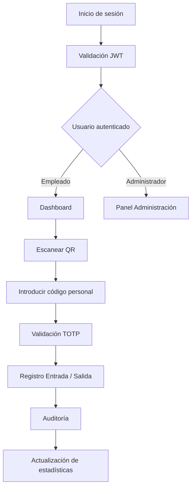
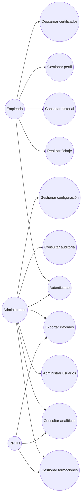
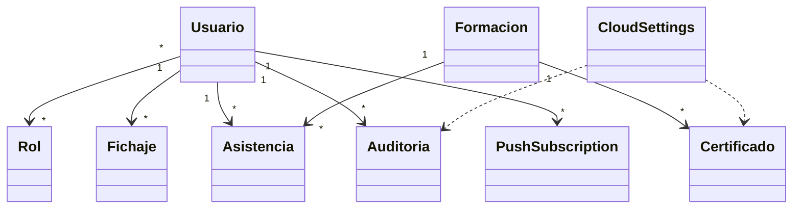

# Documento de Análisis de Requisitos del Sistema

**Asignatura:** Diseño y Pruebas (Grado en Ingeniería del Software, Universidad de Sevilla)

**Curso académico:** 2025/2026

**Nombre del proyecto:** BA Distribution Academy — Smart Check-in System

**Repositorio:** https://github.com/jfpaardoo/smart-checkin-system

**Autor:** Juan Felipe Pardo Carrillo

---

# 1. Introducción

## 1.1 Descripción general

BA Distribution Academy es una plataforma integral para la gestión del control de asistencia y la administración de formaciones corporativas desarrollada para BA Glass.

El sistema sustituye los procesos manuales de registro de presencia por una solución completamente digital, segura y auditable que permite registrar tanto la asistencia diaria de los empleados como su participación en acciones formativas internas.

La aplicación combina un frontend desarrollado con React 18, un backend basado en Spring Boot 3 y una base de datos PostgreSQL para proporcionar una plataforma moderna que integra autenticación segura mediante JWT, códigos QR dinámicos, validación criptográfica mediante TOTP, auditoría, analítica, notificaciones Push, exportación documental e integración con Microsoft OneDrive.

Gracias a su arquitectura desacoplada y a su diseño basado en servicios REST, el sistema puede desplegarse mediante Docker, utilizar almacenamiento cloud y escalar fácilmente para dar soporte a múltiples centros de trabajo.

---

## 1.2 Objetivos

Los objetivos principales del sistema son:

- Digitalizar completamente el proceso de control horario.
- Eliminar el fraude asociado al fichaje presencial mediante códigos QR temporales.
- Gestionar el ciclo completo de las formaciones corporativas.
- Centralizar la administración de empleados.
- Proporcionar métricas e indicadores de asistencia.
- Automatizar la generación de certificados e informes.
- Mantener un registro completo de auditoría.
- Cumplir los requisitos del Reglamento General de Protección de Datos (RGPD).

---

## 1.3 Valor aportado

La plataforma incorpora numerosas funcionalidades que aportan ventajas respecto a un sistema tradicional de control horario.

Entre ellas destacan:

- Autenticación segura mediante JWT.
- Doble factor de autenticación (2FA).
- Generación dinámica de códigos QR.
- Validación TOTP de un solo uso.
- Firma digital para determinadas operaciones.
- Gestión integral de formaciones.
- Exportación de informes PDF, Excel y CSV.
- Auditoría completa de operaciones.
- Integración con Microsoft OneDrive.
- Notificaciones Push.
- Progressive Web App (PWA).
- Analítica en tiempo real.
- Internacionalización en ocho idiomas.

---

# 2. Flujo general del sistema

---

# 3. Tipos de Usuarios / Roles

El sistema implementa un modelo de control de acceso basado en roles (RBAC, *Role-Based Access Control*), en el que cada usuario dispone únicamente de los permisos necesarios para realizar sus funciones.

La autenticación se realiza mediante JWT y, una vez validado el usuario, el sistema determina las operaciones permitidas según el rol asociado.

Durante el análisis del repositorio se identifican tres perfiles funcionales principales.

---

## 3.1 Administrador

El Administrador es el usuario con el mayor nivel de privilegios dentro del sistema.

Es responsable de la configuración global de la plataforma y de la supervisión del funcionamiento del sistema.

### Responsabilidades

- Gestionar usuarios.
- Aprobar solicitudes de registro.
- Suspender o eliminar cuentas.
- Gestionar roles.
- Crear, modificar y eliminar formaciones.
- Consultar estadísticas.
- Visualizar auditorías.
- Generar códigos QR dinámicos.
- Exportar informes.
- Configurar OneDrive.
- Gestionar copias de seguridad.
- Configurar parámetros del sistema.
- Gestionar certificados.
- Supervisar incidencias.

### Operaciones permitidas

- CRUD completo de usuarios.
- CRUD completo de formaciones.
- Consulta de todos los fichajes.
- Consulta de auditorías.
- Consulta de analíticas.
- Exportación de datos.
- Administración del almacenamiento cloud.
- Gestión de notificaciones.
- Gestión de parámetros de seguridad.

---

## 3.2 Empleado

Representa al personal de BA Glass que utiliza la plataforma durante su actividad diaria.

Es el usuario que realiza el proceso de fichaje y participa en las formaciones.

### Responsabilidades

- Acceder a la aplicación.
- Consultar su perfil.
- Modificar sus datos personales.
- Cambiar contraseña.
- Activar autenticación de doble factor.
- Realizar fichajes.
- Escanear códigos QR.
- Introducir código personal.
- Firmar salidas cuando sea necesario.
- Consultar sus formaciones.
- Asistir a cursos.
- Descargar certificados.
- Consultar su historial.

### Operaciones permitidas

- Login.
- Logout.
- Gestión de perfil.
- Fichaje.
- Firma digital.
- Consulta de asistencia.
- Consulta de certificados.
- Configuración de seguridad.

---

## 3.3 Responsable de Recursos Humanos

Aunque técnicamente comparte gran parte de las funcionalidades del administrador, el análisis funcional del sistema permite identificar un perfil orientado específicamente a la gestión del personal.

Sus funciones están relacionadas con el seguimiento de empleados y acciones formativas.

### Responsabilidades

- Seguimiento de asistencia.
- Gestión de formaciones.
- Consulta de indicadores.
- Exportación de informes.
- Emisión de certificados.
- Consulta de auditorías relacionadas con empleados.

---

## Resumen de permisos

| Funcionalidad | Administrador | RRHH | Empleado |
|---------------|:------------:|:----:|:--------:|
| Iniciar sesión | ✔ | ✔ | ✔ |
| Cambiar contraseña | ✔ | ✔ | ✔ |
| Activar 2FA | ✔ | ✔ | ✔ |
| Consultar perfil | ✔ | ✔ | ✔ |
| Modificar perfil | ✔ | ✔ | ✔ |
| Realizar fichaje | ✔ | ✔ | ✔ |
| Escanear QR | ✔ | ✔ | ✔ |
| Firma digital | ✔ | ✔ | ✔ |
| Consultar historial propio | ✔ | ✔ | ✔ |
| Consultar historial global | ✔ | ✔ | ✘ |
| Crear formaciones | ✔ | ✔ | ✘ |
| Editar formaciones | ✔ | ✔ | ✘ |
| Eliminar formaciones | ✔ | ✔ | ✘ |
| Gestionar usuarios | ✔ | ✘ | ✘ |
| Aprobar registros | ✔ | ✘ | ✘ |
| Consultar auditoría | ✔ | ✔ | ✘ |
| Exportar informes | ✔ | ✔ | ✘ |
| Configurar OneDrive | ✔ | ✘ | ✘ |
| Gestionar copias de seguridad | ✔ | ✘ | ✘ |
| Consultar analíticas | ✔ | ✔ | ✘ |

---

# 4. Requisitos Funcionales

Tras el análisis del repositorio se han identificado los siguientes requisitos funcionales implementados por el sistema.

## RF-01 Autenticación

El sistema permitirá a los usuarios autenticarse mediante nombre de usuario y contraseña.

### Prioridad

Alta

### Módulos implicados

- AuthController
- UserService
- JWT
- Frontend Login

---

## RF-02 Gestión de sesiones

El sistema mantendrá sesiones autenticadas mediante JSON Web Tokens.

El usuario podrá cerrar la sesión en cualquier momento, invalidándose el token correspondiente.

---

## RF-03 Registro de nuevos empleados

El sistema permitirá el registro de nuevos usuarios.

Las cuentas permanecerán en estado **PENDING** hasta ser aprobadas por un administrador.

---

## RF-04 Aprobación de usuarios

Los administradores podrán aprobar o rechazar solicitudes pendientes.

Una vez aprobado, el usuario pasará al estado **ACTIVE**.

---

## RF-05 Gestión de usuarios

Los administradores podrán:

- crear usuarios;
- modificar usuarios;
- suspender usuarios;
- eliminar usuarios;
- consultar información de usuarios.

---

## RF-06 Gestión de perfiles

Cada empleado podrá modificar su información personal.

Entre otros datos:

- nombre;
- apellidos;
- correo electrónico;
- contraseña.

---

## RF-07 Cambio de contraseña

El sistema permitirá modificar la contraseña previa validación de la contraseña actual.

---

## RF-08 Activación de doble factor

Los usuarios podrán activar la autenticación mediante TOTP.

El sistema generará un secreto criptográfico asociado al usuario.

---

## RF-09 Validación mediante 2FA

Cuando un usuario tenga activado el doble factor, el sistema solicitará un código TOTP válido antes de completar la autenticación.

---

## RF-10 Generación dinámica de QR

El sistema generará códigos QR temporales sincronizados mediante TOTP.

Cada código tendrá un periodo de validez limitado.

---

## RF-11 Escaneo del QR

El empleado podrá escanear el código QR utilizando la cámara de su dispositivo.

---

## RF-12 Fichaje mediante QR

Tras validar el QR y el código personal, el sistema registrará automáticamente la entrada o salida correspondiente.

---

## RF-13 Código personal

Cada empleado dispondrá de un código personal único utilizado como segundo factor durante el fichaje.

---

## RF-14 Firma digital

Cuando sea necesario registrar una salida, el sistema solicitará una firma manuscrita realizada sobre un lienzo digital.

La firma quedará almacenada junto al registro correspondiente.

---

## RF-15 Historial de fichajes

Cada empleado podrá consultar su historial completo de entradas y salidas.

---

## RF-16 Gestión de formaciones

Los administradores podrán:

- crear acciones formativas;
- modificarlas;
- eliminarlas;
- consultar asistentes;
- gestionar documentación asociada.

---

## RF-17 Asistencia a formaciones

Los empleados podrán registrar su asistencia a las formaciones disponibles.

---

## RF-18 Certificados

El sistema permitirá generar certificados asociados a las acciones formativas completadas.

---

## RF-19 Analítica

Los administradores podrán consultar indicadores de:

- asistencia;
- participación;
- actividad de usuarios;
- evolución temporal;
- estadísticas globales.

---

## RF-20 Auditoría

Todas las operaciones sensibles quedarán registradas en un sistema de auditoría.

Cada registro incluirá información suficiente para identificar:

- usuario;
- acción;
- fecha;
- dirección IP;
- detalles de la operación.

---

## RF-21 Exportaciones

El sistema permitirá exportar información en distintos formatos:

- PDF
- Excel
- CSV

---

## RF-22 Integración Cloud

La documentación generada podrá almacenarse automáticamente en Microsoft OneDrive.

---

## RF-23 Notificaciones Push

Los usuarios podrán recibir notificaciones incluso con la aplicación cerrada.

---

## RF-24 Internacionalización

Toda la interfaz permitirá cambiar dinámicamente entre los idiomas soportados.

---

## RF-25 Progressive Web App

La aplicación podrá instalarse como aplicación nativa desde dispositivos compatibles.

---

---

# 5. Historias de Usuario

Las siguientes historias de usuario se han obtenido a partir del análisis funcional del repositorio, la estructura de los módulos implementados, los controladores REST, el frontend React y las pruebas automatizadas del sistema.

Cada historia de usuario representa una funcionalidad existente dentro de la aplicación y servirá como base para la planificación de los distintos incrementos del proyecto.

---

# Épica 1. Autenticación y Gestión de Usuarios

---

## HU-01. Inicio de sesión

| Campo | Descripción |
|--------|-------------|
| **Como** | Empleado |
| **Quiero** | iniciar sesión utilizando mis credenciales |
| **Para** | acceder a las funcionalidades del sistema |

### Criterios de aceptación

- El usuario introduce usuario y contraseña.
- Las credenciales son validadas.
- Se genera un JWT.
- El usuario es redirigido al panel correspondiente.
- Si las credenciales son incorrectas se mostrará un mensaje de error.

### Prioridad

Muy Alta

### Módulos relacionados

- AuthController
- Login
- JWT
- SecurityConfiguration

---

## HU-02. Registro de empleado

| Campo | Descripción |
|--------|-------------|
| **Como** | Empleado |
| **Quiero** | solicitar una cuenta |
| **Para** | poder acceder posteriormente a la plataforma |

### Criterios de aceptación

- Se completa el formulario.
- Se valida la información.
- La cuenta queda en estado **PENDING**.
- El administrador será notificado.

---

## HU-03. Aprobar usuarios

| Campo | Descripción |
|--------|-------------|
| **Como** | Administrador |
| **Quiero** | aprobar solicitudes pendientes |
| **Para** | permitir el acceso de nuevos empleados |

### Criterios de aceptación

- Se muestran los usuarios pendientes.
- El administrador puede aprobar o rechazar.
- El usuario pasa a estado ACTIVE.

---

## HU-04. Cambiar contraseña

| Campo | Descripción |
|--------|-------------|
| **Como** | Usuario autenticado |
| **Quiero** | modificar mi contraseña |
| **Para** | aumentar la seguridad de mi cuenta |

### Criterios de aceptación

- Debe introducir la contraseña actual.
- La nueva contraseña debe cumplir las políticas definidas.
- El cambio queda registrado.

---

## HU-05. Activar doble factor

| Campo | Descripción |
|--------|-------------|
| **Como** | Usuario |
| **Quiero** | activar autenticación TOTP |
| **Para** | proteger mi cuenta |

### Criterios de aceptación

- El sistema genera un secreto.
- Se muestra un QR.
- El usuario verifica un código.
- El sistema activa el 2FA.

---

## HU-06. Cerrar sesión

| Campo | Descripción |
|--------|-------------|
| **Como** | Usuario |
| **Quiero** | cerrar mi sesión |
| **Para** | impedir accesos no autorizados |

### Criterios de aceptación

- El JWT queda invalidado.
- Se elimina del almacenamiento local.
- El usuario vuelve a la pantalla inicial.

---

# Épica 2. Gestión de Perfil

---

## HU-07. Consultar perfil

| Campo | Descripción |
|--------|-------------|
| **Como** | Empleado |
| **Quiero** | consultar mi información personal |
| **Para** | verificar que mis datos son correctos |

---

## HU-08. Modificar perfil

| Campo | Descripción |
|--------|-------------|
| **Como** | Empleado |
| **Quiero** | actualizar mis datos |
| **Para** | mantener la información actualizada |

---

## HU-09. Consultar historial

| Campo | Descripción |
|--------|-------------|
| **Como** | Empleado |
| **Quiero** | visualizar todos mis fichajes |
| **Para** | controlar mi jornada laboral |

---

# Épica 3. Control Horario

---

## HU-10. Escanear QR

| Campo | Descripción |
|--------|-------------|
| **Como** | Empleado |
| **Quiero** | escanear un código QR |
| **Para** | registrar mi entrada o salida |

### Criterios de aceptación

- El QR debe estar vigente.
- El QR debe ser válido.
- El lector utilizará la cámara del dispositivo.

---

## HU-11. Introducir código personal

| Campo | Descripción |
|--------|-------------|
| **Como** | Empleado |
| **Quiero** | introducir mi código personal |
| **Para** | validar mi identidad |

---

## HU-12. Registrar entrada

| Campo | Descripción |
|--------|-------------|
| **Como** | Empleado |
| **Quiero** | registrar una entrada |
| **Para** | comenzar mi jornada laboral |

---

## HU-13. Registrar salida

| Campo | Descripción |
|--------|-------------|
| **Como** | Empleado |
| **Quiero** | registrar una salida |
| **Para** | finalizar mi jornada laboral |

---

## HU-14. Firmar salida

| Campo | Descripción |
|--------|-------------|
| **Como** | Empleado |
| **Quiero** | firmar digitalmente la salida |
| **Para** | confirmar el registro realizado |

---

## HU-15. Consultar estado actual

| Campo | Descripción |
|--------|-------------|
| **Como** | Empleado |
| **Quiero** | conocer si actualmente estoy trabajando |
| **Para** | evitar errores de fichaje |

---

# Épica 4. Formaciones

---

## HU-16. Crear formación

| Campo | Descripción |
|--------|-------------|
| **Como** | Administrador |
| **Quiero** | crear una nueva formación |
| **Para** | organizar actividades formativas |

---

## HU-17. Editar formación

| Campo | Descripción |
|--------|-------------|
| **Como** | Administrador |
| **Quiero** | modificar una formación |
| **Para** | actualizar su información |

---

## HU-18. Eliminar formación

| Campo | Descripción |
|--------|-------------|
| **Como** | Administrador |
| **Quiero** | eliminar una formación |
| **Para** | retirar actividades obsoletas |

---

## HU-19. Consultar formaciones

| Campo | Descripción |
|--------|-------------|
| **Como** | Empleado |
| **Quiero** | visualizar las formaciones disponibles |
| **Para** | conocer la oferta formativa |

---

## HU-20. Inscribirse en una formación

| Campo | Descripción |
|--------|-------------|
| **Como** | Empleado |
| **Quiero** | registrarme en una formación |
| **Para** | participar en ella |

---

## HU-21. Registrar asistencia

| Campo | Descripción |
|--------|-------------|
| **Como** | Empleado |
| **Quiero** | confirmar mi asistencia |
| **Para** | que quede registrada en el sistema |

---

## HU-22. Finalizar formación

| Campo | Descripción |
|--------|-------------|
| **Como** | Empleado |
| **Quiero** | registrar mi salida de una formación |
| **Para** | completar correctamente la asistencia |

---

## HU-23. Descargar certificado

| Campo | Descripción |
|--------|-------------|
| **Como** | Empleado |
| **Quiero** | descargar mi certificado |
| **Para** | acreditar la formación realizada |

---

# Épica 5. Administración

---

## HU-24. Gestionar usuarios

Como administrador quiero administrar los usuarios para mantener actualizado el sistema.

---

## HU-25. Gestionar roles

Como administrador quiero asignar permisos para controlar el acceso al sistema.

---

## HU-26. Consultar auditoría

Como administrador quiero consultar el registro de auditoría para detectar incidencias.

---

## HU-27. Exportar informes

Como administrador quiero exportar información en distintos formatos para compartirla con RRHH.

---

## HU-28. Consultar analíticas

Como administrador quiero visualizar indicadores de actividad para facilitar la toma de decisiones.

---

## HU-29. Configurar almacenamiento cloud

Como administrador quiero configurar OneDrive para almacenar automáticamente la documentación.

---

## HU-30. Ejecutar copias de seguridad

Como administrador quiero realizar copias de seguridad para proteger la información del sistema.

---

# Épica 6. Sistema

---

## HU-31. Recibir notificaciones Push

Como usuario quiero recibir notificaciones para conocer información importante incluso con la aplicación cerrada.

---

## HU-32. Cambiar idioma

Como usuario quiero seleccionar el idioma de la interfaz para utilizar la aplicación en mi idioma preferido.

---

## HU-33. Instalar la aplicación

Como usuario quiero instalar la PWA para acceder rápidamente desde mi dispositivo.

---

## HU-34. Consultar estadísticas personales

Como empleado quiero visualizar mis estadísticas para conocer mi evolución.

---

## HU-35. Generar código QR dinámico

Como administrador quiero proyectar un QR temporal para controlar el fichaje de los empleados.

---

## Resumen de Historias de Usuario

| Épica | Nº Historias |
|--------|-------------:|
| Autenticación | 6 |
| Perfil | 3 |
| Control horario | 6 |
| Formaciones | 8 |
| Administración | 7 |
| Sistema | 5 |

**Total de Historias de Usuario:** **35**

Estas historias cubren la totalidad de los módulos funcionales identificados durante el análisis del repositorio y constituyen la base funcional del sistema.

---

# 6. Casos de Uso

Los casos de uso representan las interacciones principales entre los diferentes actores y el sistema. A partir del análisis del código fuente y de la estructura funcional del proyecto se identifican los siguientes casos de uso.

## 6.1 Diagrama general de casos de uso

---

# CU-01 Autenticarse

## Actor principal

Empleado

## Actores secundarios

Sistema de autenticación

## Objetivo

Permitir el acceso seguro a la plataforma.

### Flujo principal

1. El usuario introduce sus credenciales.
2. El sistema valida usuario y contraseña.
3. Se comprueba si el usuario tiene activado el segundo factor.
4. En caso afirmativo se solicita el código TOTP.
5. El sistema genera un JWT.
6. Se muestra el panel principal.

### Flujos alternativos

- Usuario inexistente.
- Contraseña incorrecta.
- Cuenta pendiente de aprobación.
- Usuario bloqueado.
- Código TOTP incorrecto.

---

# CU-02 Registrar entrada

## Actor

Empleado

## Objetivo

Registrar el inicio de la jornada laboral.

### Flujo principal

1. Escanear código QR.
2. Introducir código personal.
3. Validar ambos factores.
4. Registrar entrada.
5. Actualizar estado del empleado.
6. Registrar evento de auditoría.

---

# CU-03 Registrar salida

## Actor

Empleado

### Flujo principal

1. Escanear QR.
2. Introducir código.
3. Firmar digitalmente.
4. Registrar salida.
5. Actualizar estadísticas.

---

# CU-04 Crear formación

## Actor

Administrador

### Flujo principal

1. Acceder al módulo.
2. Introducir datos.
3. Validar información.
4. Guardar formación.
5. Publicar disponibilidad.

---

# CU-05 Gestionar usuarios

## Actor

Administrador

### Flujo principal

1. Consultar listado.
2. Buscar usuario.
3. Editar información.
4. Guardar cambios.

---

# CU-06 Consultar analíticas

## Actor

Administrador

### Flujo principal

1. Acceder al panel.
2. Seleccionar período.
3. Obtener indicadores.
4. Mostrar gráficos.
5. Exportar resultados.

---

# CU-07 Exportar información

## Actor

Administrador

### Flujo principal

1. Seleccionar datos.
2. Elegir formato.
3. Generar documento.
4. Descargar archivo.

---

# CU-08 Configurar OneDrive

## Actor

Administrador

### Flujo principal

1. Introducir credenciales.
2. Validar conexión.
3. Guardar configuración.
4. Confirmar disponibilidad.

---

# CU-09 Descargar certificado

## Actor

Empleado

### Flujo principal

1. Consultar formaciones finalizadas.
2. Seleccionar certificado.
3. Generar PDF.
4. Descargar documento.

---

# 7. Reglas de Negocio

Las siguientes reglas representan las restricciones funcionales identificadas durante el análisis del sistema.

## RN-01

Un usuario no puede iniciar sesión si su cuenta no ha sido aprobada.

---

## RN-02

Cada dirección de correo electrónico debe ser única.

---

## RN-03

Cada usuario únicamente puede disponer de un código personal.

---

## RN-04

Los códigos QR poseen un tiempo limitado de validez.

---

## RN-05

Los códigos QR caducados serán rechazados.

---

## RN-06

Cada código TOTP solamente será válido durante su ventana temporal.

---

## RN-07

No podrán existir dos fichajes consecutivos de entrada.

---

## RN-08

No podrán existir dos fichajes consecutivos de salida.

---

## RN-09

Toda salida debe estar precedida por una entrada válida.

---

## RN-10

La firma digital únicamente será obligatoria cuando el proceso de salida así lo requiera.

---

## RN-11

Cada operación sensible generará un registro de auditoría.

---

## RN-12

Los certificados solamente podrán generarse cuando la formación haya finalizado correctamente.

---

## RN-13

Un administrador puede gestionar cualquier usuario.

---

## RN-14

Un empleado únicamente puede modificar su propia información.

---

## RN-15

Los JWT expirados dejarán de ser válidos inmediatamente.

---

## RN-16

Los tokens cerrados mediante logout serán incluidos en la blacklist.

---

## RN-17

Las exportaciones únicamente estarán disponibles para usuarios autorizados.

---

## RN-18

Las copias de seguridad solo podrán ejecutarse por administradores.

---

## RN-19

Las notificaciones Push únicamente serán enviadas a usuarios suscritos.

---

## RN-20

Todas las operaciones deberán quedar registradas con fecha y hora.

---

## RN-21

Los cambios de contraseña invalidarán las sesiones activas.

---

## RN-22

Los usuarios eliminados dejarán de poder autenticarse.

---

## RN-23

Las formaciones únicamente podrán modificarse antes de su finalización.

---

## RN-24

No podrá eliminarse una formación con asistentes registrados sin confirmación administrativa.

---

## RN-25

Toda operación fallida de autenticación podrá registrarse para análisis de seguridad.

---

## RN-26

Los datos personales deberán tratarse conforme al RGPD.

---

## RN-27

El sistema conservará la integridad referencial entre usuarios, fichajes y formaciones.

---

## RN-28

Las estadísticas se calcularán únicamente a partir de registros válidos.

---

## RN-29

Las operaciones críticas deberán ejecutarse dentro de una transacción.

---

## RN-30

Toda comunicación entre cliente y servidor se realizará mediante HTTPS en producción.

---

# 8. Requisitos No Funcionales

## Seguridad

- Autenticación mediante JWT.
- Doble factor TOTP.
- Contraseñas cifradas.
- Protección CSRF.
- Control de acceso basado en roles.
- Auditoría de operaciones.
- Blacklist de tokens.
- Rate limiting.
- Validación de entradas.
- Gestión segura de sesiones.

---

## Rendimiento

- Tiempo medio de autenticación inferior a 2 segundos.
- Tiempo medio de generación de QR inferior a 1 segundo.
- Consultas optimizadas mediante JPA.
- Procesamiento asíncrono de determinadas tareas.
- Uso de caché cuando resulte apropiado.

---

## Disponibilidad

- Funcionamiento continuo durante la jornada laboral.
- Recuperación ante errores.
- Copias de seguridad automáticas.
- Integración con almacenamiento cloud.

---

## Escalabilidad

El sistema deberá permitir:

- aumentar el número de usuarios;
- añadir nuevas sedes;
- incorporar nuevos módulos funcionales;
- integrar nuevos proveedores cloud;
- ampliar el número de idiomas.

---

## Mantenibilidad

El proyecto sigue una arquitectura en capas que facilita la evolución del software.

Se separan claramente:

- presentación;
- lógica de negocio;
- persistencia;
- configuración;
- seguridad;
- integración.

---

## Usabilidad

La interfaz deberá ser:

- intuitiva;
- responsive;
- accesible;
- consistente;
- internacionalizada;
- compatible con dispositivos móviles.

---

## Compatibilidad

La aplicación deberá funcionar correctamente en:

- Google Chrome
- Mozilla Firefox
- Microsoft Edge
- Safari

Además podrá instalarse como Progressive Web App (PWA).

---

---

# 9. Modelo Conceptual del Dominio

El modelo conceptual describe las principales entidades del sistema, sus atributos más relevantes y las relaciones existentes entre ellas. Este modelo constituye la base para el diseño lógico de la base de datos y para la implementación de la lógica de negocio.

Durante el análisis del repositorio se identifican las siguientes entidades principales.

## 9.1 Entidades del dominio

### Usuario

Representa a cualquier persona registrada en la plataforma.

#### Atributos principales

- Identificador
- Nombre
- Apellidos
- Correo electrónico
- Nombre de usuario
- Contraseña cifrada
- Estado de la cuenta
- Código personal
- Configuración de doble factor
- Fecha de creación
- Fecha de modificación

#### Relaciones

- Tiene uno o varios roles.
- Puede realizar múltiples fichajes.
- Puede asistir a múltiples formaciones.
- Puede generar registros de auditoría.
- Puede recibir notificaciones Push.

---

### Rol

Define el conjunto de permisos asignados a un usuario.

#### Atributos

- Identificador
- Nombre
- Descripción

#### Relaciones

- Un rol puede estar asignado a múltiples usuarios.

---

### Fichaje

Representa un registro de entrada o salida.

#### Atributos

- Identificador
- Fecha
- Hora
- Tipo de registro
- Código QR utilizado
- Firma digital
- Estado
- Dirección IP

#### Relaciones

- Pertenece a un usuario.

---

### Formación

Representa una actividad formativa.

#### Atributos

- Identificador
- Título
- Descripción
- Fecha de inicio
- Fecha de finalización
- Estado
- Aforo
- Ubicación

#### Relaciones

- Tiene múltiples asistentes.
- Puede generar certificados.

---

### Asistencia

Representa la participación de un usuario en una formación.

#### Atributos

- Fecha
- Hora de entrada
- Hora de salida
- Estado

---

### Certificado

Documento acreditativo de una formación.

#### Atributos

- Identificador
- Fecha de emisión
- Usuario
- Formación
- Documento PDF

---

### Registro de Auditoría

Almacena las operaciones relevantes del sistema.

#### Atributos

- Usuario
- Acción
- Fecha
- Dirección IP
- Resultado
- Descripción

---

### Configuración Cloud

Representa la configuración del almacenamiento externo.

#### Atributos

- Proveedor
- Token
- Ruta
- Estado de conexión

---

### Suscripción Push

Representa una suscripción Web Push.

#### Atributos

- Endpoint
- Claves públicas
- Usuario asociado

---

# 9.2 Modelo conceptual

---

# 10. Restricciones del Sistema

Durante el análisis del proyecto se identifican las siguientes restricciones técnicas y funcionales.

## Restricciones tecnológicas

- Backend implementado en Spring Boot.
- Frontend desarrollado en React.
- Persistencia mediante Spring Data JPA.
- Base de datos PostgreSQL.
- Compatibilidad con H2 para pruebas.
- Arquitectura REST.
- Despliegue mediante Docker.

---

## Restricciones de seguridad

- Uso obligatorio de HTTPS en producción.
- Contraseñas cifradas mediante BCrypt.
- Tokens JWT firmados.
- Protección frente a ataques por fuerza bruta.
- Control de permisos basado en roles.
- Validación de todas las entradas del usuario.

---

## Restricciones legales

La aplicación deberá cumplir:

- Reglamento General de Protección de Datos (RGPD).
- Conservación segura de datos personales.
- Derecho de supresión.
- Derecho de acceso.
- Derecho de rectificación.

---

## Restricciones operativas

- El sistema requiere conexión con el servidor para validar los fichajes.
- Los códigos QR tienen un periodo de validez limitado.
- El doble factor depende de un dispositivo autenticador compatible con TOTP.
- Las notificaciones Push requieren autorización previa del usuario.

---

# 11. Criterios de Aceptación del Sistema

El sistema será aceptado cuando se cumplan los siguientes criterios.

## Autenticación

- Los usuarios pueden iniciar sesión correctamente.
- Las cuentas pendientes no pueden acceder.
- El segundo factor funciona correctamente.
- Los tokens expirados son rechazados.

---

## Gestión de usuarios

- Los administradores pueden crear usuarios.
- Los administradores pueden modificar usuarios.
- Los administradores pueden eliminar usuarios.
- Los empleados únicamente pueden modificar su perfil.

---

## Control horario

- El QR es validado correctamente.
- El código personal es obligatorio.
- No se permiten registros inconsistentes.
- Se registra la auditoría correspondiente.

---

## Formaciones

- Las formaciones pueden crearse.
- Los asistentes quedan registrados.
- Los certificados se generan correctamente.

---

## Auditoría

- Toda operación sensible genera un registro.
- El historial puede consultarse.
- Los filtros funcionan correctamente.

---

## Exportaciones

- Se generan correctamente documentos PDF.
- Se generan correctamente documentos Excel.
- Se generan correctamente documentos CSV.

---

## Integración cloud

- La conexión con OneDrive se valida.
- Los documentos pueden almacenarse automáticamente.

---

## Notificaciones

- Los usuarios reciben notificaciones cuando existe una suscripción válida.

---

## Internacionalización

- Todos los idiomas disponibles pueden seleccionarse dinámicamente.
- El cambio de idioma no requiere reiniciar la aplicación.

---

# 12. Trazabilidad entre Requisitos y Módulos

| Requisito | Backend | Frontend |
|-----------|---------|----------|
| RF-01 Autenticación | AuthController | Login |
| RF-02 JWT | SecurityConfiguration | TokenService |
| RF-03 Gestión de usuarios | UserController | Administración |
| RF-04 Doble factor | TotpController | TwoFactorSettings |
| RF-05 Fichajes | CheckinController | ScannerCheckin |
| RF-06 QR dinámico | QR Generator | QRGeneratorAdmin |
| RF-07 Formaciones | FormationController | FormationAdmin |
| RF-08 Certificados | CertificateController | Dashboard |
| RF-09 Auditoría | AuditController | AuditDashboard |
| RF-10 Analítica | AnalyticsController | AnalyticsDashboard |
| RF-11 Exportaciones | ExportController | AnalyticsExportMenu |
| RF-12 OneDrive | CloudSettings | CloudSettingsAdmin |
| RF-13 Push Notifications | PushController | useSubscription |
| RF-14 Firma digital | SignatureController | SignatureStep |
| RF-15 Perfil | UserController | UserProfile |

---

# 13. Conclusiones

El análisis funcional realizado sobre el repositorio permite concluir que **BA Distribution Academy – Smart Check-in System** constituye una plataforma integral para la gestión del control horario y de las acciones formativas corporativas.

El sistema implementa una arquitectura moderna basada en una clara separación entre presentación, lógica de negocio y persistencia, incorporando mecanismos avanzados de seguridad como autenticación mediante JWT, doble factor basado en TOTP, auditoría de operaciones, control de acceso por roles y protección frente a accesos no autorizados.

Desde el punto de vista funcional, la aplicación cubre el ciclo completo de gestión de usuarios, fichajes, formaciones, generación de certificados, analítica empresarial, exportación de informes e integración con servicios cloud, proporcionando una solución centralizada para el departamento de Recursos Humanos.

El análisis del código fuente evidencia además una elevada modularidad, una adecuada separación de responsabilidades y una cobertura funcional coherente con los objetivos del proyecto, lo que facilita tanto su mantenimiento como su futura evolución mediante la incorporación de nuevos módulos o funcionalidades.

Finalmente, la trazabilidad entre los requisitos identificados, las historias de usuario, los casos de uso y los módulos implementados permite verificar que el sistema satisface los objetivos definidos durante la fase de análisis y proporciona una base sólida para las actividades de diseño, implementación y validación desarrolladas durante el proyecto.

---

