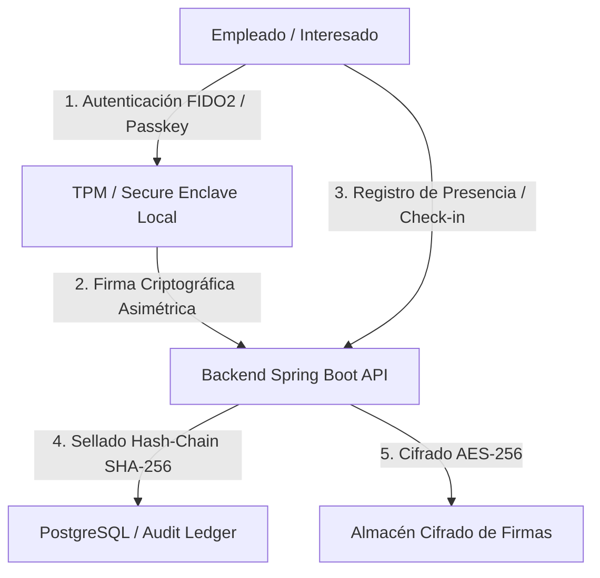

# Evaluación de Impacto en la Protección de Datos (EIPD / DPIA)
## Conforme al Artículo 35 del Reglamento General de Protección de Datos (RGPD - UE 2016/679)

---

### 1. Ficha Resumen del Tratamiento

| Parámetro | Detalle |
| :--- | :--- |
| **Nombre del Sistema** | Smart Checkin System (Distribution Academy) |
| **Responsable del Tratamiento** | Smart Checkin S.L. / Empresa Cliente Empleadora |
| **Finalidad Principal** | Control de presencia laboral, registro de jornada (RDL 8/2019), gestión de formaciones y trazabilidad inmutable |
| **Categorías de Interesados** | Empleados, formadores, administradores y personal de auditoría |
| **Categorías de Datos** | Datos identificativos (nombre, DNI/código, email), registros temporales (timestamp de fichaje), firmas manuscritas digitalizadas y metadatos de autenticación FIDO2 (credenciales públicas) |
| **Tratamiento de Datos Especiales (Art. 9)** | **NO.** No se procesan ni almacenan patrones biométricos en servidor. La autenticación Passkey delega la biometría al hardware local del usuario (Secure Enclave / TPM). |
| **Base de Legitimación** | Obligación Legal (Art. 6.1.c RGPD - RDL 8/2019) y Ejecución de Contrato Laboral (Art. 6.1.b RGPD) |
| **Plazo de Conservación** | 4 años conforme a la legislación laboral y de Seguridad Social vigente |

---

### 2. Descripción Sistemática del Tratamiento

El sistema **Smart Checkin** gestiona el ciclo de vida del registro de presencia, acreditación de asistencia a formaciones profesionales y auditoría interna mediante una arquitectura desacoplada Spring Boot + React.

1. **Autenticación FIDO2 / Passkeys (WebAuthn):**
   - El usuario registra una credencial asimétrica vinculada a su dispositivo personal o corporativo.
   - El servidor **únicamente almacena la clave pública** (`publicKey`) y el `credentialId`.
   - La verificación biométrica (huella Touch ID, reconocimiento facial Face ID o PIN) se ejecuta **exclusivamente dentro del enclave seguro del dispositivo cliente**; el dato biométrico nunca abandona el hardware ni se transmite por la red.

2. **Registro de Jornada y Firmas Digitalizadas:**
   - La captura de firma en pantalla para actas de formación se procesa vectorialmente en el cliente, se sella con timestamp y se cifra en reposo mediante **AES-256**.
   - Los registros de check-in incluyen marca temporal normalizada a segundos, identificador de usuario, tipo de acción y dirección IP de origen.

3. **Auditoría Forense Inmutable (Hash-Chain):**
   - Cada evento de auditoría queda encadenado criptográficamente con el hash SHA-256 del registro precedente (`previousHash`), impidiendo cualquier modificación o borrado retroactivo no detectado.

---

### 3. Evaluación de Necesidad y Proporcionalidad

#### 3.1. Base Jurídica
- **Cumplimiento de Obligación Legal (Art. 6.1.c RGPD):** El Real Decreto-ley 8/2019, de 8 de marzo, impone el registro diario de jornada laboral, exigiendo garantizar el horario concreto de inicio y finalización de cada trabajador.
- **Ejecución del Contrato Laboral (Art. 6.1.b RGPD):** Impartición y certificación de cursos de formación y capacitación técnica.

#### 3.2. Principio de Minimización de Datos (Art. 5.1.c RGPD)
- **Cero Datos Biométricos Centralizados:** En cumplimiento de la Guía de la AEPD sobre tratamientos de control de presencia mediante biometría (noviembre 2023), se descartan lectores biométricos en servidor.
- **Sin Geovigilancia Continua:** No se registra seguimiento por GPS en segundo plano; únicamente se valida la conectividad de red local autorizada o verificación de código personal/QR dinámico de sala.

---

### 4. Análisis de Riesgos y Medidas de Mitigación

| Riesgo Identificado | Impacto Inicial | Probabilidad | Medida de Mitigación Técnica / Organizativa | Riesgo Residual |
| :--- | :---: | :---: | :--- | :---: |
| **Acceso no autorizado a registros de presencia** | ALTO | BAJA | Autenticación multifactor (TOTP / WebAuthn FIDO2 obligatorio para administradores), control de acceso basado en roles (RBAC) y tokens JWT firmados con expiración corta. | **BAJO** |
| **Manipulación retroactiva de horas trabajadas** | CRÍTICO | MEDIA | Sellado criptográfico secuencial SHA-256 (Hash-Chain) con verificación continua y bloqueo de mutabilidad en base de datos. | **MUY BAJO** |
| **Fuga de datos de firmas manuscritas** | ALTO | BAJA | Cifrado en reposo AES-256-GCM, almacenamiento desacoplado y endpoints protegidos por roles de administración. | **BAJO** |
| **Ataques de fuerza bruta o suplantación de identidad** | MEDIO | MEDIA | Rate Limiting con Bucket4j (10 peticiones/min en endpoints sensibles), bloqueo automático tras intentos fallidos y Cloudflare Turnstile CAPTCHA. | **MUY BAJO** |
| **Interceptación de credenciales en tránsito** | ALTO | BAJA | HSTS obligatorio, TLS 1.3, cookies `HttpOnly; Secure; SameSite=Strict` y cabeceras estrictas de Content-Security-Policy (CSP). | **DESPRECIABLE** |

---

### 5. Derechos de los Interesados (ARCO-POL)

1. **Derecho de Acceso y Portabilidad (Art. 15 y 20 RGPD):**
   - Módulo de auto-descarga de datos personales y registros de presencia en formato estructurado (CSV/JSON) disponible en `/api/v1/exports/me/export`.
2. **Derecho de Supresión / Derecho al Olvido (Art. 17 RGPD):**
   - Mecanismo de anonimización y borrado de cuenta en el perfil de usuario, preservando únicamente los resúmenes agregados que la legislación laboral exige retener durante 4 años.
3. **Canal de Contacto y Notificación de Incidentes (Art. 33 y 34 RGPD):**
   - Canal formal de reporte de seguridad documentado en `/.well-known/security.txt` (RFC 9116) y protocolo de notificación a la AEPD en menos de 72 horas ante brechas de seguridad.

---

### 6. Conclusión y Dictamen de Conformidad

> **Dictamen del Delegado de Protección de Datos (DPO) / Responsable de Seguridad:**
> 
> El tratamiento de datos implementado en **Smart Checkin System** cumple plenamente con los principios de **Privacidad desde el Diseño y por Defecto (Art. 25 RGPD)**. Las salvaguardas criptográficas (FIDO2/WebAuthn, AES-256 y hash chain SHA-256) garantizan la confidencialidad, integridad y disponibilidad de la información sin invadir desproporcionadamente la privacidad de los empleados.
>
