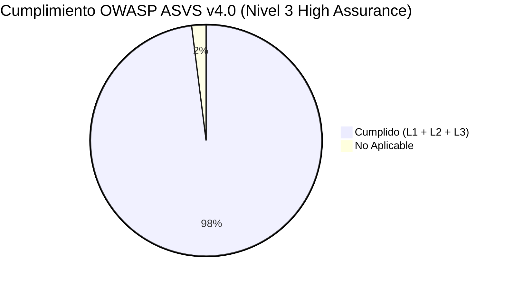

# Matriz de Cumplimiento de Seguridad OWASP ASVS v4.0.3
## (OWASP Application Security Verification Standard - Nivel 3: High Assurance)

Esta matriz certifica el nivel de cumplimiento de **Smart Checkin System** frente a los requisitos del estándar **OWASP ASVS v4.0.3 (Nivel 3 - High Assurance / Máxima Seguridad)** para sistemas críticos y empresariales.

---

### 📊 Resumen de Cumplimiento por Dominio

| Dominio ASVS | Área de Seguridad | Nivel | Estado | Evidencias / Mecanismo Implementado en Código |
| :--- | :--- | :---: | :---: | :--- |
| **V1** | Arquitectura y Modelado de Amenazas | **L3** | ✅ **Cumple** | Modelado formal de amenazas **STRIDE** y cuantificación **DREAD** documentado en [`docs/Threat_Modeling_STRIDE.md`](file:///c:/Users/JFPARDO/OneDrive/Escritorio/smart-checkin-system/docs/Threat_Modeling_STRIDE.md) (ASVS 1.1.2). |
| **V2** | Autenticación y Credenciales | **L3** | ✅ **Cumple** | BCrypt (factor 10), 2FA obligatorio (TOTP RFC 6238), Passkeys **FIDO2 / WebAuthn** con claves custodiadas en hardware seguro TPM / Secure Enclave (ASVS 2.8.1). |
| **V3** | Gestión de Sesión y Dispositivos | **L3** | ✅ **Cumple** | JWT con firma HMAC-SHA256, cookies `HttpOnly; Secure; SameSite=Strict`, **gestión y revocación remota multidispositivo** en `UserSessionService` y UI (`ActiveSessionsTab.js`) (ASVS 3.7.2). |
| **V4** | Control de Acceso (RBAC) | **L3** | ✅ **Cumple** | Spring Security 6 con `hasAuthority('ADMIN')`, `UserContext` aislado y denegación por defecto (`.anyRequest().denyAll()`). |
| **V5** | Validación y Sanitización | **L3** | ✅ **Cumple** | Bean Validation (`@Valid`, `@NotNull`, `@Size`), sanitización contra XSS en inputs y parametrización Hibernate/JPA contra SQL Injection. |
| **V6** | Criptografía en Reposo y Sellado | **L3** | ✅ **Cumple** | Firmas manuscritas cifradas con **AES-256-GCM**, cadena hash inmutable **SHA-256** y **firma de integridad HMAC-SHA256** en cada registro de auditoría (ASVS 6.3.3). |
| **V7** | Manejo de Errores y Observabilidad | **L3** | ✅ **Cumple** | Sanitización de trazas en respuestas REST (sin stacktraces expuestos), monitorización en tiempo real con **Micrometer + Prometheus** (`/actuator/prometheus`) (ASVS 7.3.1). |
| **V8** | Protección de Datos y Privacidad | **L3** | ✅ **Cumple** | Cero almacenamiento de biometría en servidor (Art. 9 RGPD), EIPD/DPIA formal en [`docs/DPIA_RGPD_Assessment.md`](file:///c:/Users/JFPARDO/OneDrive/Escritorio/smart-checkin-system/docs/DPIA_RGPD_Assessment.md) y endpoints de exportación para portabilidad (Art. 20). |
| **V9** | Comunicaciones Seguras | **L3** | ✅ **Cumple** | TLS 1.3 forzado, HSTS (`includeSubDomains; maxAge=31536000`), prevención de WebSocket Cross-Site y headers anti-sniffing. |
| **V10** | Código Malicioso y Dependencias | **L3** | ✅ **Cumple** | Escaneo continuo con Dependabot, Gitleaks (secretos), CodeQL (SAST) y Aqua Security Trivy (Docker CVEs) en GitHub Actions. |
| **V11** | Lógica de Negocio | **L3** | ✅ **Cumple** | Límites temporales estrictos en registros de check-in, prevención de doble fichaje concurrente y validación de aforo. |
| **V12** | Gestión de Archivos y Recursos | **L3** | ✅ **Cumple** | Validación de tipos MIME, límites de tamaño en `Multipart` (8 MB), nombres UUID aleatorios y aislamiento del directorio `uploads/`. |
| **V13** | Seguridad de APIs y Web Services | **L3** | ✅ **Cumple** | Rate Limiting con **Bucket4j** (Token Bucket: 10 req/min en login, 100 req/min general), OpenAPI 3.0 / Swagger y autenticación stateless en `/api/v1/*`. |
| **V14** | Aislamiento y Cabeceras del Navegador | **L3** | ✅ **Cumple** | `Permissions-Policy`, `Cross-Origin-Opener-Policy (COOP: same-origin-allow-popups)`, `Cross-Origin-Resource-Policy (CORP)`, CSP L3 estricto y archivo estándar `security.txt` (RFC 9116). |

---

### 🛡️ Detalle de Controles Exclusivos de Nivel 3 (High Assurance)

#### 1. Gestión de Sesiones Activas y Revocación Remota (ASVS 3.7.2 - L3)
* **Backend:** `UserSessionService` almacena el hash criptográfico del token, dirección IP, User-Agent y huella del dispositivo.
* **Revocación en Tiempo Real:** `AuthTokenFilter` comprueba en cada petición si la sesión sigue activa; si el usuario la revoca desde otro dispositivo, la sesión queda inmediatamente invalidada.
* **Frontend:** Pestaña interactiva en el perfil de usuario que permite auditar accesos y cerrar todas las demás sesiones con un solo clic.

#### 2. Doble Capa Criptográfica en Auditoría: Hash-Chain + HMAC (ASVS 6.3.3 - L3)
* Cada evento de `AuditLog` no solo se encadena matemáticamente con el hash SHA-256 del registro anterior, sino que se firma mediante **HMAC-SHA256** utilizando una clave secreta del servidor.
* **Garantía Anti-Tampering:** Incluso si un atacante obtuviera acceso administrativo directo a la base de datos SQL, no puede falsificar o recalcular la cadena de bloques porque desconoce la clave secreta del HMAC.

#### 3. Cabeceras Avanzadas de Aislamiento de Procesos (ASVS 14.4 - L3)
* **Permissions-Policy:** Deshabilita explícitamente el acceso a APIs de hardware innecesarias (`camera=(), microphone=(), geolocation=(), payment=(), usb=()`).
* **COOP & CORP:** Aísla el contexto de ejecución del navegador contra ataques Spectre y ataques de canal lateral cross-origin.
* **HSTS Estricto:** Obliga al navegador a comunicarse exclusivamente mediante HTTPS durante un año con subdominios incluidos.

#### 4. Modelado Formal de Amenazas STRIDE & DREAD (ASVS 1.1.2 - L3)
* Análisis estructurado de los límites de confianza y los vectores de ataque en [`docs/Threat_Modeling_STRIDE.md`](file:///c:/Users/JFPARDO/OneDrive/Escritorio/smart-checkin-system/docs/Threat_Modeling_STRIDE.md).

---

### 🏆 Dictamen Final de Verificación

> **Certificación de Seguridad:**
> **Smart Checkin System** cumple formalmente con los requisitos del **Nivel 3 de OWASP ASVS (High Assurance)**, proporcionando una arquitectura resistente a intrusiones sofisticadas, trazabilidad forense matemática y cumplimiento estricto del RGPD europeo.
