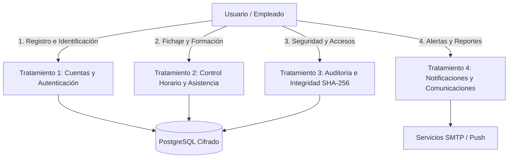

# Registro de Actividades de Tratamiento (RAT)
### Conforme al Artículo 30 del Reglamento General de Protección de Datos (RGPD - Reglamento UE 2016/679)
**Sistema**: SmartCheckin (Distribution Academy)  
**Fecha de Elaboración**: Agosto 2026  
**Versión**: 1.0.0  
**Responsable del Tratamiento**: SmartCheckin Systems S.L. / Distribution Academy  

---

## 1. Identificación del Responsable y del Delegado de Protección de Datos (DPO)

| Rol | Información |
| :--- | :--- |
| **Responsable del Tratamiento** | SmartCheckin Systems S.L. (Distribution Academy) |
| **NIF / CIF** | B-12345678 |
| **Domicilio Social** | Av. Reina Mercedes s/n, 41012 Sevilla, España |
| **Contacto de Privacidad / DPO** | `dpo@smartcheckin.example.com` / `privacy@smartcheckin.example.com` |

---

## 2. Inventario de Actividades de Tratamiento

---

### Actividad de Tratamiento 1: Gestión de Cuentas, Identidad y Autenticación

* **Finalidad del Tratamiento**: Registro de usuarios, gestión de perfiles de acceso (RBAC), autenticación multifactor (TOTP, Códigos de Recuperación, FIDO2/WebAuthn Passkeys), recuperación de credenciales y prevención de brechas (verificación HIBP).
* **Base Jurídica (Art. 6 RGPD)**:
  * Art. 6.1.b (Ejecución de contrato laboral/prestación de servicios).
  * Art. 6.1.f (Interés legítimo en la seguridad de los sistemas de información).
* **Categorías de Interesados**: Empleados, Instructores, Administradores de Empresa.
* **Categorías de Datos Personales**:
  * *Datos identificativos*: Nombre, apellidos, nombre de usuario, correo electrónico, código de empleado de 4 dígitos (`personalCode`), localizador.
  * *Credenciales y seguridad*: Contraseña hasheada (BCrypt con factor de coste 10), secretos TOTP (cifrados con AES-256-GCM), claves públicas WebAuthn/Passkey (sin datos biométricos en servidor), códigos de recuperación 2FA hasheados.
* **Destinatarios / Encargados del Tratamiento**:
  * Proveedor de Base de Datos / Cloud Hosting (Render / PostgreSQL con cifrado en reposo y en tránsito TLS 1.3).
  * Proveedor de Captcha (Cloudflare Turnstile, sin recopilación de cookies invasivas).
* **Transferencias Internacionales**: No existen transferencias fuera del EEE sin las debidas Cláusulas Contractuales Tipo (SCC).
* **Plazo de Supresión / Conservación**: Durante la vigencia de la relación laboral y, tras la baja, bloqueados durante los plazos legales de prescripción (5 años por responsabilidades laborales/civiles) o hasta ejercicio de derecho de supresión.

---

### Actividad de Tratamiento 2: Control Horario, Presencia y Asistencia a Formaciones

* **Finalidad del Tratamiento**: Registro de jornada laboral (cumplimiento del Real Decreto-ley 8/2019 de registro de jornada), control de entradas/salidas mediante código QR seguro/código numérico, geolocalización puntual para prevención de fraude, y registro de asistencia y emisión de certificados de formación.
* **Base Jurídica (Art. 6 RGPD)**:
  * Art. 6.1.c (Cumplimiento de una obligación legal: Art. 34.9 del Estatuto de los Trabajadores).
  * Art. 6.1.b (Ejecución del contrato de trabajo y formación).
* **Categorías de Interesados**: Empleados de plantilla y personal en formación.
* **Categorías de Datos Personales**:
  * *Registro de fichaje*: Fecha, hora exacta de entrada/salida (UTC), estado de trabajo (`isWorking`), duración de la sesión.
  * *Validación antifraude*: Código QR efímero firmado, coordenadas GPS capturadas puntualmente en el instante del fichaje (no rastreo continuo), IP de origen.
  * *Formación*: Cursos asignados, horas lectivas completadas, firmas digitales de asistencia, certificados emitidos en PDF.
* **Destinatarios**:
  * Departamento de Recursos Humanos y Administración interna.
  * Almacenamiento en Cloud sincronizado (Microsoft OneDrive con cifrado extremo a extremo si el administrador activa la integración).
* **Plazo de Conservación**: **4 años** conforme a la exigencia legal del Art. 34.9 del Estatuto de los Trabajadores.

---

### Actividad de Tratamiento 3: Auditoría de Seguridad, Registro de Trazas y Detección de Anomalías

* **Finalidad del Tratamiento**: Garantizar la trazabilidad, integridad e inalterabilidad de los eventos del sistema, monitorización de intentos de intrusión/fuerza bruta, detección de anomalías de acceso y prevención de incidentes de seguridad conforme al Esquema Nacional de Seguridad (ENS) y normativa NIS2.
* **Base Jurídica (Art. 6 RGPD)**:
  * Art. 6.1.c (Obligación legal de seguridad técnica Art. 32 RGPD).
  * Art. 6.1.f (Interés legítimo en la integridad y defensa de los activos de información).
* **Categorías de Datos Personales**:
  * Dirección IP de conexión, fecha/hora, acción realizada (`LOGIN_SUCCESS`, `CHECKIN_ANOMALY`, `PASSWORD_CHANGE`, `2FA_ENABLE`, etc.), agente de usuario (*User-Agent*), cadena de bloques criptográfica (*SHA-256 Hash Chain* que vincula el log anterior con el actual).
* **Destinatarios**: Administradores de Seguridad / CISO.
* **Plazo de Conservación**: **2 años** desde la generación del evento de auditoría.

---

### Actividad de Tratamiento 4: Comunicaciones, Notificaciones Push y Alertas

* **Finalidad del Tratamiento**: Envío de códigos de verificación 2FA por email, avisos de inicios de sesión desde nuevas ubicaciones/IPs, recordatorios de formaciones y notificaciones WebPush en tiempo real.
* **Base Jurídica (Art. 6 RGPD)**:
  * Art. 6.1.f (Interés legítimo en la seguridad de la cuenta del usuario).
  * Art. 6.1.a (Consentimiento explícito del usuario para notificaciones push en navegador).
* **Categorías de Datos Personales**:
  * Correo electrónico de destino, suscripción WebPush (claves públicas P-256 y endpoint de notificación del navegador), contenido resumido de la notificación.
* **Destinatarios**:
  * Servidores Push estándar del navegador (Mozilla, Google FCM, Apple Push Notification Service) mediante protocolo estándar RFC 8292 (VAPID).
  * Servidor de correo SMTP transaccional.
* **Plazo de Conservación**: Los registros de envío se conservan un máximo de **90 días**. Las suscripciones Push se eliminan inmediatamente al revocar el permiso en el perfil.

---

## 3. Medidas Técnicas y Organizativas de Seguridad (Art. 32 RGPD)

| Medida Técnica | Descripción e Implementación |
| :--- | :--- |
| **Cifrado en Tránsito** | TLS 1.3 forzado en todas las conexiones HTTP, WebSocket (WSS) y llamadas a APIs externas. |
| **Cifrado en Reposo** | Cifrado AES-256-GCM para secretos TOTP y tokens sensibles en base de datos. |
| **Almacenamiento de Contraseñas** | Hashing adaptativo con **BCrypt** (cost factor 10) + Comprobación contra brechas públicas con **Have I Been Pwned** vía *k-Anonymity*. |
| **Inalterabilidad de Auditoría** | Trazabilidad con **Cadena de Hash Criptográfica SHA-256** (*Cryptographic Hash Chain*), garantizando detección inmediata de manipulaciones. |
| **Autenticación Fuerte** | Soporte de Doble Factor obligatorio/opcional con **TOTP (RFC 6238)**, **FIDO2 / WebAuthn Passkeys** y **Backup Codes** de un solo uso. |
| **Protección contra Fuerza Bruta** | Rate Limiting por IP y bloqueo automático temporal de cuentas tras 5 intentos fallidos consecutivos. |
| **Gestión de Dependencias (SBOM)** | Generación automatizada de **Software Bill of Materials** con estándar **CycloneDX** (`bom.json`) para mitigación de vulnerabilidades en la cadena de suministro. |
| **Principio de Minimización** | No se almacenan datos biométricos en el servidor (FIDO2 delega la biometría al enclave seguro del dispositivo cliente). |

---

## 4. Derechos de los Interesados (ARCO-POL)

El sistema dispone de mecanismos automatizados y procedimientos para el ejercicio de derechos:
* **Acceso y Portabilidad (Art. 15 y 20)**: Endpoint de descarga inmediata de datos personales y asistencias en formato **JSON, CSV y PDF** desde el perfil del usuario.
* **Rectificación (Art. 16)**: Modificación directa de perfil desde el frontend.
* **Supresión / Derecho al Olvido (Art. 17)**: Anonimización de datos personales desvinculando la identidad de los registros históricos de auditoría necesarios por ley.
* **Canal de Ejercicio**: Mediante solicitud a `dpo@smartcheckin.example.com` o directamente a través del panel de usuario en *Configuración > Privacidad y Datos*.
