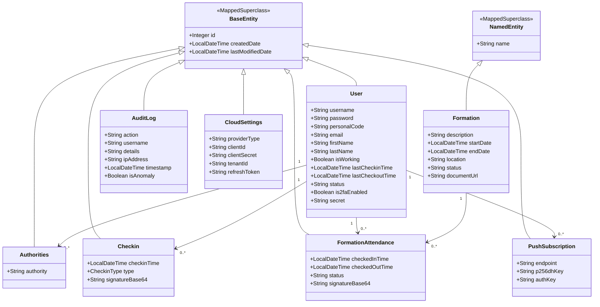

# Diseño y Pruebas
## Documento de Diseño del Sistema

<br>

<div align="center">

# Distribution Academy
## Sistema Integrado de Fichaje Inteligente y Gestión de Formaciones

---

### Grado en Ingeniería del Software

### Universidad de Sevilla

### Asignatura
**Diseño y Pruebas**

### Curso Académico
**2025/2026**

### Autor
**Juan Felipe Pardo Carrillo**

### Repositorio del proyecto
https://github.com/jfpaardoo/smart-checkin-system

---

**Documento de Diseño del Sistema**

</div>

---

# Índice

1. Introducción
2. Diagramas UML
   - 2.1 Diagrama de Dominio / Diseño
   - 2.2 Diagrama de Capas
3. Descomposición de los mockups del tablero de juego en componentes
4. Patrones de diseño y arquitectónicos aplicados
5. Decisiones de diseño
6. Refactorizaciones aplicadas

---

# 1. Introducción

## 1.1 Descripción general del proyecto

**Distribution Academy** es una plataforma web desarrollada para la gestión integral del control de asistencia de empleados y de las formaciones impartidas dentro del entorno empresarial de **la empresa**.

El sistema combina un mecanismo de fichaje mediante códigos QR dinámicos con una plataforma de administración de cursos, asistencia, generación de informes y análisis estadístico. Toda la aplicación ha sido diseñada bajo una arquitectura cliente-servidor basada en **Spring Boot** para el backend y **React** para el frontend, permitiendo una separación clara entre la lógica de negocio y la interfaz de usuario.

El proyecto pretende sustituir los sistemas tradicionales de control horario mediante una solución moderna, segura y completamente digital, capaz de adaptarse a entornos industriales donde el control de accesos, la trazabilidad y la gestión documental constituyen elementos críticos.

---

## 1.2 Objetivos del sistema

Los principales objetivos perseguidos durante el desarrollo del proyecto son los siguientes:

- Digitalizar completamente el proceso de fichaje de entrada y salida de los empleados.
- Eliminar el fraude asociado al fichaje por terceros mediante códigos QR temporales.
- Centralizar la gestión de las formaciones corporativas impartidas por la empresa.
- Facilitar el seguimiento de la asistencia tanto a jornadas laborales como a acciones formativas.
- Permitir la generación automática de informes y estadísticas para los responsables de Recursos Humanos.
- Garantizar la seguridad de la información mediante mecanismos modernos de autenticación, autorización y cifrado.
- Proporcionar una interfaz moderna, intuitiva y completamente adaptable a dispositivos móviles.

---

## 1.3 Valor aportado por la aplicación

La plataforma aporta una solución integral que unifica distintos procesos empresariales que habitualmente se encuentran distribuidos entre múltiples aplicaciones.

Entre las principales ventajas destacan:

- Eliminación del fichaje fraudulento mediante códigos QR dinámicos basados en TOTP.
- Gestión centralizada de usuarios, empleados y administradores.
- Control completo del ciclo de vida de las formaciones.
- Firma digital durante el registro de salida cuando es necesaria.
- Exportación de informes en diferentes formatos (PDF, Excel y CSV).
- Auditoría completa de todas las operaciones relevantes realizadas en el sistema.
- Sistema de notificaciones push para informar a los empleados de nuevos eventos.
- Soporte multilenguaje mediante internacionalización completa.

---

## 1.4 Funcionamiento general del sistema

El funcionamiento habitual del sistema puede resumirse en el siguiente flujo de trabajo:

1. Un empleado solicita el alta en la plataforma mediante el formulario de registro.
2. Un administrador revisa la solicitud y aprueba la creación definitiva de la cuenta.
3. Una vez autenticado, el empleado puede consultar sus formaciones y realizar el fichaje diario.
4. El administrador genera un código QR temporal que se actualiza automáticamente cada pocos segundos.
5. El empleado escanea dicho código utilizando la aplicación web instalada como PWA.
6. El sistema valida el token recibido y registra la entrada o salida correspondiente.
7. Cuando la operación corresponde a una salida que requiere validación adicional, el empleado incorpora su firma manuscrita directamente sobre la pantalla del dispositivo.
8. Toda la información queda registrada para su posterior consulta, análisis o exportación.

---

## 1.5 Alcance del proyecto

El sistema contempla tres perfiles principales de usuario:

- **Empleado**, encargado de realizar el fichaje y consultar las formaciones asignadas.
- **Responsable de Recursos Humanos**, encargado de gestionar las formaciones y realizar el seguimiento de la asistencia.
- **Administrador**, responsable de la configuración global del sistema, gestión de usuarios, auditoría y mantenimiento.

Cada perfil dispone únicamente de las funcionalidades correspondientes a sus permisos mediante un sistema de autorización basado en roles.

---

## 1.6 Tecnologías empleadas

El desarrollo del sistema se apoya principalmente en las siguientes tecnologías:

### Backend

- Java 21
- Spring Boot 3
- Spring Security
- Spring Data JPA
- PostgreSQL
- JWT (RS256)
- WebSockets STOMP
- Bucket4j
- OpenPDF
- XChart

### Frontend

- React 18
- Tailwind CSS
- React Router
- Reactstrap
- Recharts
- html5-qrcode
- react-signature-canvas
- react-i18next

---

## 1.7 Vídeo demostrativo

Enlace al vídeo de explicación del funcionamiento del sistema:

> *(Añadir aquí el enlace de YouTube cuando esté disponible.)*

---

# 2. Diagramas UML

En esta sección se presenta el diseño estructural del sistema mediante diferentes diagramas UML. Estos diagramas permiten representar tanto el modelo de dominio como la arquitectura en capas implementada durante el desarrollo del proyecto.

El objetivo es mostrar cómo se relacionan las distintas entidades de negocio, así como la organización interna del backend siguiendo la arquitectura propuesta por Spring Boot basada en controladores, servicios y repositorios.

---

# 2.1 Diagrama de Dominio / Diseño

El modelo de dominio representa las entidades principales del sistema y las relaciones existentes entre ellas.

Durante el diseño se ha partido del modelo conceptual obtenido en la fase de análisis, incorporando posteriormente todos los detalles necesarios para la implementación, tales como:

- Tipos de datos de todos los atributos.
- Relaciones de asociación entre entidades.
- Cardinalidades.
- Jerarquías de herencia.
- Restricciones de algunos atributos.
- Clases base proporcionadas por Spring Data JPA.
- Entidades persistentes utilizadas durante la implementación.

El sistema utiliza como clases base **BaseEntity** y **NamedEntity**, heredadas del proyecto inicial, permitiendo reutilizar la gestión automática de identificadores y otros atributos comunes.

Las entidades principales del sistema son:

- User
- Authorities
- Checkin
- Formation
- FormationAttendance
- AuditLog
- PushSubscription
- CloudSettings

Estas entidades modelan completamente el funcionamiento del sistema de fichaje, gestión de formaciones, auditoría y almacenamiento de configuración.

## Diagrama UML



### Descripción del modelo

El núcleo del sistema gira en torno a la entidad **User**, que representa tanto a empleados como administradores y responsables de recursos humanos.

Cada usuario puede disponer de uno o varios roles mediante la entidad **Authorities**, realizar múltiples registros de entrada y salida (**Checkin**), participar en diferentes formaciones (**FormationAttendance**) y registrar distintos dispositivos para la recepción de notificaciones push (**PushSubscription**).

Las formaciones se representan mediante la entidad **Formation**, que almacena toda la información relacionada con cursos corporativos, incluyendo fechas, documentación asociada y estado de la actividad.

Por otra parte, **AuditLog** registra todas las operaciones relevantes realizadas por los usuarios para garantizar la trazabilidad del sistema, mientras que **CloudSettings** mantiene la configuración necesaria para la integración con Microsoft OneDrive y los servicios de almacenamiento externos.

Este modelo permite representar todas las reglas de negocio implementadas manteniendo una clara separación entre los distintos conceptos del dominio.

---

# 2.2 Diagrama de Capas

El backend del proyecto sigue una arquitectura clásica en capas (Layered Architecture), recomendada por Spring Boot y ampliamente utilizada en aplicaciones empresariales.

La aplicación se divide en tres niveles principales:

- **Capa de presentación**, formada por los controladores REST encargados de recibir las peticiones HTTP.
- **Capa de negocio**, donde se implementan todas las reglas de negocio mediante servicios.
- **Capa de persistencia**, formada por los repositorios JPA responsables del acceso a la base de datos.

Esta organización evita el acoplamiento entre componentes y facilita tanto el mantenimiento como las pruebas unitarias.

Las dependencias siguen siempre la dirección:

```
Cliente
      ↓
Controladores REST
      ↓
Servicios
      ↓
Repositorios
      ↓
Base de Datos
```

## Diagrama de capas

> *(Aquí se incluirá el diagrama PlantUML correspondiente almacenado en el repositorio del proyecto.)*

```text
Presentation Layer
    │
    ├── AuthController
    ├── UserRestController
    ├── CheckinRestController
    ├── FormationRestController
    ├── AnalyticsRestController
    ├── ExportRestController
    ├── PushNotificationController
    └── CloudSettingsRestController

            │

Business Layer

    ├── AuthService
    ├── UserService
    ├── CheckinService
    ├── FormationService
    ├── AnalyticsService
    ├── CertificateGeneratorService
    ├── DatabaseBackupService
    ├── PushNotificationService
    ├── OneDriveService
    ├── EmailService
    └── AnomalyDetectionService

            │

Persistence Layer

    ├── UserRepository
    ├── CheckinRepository
    ├── FormationRepository
    ├── FormationAttendanceRepository
    ├── AuditLogRepository
    ├── PushSubscriptionRepository
    └── StatisticsRepository
```

### Organización de las capas

La **capa de presentación** expone la API REST consumida por el frontend desarrollado en React. Cada controlador recibe las peticiones HTTP, valida los datos de entrada y delega completamente la lógica de negocio en los servicios correspondientes.

La **capa de servicios** constituye el núcleo de la aplicación. Aquí se implementan las reglas de negocio relacionadas con la autenticación, control horario, gestión de formaciones, generación de informes, estadísticas, integración con OneDrive, envío de notificaciones y auditoría.

Finalmente, la **capa de persistencia** utiliza Spring Data JPA para encapsular completamente el acceso a PostgreSQL mediante repositorios especializados, permitiendo desacoplar la lógica de negocio de los detalles de almacenamiento.

Esta arquitectura facilita la escalabilidad del sistema, mejora la reutilización del código y simplifica la realización de pruebas unitarias y de integración.