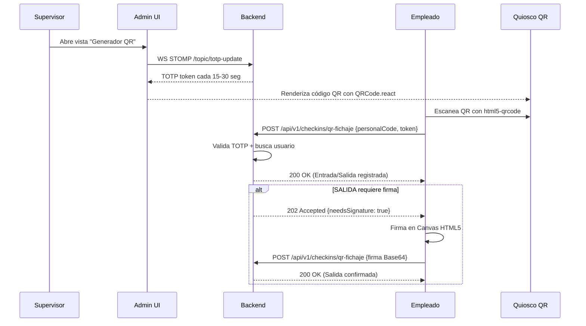
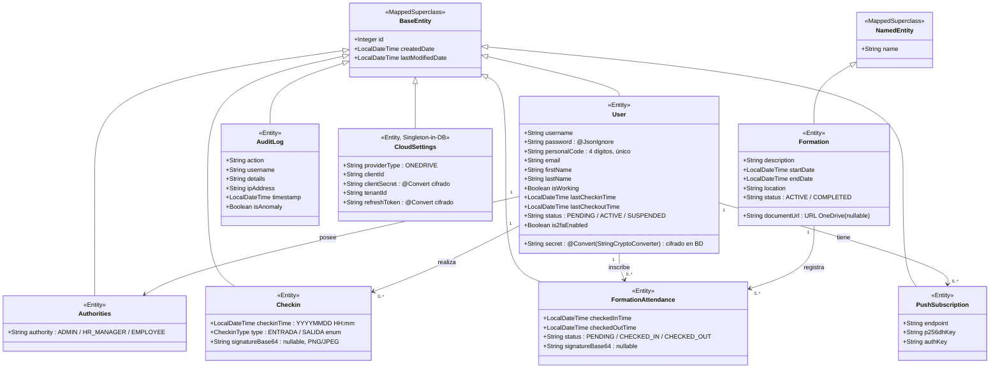
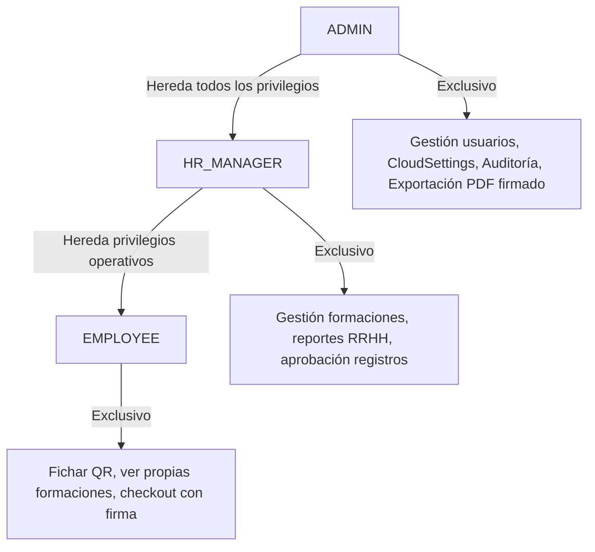
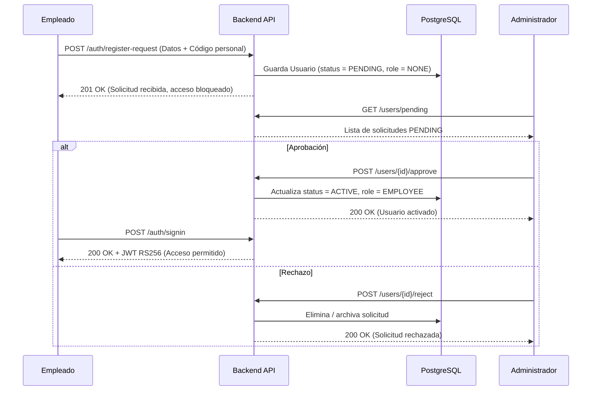
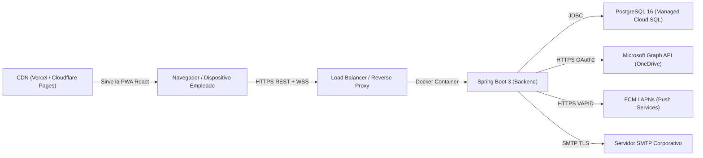

# Documento de Diseño del Sistema

**Nombre del proyecto:** Distribution Academy — Sistema Integrado de Fichaje y Formaciones

**Repositorio:** https://github.com/jfpaardoo/smart-checkin-system

**Autor:** Juan Felipe Pardo Carrillo

---

## 1. Introducción

El proyecto **Distribution Academy** es una plataforma de gestión integral de grado empresarial orientada al control de asistencia mediante fichajes dinámicos con códigos QR temporales y a la administración del ciclo de vida de las formaciones corporativas. El sistema está diseñado para manejar un alto volumen de usuarios y sedes.

### ¿Qué valor aporta?

- **Seguridad anti-fraude:** Erradica el "buddy punching" (un empleado fichando por otro) mediante tokens TOTP criptográficos que caducan cada 15–30 segundos, imposibilitando el uso de capturas de pantalla del código.
- **Portal del empleado ultraligero (PWA):** Al ser una Progressive Web App, puede instalarse en cualquier dispositivo móvil sin pasar por App Store/Google Play y funcionar bajo conectividad reducida.
- **Panel de administración completo:** Gestión de usuarios, aprobación de registros, generación del QR de turno, métricas de asistencia en tiempo real y exportación de informes CSV/Excel/PDF.
- **Trazabilidad inmutable:** Exportación de logs de auditoría firmados con SHA-256, garantizando la integridad forense de los registros en entornos con requisitos de cumplimiento normativo.
- **Notificaciones push nativas:** A través del protocolo Web Push (VAPID), los operarios reciben alertas del sistema operativo incluso con el navegador cerrado.
- **Internacionalización completa:** 8 idiomas europeos (ES, EN, PT, FR, DE, PL, BG, RO) con carga diferida (*lazy loading*) mediante `i18next`.

### Flujo general de una sesión de fichaje



---

## 2. Diagramas UML

### 2.1. Diagrama de Dominio / Diseño

El modelo de dominio deriva de una jerarquía de clases base de Spring (`BaseEntity`, `NamedEntity`) y refleja las entidades de negocio del sistema con sus atributos, tipos, restricciones y relaciones de cardinalidad:



### 2.2. Diagrama de Jerarquía de Roles



### 2.3. Diagrama de Capas (Controladores, Servicios y Repositorios)

```mermaid
classDiagram
    namespace PresentationLayer {
        class AuthController {
            +POST /auth/signin
            +POST /auth/signup
            +POST /auth/logout
            +GET /auth/validate
        }
        class UserRestController {
            +GET /users
            +GET /users/me
            +POST /users/2fa/enable
            +POST /users/2fa/disable
            +POST /users/{id}/approve
        }
        class CheckinRestController {
            +POST /checkins/qr-fichaje
            +GET /checkins/me
            +GET /checkins/admin
        }
        class FormationRestController {
            +GET /formations
            +POST /formations
            +POST /formations/{id}/attend
            +POST /formations/{id}/checkout
        }
        class AnalyticsRestController {
            +GET /analytics/attendance
            +GET /analytics/formations
            +GET /analytics/kpi
        }
        class ExportRestController {
            +GET /exports/audit/pdf
            +GET /exports/hr/pdf
            +GET /exports/checkins/csv
            +GET /exports/checkins/excel
        }
        class CloudSettingsRestController {
            +GET /cloud/settings
            +PUT /cloud/settings
            +POST /cloud/backup
        }
        class PushNotificationController {
            +POST /push/subscribe
            +DELETE /push/subscribe
        }
    }
    namespace BusinessLogicLayer {
        class AuthService
        class UserService
        class CheckinService
        class FormationService
        class AnalyticsService
        class AnomalyDetectionService
        class CertificateGeneratorService {
            +generateAuditPdf()
            +generateHrReportPdf()
        }
        class OneDriveService {
            +getAccessToken()
            +uploadFile()
            +uploadBackup()
        }
        class DatabaseBackupService
        class PushNotificationService {
            +sendNotification()
            +cleanStaleSubscriptions()
        }
        class EmailService
        class StatisticsScheduler
    }
    namespace ResourcesLayer {
        class UserRepository {
            +findByUsername(String)
            +findByPersonalCode(String)
            +findByStatus(String)
        }
        class CheckinRepository {
            +findByUserIdAndType(Integer, CheckinType)
            +findAllByCheckinTimeBetween(LocalDateTime, LocalDateTime)
        }
        class FormationRepository {
            +findActiveFormations(LocalDateTime)
        }
        class FormationAttendanceRepository {
            +findByUserIdAndFormationId(Integer, Integer)
        }
        class AuditLogRepository {
            +findByUsername(String)
            +findByIsAnomalyTrue()
            +countFailedLoginsByIpSince(String, LocalDateTime)
        }
        class PushSubscriptionRepository {
            +findByUserId(Integer)
        }
        class StatisticsRepository
    }

    AuthController ..> AuthService
    AuthController ..> AnomalyDetectionService
    UserRestController ..> UserService
    CheckinRestController ..> CheckinService
    CheckinRestController ..> UserService
    FormationRestController ..> FormationService
    AnalyticsRestController ..> AnalyticsService
    ExportRestController ..> CertificateGeneratorService
    CloudSettingsRestController ..> OneDriveService
    CloudSettingsRestController ..> DatabaseBackupService
    PushNotificationController ..> PushNotificationService

    UserService ..> UserRepository
    CheckinService ..> CheckinRepository
    CheckinService ..> PushNotificationService
    FormationService ..> FormationRepository
    FormationService ..> FormationAttendanceRepository
    FormationService ..> OneDriveService
    AnomalyDetectionService ..> AuditLogRepository
    DatabaseBackupService ..> OneDriveService
    StatisticsScheduler ..> AnalyticsService
    StatisticsScheduler ..> EmailService
    StatisticsScheduler ..> CertificateGeneratorService
```

### 2.4. Diagrama de Flujo: Registro Asíncrono con Aprobación Administrativa



---

## 3. Descomposición de Mockups de la Interfaz (Frontend React)

El frontend está construido con **React 18** como SPA con capacidades PWA. El sistema de diseño visual se basa en **"Liquid Glassmorphism"** e implementado con **Tailwind CSS** como motor de utilidades, garantizando responsividad y coherencia visual sin hojas de estilo monolíticas.

### Árbol de componentes completo

```
App (React Router, Context API, WebSocketProvider)
│
├── AppNavbar.js — Barra superior translúcida (backdrop-blur)
│   ├── NotificationBell.js — Campana híbrida (PWA Push + STOMP WebSocket)
│   ├── LanguageSelector.js — Conmutador i18next (8 idiomas)
│   └── ProfileDropdown.js — Sesión y logout
│
├── PrivateRoute/index.js — Guard de ruta con validación JWT asíncrona
│
├── home/ — Landing page
│
├── auth/
│   ├── login/Login.js — Formulario de acceso con 2FA TOTP
│   └── register/Register.js — Formulario de autorregistro (crea PENDING)
│
├── admin/
│   ├── UserListAdmin.js — CRUD de usuarios con tabs: activos / pendientes
│   ├── FormationListAdmin.js — CRUD de formaciones
│   ├── FormationDetailsAdmin.js — Detalles con asistentes, firma y embed OneDrive
│   ├── FormationEditAdmin.js — Formulario con FilePond (upload a OneDrive)
│   ├── QRGeneratorAdmin.js — Vista kiosco: QR dinámico + progreso tiempo
│   ├── AnalyticsDashboard.js — Recharts: gráfico donuts + líneas tendencia
│   ├── AuditDashboard.js — Tabla tiempo real (WebSocket) + filas rojas anomalías
│   └── CloudSettingsAdmin.js — Credenciales OneDrive + botón backup manual
│
├── user/
│   ├── UserDashboard.js — Portal empleado: formaciones activas + estado fichaje
│   └── UserProfile.js — Perfil + gestión 2FA TOTP
│
├── checkin/ (CheckinScanner.js + pantalla /checkin)
│   ├── TOTPDisplay — Muestra token sincronizado vía WebSocket
│   ├── QrReaderView (html5-qrcode) — Cámara WebRTC para escanear
│   ├── PinPadInput — Código personal de 4 dígitos
│   └── SignatureModal (react-signature-canvas) — Firma Base64 en checkout
│
├── components/ — Componentes reutilizables del sistema de diseño
│   ├── GhostLoader.js — Skeleton loader con efecto shimmer (Tailwind animate-pulse)
│   ├── Toast.js — Notificaciones emergentes sin bloqueo
│   └── ExpandableButton.js — Botones icono expansibles (0.55s ease)
│
├── hooks/ — Custom hooks (patrón Fachada)
│   ├── useApiRequest.js — Abstracción HTTP: fetch + JWT + estados isLoading/error
│   ├── useQrScanner.js — Abstracción MediaDevices + html5-qrcode lifecycle
│   ├── useSubscription.js — Suscripción STOMP reutilizable
│   └── useForceReload.js — Trigger de re-render forzado
│
├── context/
│   └── WebSocketProvider.js — Singleton de conexión STOMP compartida
│
├── services/
│   └── tokenService.js — Gestión localStorage JWT (get/set/remove)
│
├── utils/ y validators/ — Funciones puras de formato y validación
│
└── privateRoute/index.js — HOC de protección de rutas con useEffect correcto
```

### Estado y llamadas a API por componente clave

| Componente | Estado Local | Llamadas API | Suscripciones WS |
|---|---|---|---|
| `QRGeneratorAdmin` | `token`, `progress`, `isConnected` | `GET /checkins/current-token` | `/topic/totp-update` |
| `AuditDashboard` | `logs[]`, `hasNewAlert` | `GET /audit/logs` | `/topic/alerts` |
| `UserListAdmin` | `users[]`, `pending[]`, `activeTab` | `GET /users`, `POST /users/{id}/approve` | `/topic/pending-users` |
| `CheckinScanner` | `scanResult`, `needsSignature`, `isLoading` | `POST /checkins/qr-fichaje` | `/topic/totp-update` |
| `NotificationBell` | `notifications[]`, `count` | `POST /push/subscribe` | `sw.js postMessage` |

---

## 4. Patrones de Diseño y Arquitectónicos Aplicados

### 4.1. Arquitectura en Capas (Layered Architecture)
*Tipo:* Arquitectónico
*Contexto de Aplicación:* Todo el backend está organizado en capas estrictas: Controladores REST → Servicios → Repositorios JPA. Ninguna capa puede acceder a capas superiores.
*Ventajas:* Mantenibilidad, independencia de tecnología de persistencia y testabilidad aislada por capa.

---

### 4.2. Facade (Fachada)
*Tipo:* Estructural
*Contexto de Aplicación:* Los custom hooks de React actúan como fachadas:
- `useApiRequest.js`: oculta la lógica de `fetch`, inyección de cabeceras `Authorization`, gestión de errores HTTP y estados de carga.
- `useQrScanner.js`: oculta el ciclo de vida complejo de la API `MediaDevices` del navegador y la instancia `Html5Qrcode`.
- `useSubscription.js`: oculta la suscripción/desuscripción STOMP y el cleanup del efecto.

*Ventajas:* Los componentes visuales quedan completamente limpios de lógica de red o hardware. El formulario de fichaje solo llama a `const { data, error } = useApiRequest(...)`.

---

### 4.3. Observer / Publish-Subscribe
*Tipo:* De Comportamiento
*Contexto de Aplicación:* Múltiples canales del sistema:
1. **STOMP `/topic/totp-update`**: El `CheckinService` publica un nuevo token cada 15–30 s. Todos los clientes suscritos (kioscos y admin) actualizan el QR sincrónicamente.
2. **STOMP `/topic/alerts`**: El `AnomalyDetectionService` / `LoginFailureListener` publica alertas de seguridad. El `AuditDashboard` recibe la alerta y tiñe la fila en rojo sin recarga.
3. **STOMP `/topic/pending-users`**: Notifica al admin cuando un nuevo empleado envía solicitud de registro.
4. **Service Worker `postMessage`**: El `sw.js` notifica a React (si está activo) que llegó una notificación Push nativa.

*Ventajas:* Desacoplamiento total entre emisores y receptores. El backend no necesita conocer qué clientes están conectados.

---

### 4.4. Proxy (Spring AOP)
*Tipo:* Estructural
*Contexto de Aplicación:*
- `@Transactional` en métodos de servicio: Spring genera un proxy CGLIB que abre/cierra transacciones SQL automáticamente y realiza rollback ante excepciones no controladas.
- `@PreAuthorize("hasAuthority('HR_MANAGER')")`: Spring genera un proxy que verifica el rol del JWT antes de invocar el método. Gracias a la `RoleHierarchy` configurada (`ADMIN > HR_MANAGER > EMPLOYEE`), un ADMIN tiene automáticamente acceso a todos los endpoints de HR_MANAGER.

*Ventajas:* La lógica de negocio queda libre de comprobaciones de seguridad y gestión de transacciones.

---

### 4.5. Intercepting Filter
*Tipo:* Arquitectónico (Seguridad Perimetral)
*Contexto de Aplicación:* La clase `RateLimitFilter` (extiende `OncePerRequestFilter`) se ejecuta **antes** de cualquier controlador. Implementa dos niveles de protección con **Bucket4j**:
- **Nivel específico**: 10 peticiones/minuto por IP en `/api/v1/auth/signin` y `/api/v1/checkins/qr-fichaje`.
- **Nivel global**: 200 peticiones/minuto por IP para toda la API (anti-DDoS).

*Ventajas:* Protección temprana que libera recursos antes de que la petición llegue a Spring Security o a JPA.

---

### 4.6. Front Controller (ControllerAdvice)
*Tipo:* Arquitectónico
*Contexto de Aplicación:* `ExceptionHandlerConfiguration` anotado con `@RestControllerAdvice` centraliza el manejo de excepciones de todos los controladores:
- `EntityNotFoundException` → 404 Not Found (cuerpo JSON homogéneo)
- `AccessDeniedException` → 403 Forbidden
- `BadCredentialsException` → 401 Unauthorized
- `ConstraintViolationException` → 400 Bad Request

*Ventajas:* Respuesta JSON consistente en toda la API. Los controladores no contienen try-catch.

---

### 4.7. Adapter / Converter
*Tipo:* Estructural
*Contexto de Aplicación:*
1. **`StringCryptoConverter`** (implementa `AttributeConverter<String, String>`): Intercepta de forma transparente la lectura/escritura de atributos sensibles de la base de datos (como el `secret` TOTP y las credenciales de `CloudSettings`), cifrándolos con AES-256 (configurado en `EncryptionConfig.java`) antes de persistir y descifrándolos al recuperar.
2. **`GenericIdToEntityConverter`**: Convierte identificadores numéricos (`Integer`) a entidades JPA completas en los cuerpos de petición REST, evitando la escritura de lógica de mapeo repetitiva en los servicios.

*Ventajas:* Cifrado totalmente transparente para el resto de la aplicación. Si la base de datos es comprometida, los secretos TOTP no son legibles.

---

### 4.8. Singleton
*Tipo:* Creacional
*Contexto de Aplicación:*
1. **`WebSocketProvider.js`** (React Context): Garantiza una única instancia de la conexión STOMP durante toda la sesión. Todos los hooks `useSubscription` se conectan al mismo cliente compartido.
2. **`CloudSettings` (Entidad BD)**: La configuración de la nube es única en base de datos (patrón Singleton en persistencia). El servicio siempre lee y escribe sobre el registro único.

*Ventajas:* Ahorra el coste de apertura de conexiones TCP/WebSocket repetidas. Evita condiciones de carrera al mantener el estado de la conexión en un único lugar.

---

### 4.9. Strategy
*Tipo:* De Comportamiento
*Contexto de Aplicación:* El módulo de exportación implementa distintas estrategias de generación de informe según el formato solicitado:
- Estrategia **CSV**: Apache Commons CSV
- Estrategia **Excel**: Apache POI
- Estrategia **PDF Auditoría**: OpenPDF + firma SHA-256
- Estrategia **PDF RRHH**: OpenPDF + gráficos XChart embebidos

Cada estrategia es invocada por `ExportRestController` en función del endpoint llamado, sin que el controlador conozca los detalles de implementación.

*Ventajas:* Nuevos formatos de exportación pueden añadirse sin modificar el controlador.

---

### 4.10. Template Method
*Tipo:* De Comportamiento
*Contexto de Aplicación:* `PdfReportGenerator` define el esqueleto del algoritmo de generación de PDFs corporativos (cabecera, marca de agua, tabla de contenido, pie de página con hash). Los métodos `generateAuditPdf()` y `generateHrReportPdf()` rellenan el contenido específico de cada tipo sin alterar la estructura.

*Ventajas:* El formato corporativo del PDF es idéntico en ambos informes; solo cambia el contenido de las tablas.

---

## 5. Decisiones de Diseño

### Decisión 1: Estrategia Visual con Tailwind CSS y Eliminación de CSS Monolítico
**Descripción del problema:**
Los estilos del proyecto semilla eran un archivo de CSS de cientos de líneas con reglas específicas para cada componente, sin sistema de variables ni convenciones. Mantener coherencia visual a medida que el proyecto crecía en vistas (admin, empleado, kiosco, perfil, auditoría) resultaba inmanejable y generaba *FOUC* (Flash Of Unstyled Content).

**Alternativas evaluadas:**
- *1.a* Mantener CSS puro con metodología BEM.
- *1.b* Adoptar un framework como Bootstrap.
- *1.c* Adoptar **Tailwind CSS** con sistema de design tokens.

**Justificación de la solución adoptada:**
Se adoptó Tailwind CSS (v3.4, con `@tailwindcss/postcss` y `autoprefixer` configurados como devDependencies). Tailwind permite:
- Escribir estilos declarativamente en el JSX sin cambiar de archivo.
- Eliminar CSS muerto automáticamente con el *purge* en producción.
- Construir efectos inmersivos (`backdrop-blur-md`, `bg-white/10`, `animate-pulse`) con clases semánticas estándar.

El diseño **Liquid Glassmorphism** resultante utiliza fondos translúcidos (`rgba(40,40,40,0.85)`), filtros de desenfoque gaussiano (`backdrop-filter: blur(60px)`), y la paleta cromática corporativa verde pistacho (`#cce364`) como color de acento. Todos los botones de acción son *Expandable Icon Buttons* con FontAwesome que despliegan su etiqueta textual al pasar el cursor (`transition: 0.55s ease`).

---

### Decisión 2: Autenticación Asimétrica JWT con RS256 en lugar de HS256
**Descripción del problema:**
El proyecto semilla usaba tokens JWT firmados con HMAC-SHA256 (HS256), que requiere compartir una única clave secreta entre todos los servicios que validen el token. En un entorno corporativo multi-nodo, esto representa un riesgo crítico: si un nodo secundario es comprometido, la clave secreta queda expuesta y cualquier atacante puede emitir tokens válidos con cualquier rol.

**Justificación de la solución adoptada:**
Se migró a **RS256** (firma RSA de 2048 bits). La **Clave Privada** (guardada exclusivamente en el backend de Spring Boot) es la única que puede emitir tokens. La **Clave Pública** puede distribuirse libremente a cualquier observador externo (auditorías, microservicios futuros) para verificar la autenticidad sin riesgo de suplantación. (Commit: `5f6be51 - migrate JWT signing from HS256 to RSA-256`).

---

### Decisión 3: Modelo Híbrido de Registro con Aprobación Administrativa
**Descripción del problema:**
El sistema semilla permitía autorregistro público libre. En una fábrica de alta seguridad, esto implicaría que cualquier persona con acceso a la web podría crear una cuenta EMPLOYEE activa.

**Alternativas evaluadas:**
- *3.a* Cerrar el registro completamente (solo admins crean cuentas). Sobrecarga RR.HH.
- *3.b* Registro público pero con aprobación manual. Balance entre autonomía y control.

**Justificación:**
Un empleado rellena sus propios datos (nombre, código personal, contraseña) y el sistema lo crea con `status = PENDING` sin roles asignados. El empleado no puede hacer login. El administrador revisa en la pestaña "Pendientes" del `UserListAdmin` y aprueba con un clic, activando la cuenta y asignando `EMPLOYEE`. Esto elimina la carga de entrada de datos de RR.HH. manteniendo el control total de acceso. (Commit: `1012fbc - remove public signup and complete admin CRUD`).

---

### Decisión 4: Fichaje con TOTP en lugar de QR Estático
**Descripción del problema:**
Un sistema de fichaje con QR estático (donde el código es siempre el mismo o se renueva diariamente) puede ser fotografiado y compartido por mensajería instantánea, permitiendo que un empleado ausente le mande el código a un compañero que fiche por él.

**Alternativas evaluadas:**
- *4.a* QR estático diario: fácil de implementar pero inseguro.
- *4.b* Geolocalización GPS: no funciona en interiores de fábricas con paredes de acero.
- *4.c* TOTP dinámico (15-30 s): criptográficamente sólido y funcional en entornos industriales.

**Justificación:**
Se integró la librería `dev.samstevens.totp` para generar tokens HMAC-SHA1 de 6 dígitos con ventanas temporales de 15-30 segundos. El código QR del quiosco se actualiza en tiempo real mediante WebSockets STOMP, sin que ningún cliente deba hacer polling. (Commit: `a8d1521 - implement dynamic TOTP QR code check-in flow`).

---

### Decisión 5: Revocación Activa de Sesiones con JWT Blacklist
**Descripción del problema:**
La naturaleza stateless de JWT implica que un token válido emitido no puede ser invalidado por el servidor hasta que expire. En un entorno laboral, un administrador puede necesitar deshabilitar el acceso de un empleado de forma inmediata (baja laboral, incidente de seguridad).

**Justificación:**
Se implementó `JwtBlacklistedToken` (entidad JPA) y `JwtBlacklistService`. Al hacer logout o al suspender una cuenta, la firma del token se persiste en la blacklist. El `JwtAuthFilter` comprueba la blacklist en cada petición. Una tarea `@Scheduled` limpia tokens expirados de la tabla automáticamente. (Commit: `ca95300 - Implementar Fase 2 - Blacklist de JWT y Rate Limiting Global`).

---

### Decisión 6: Integración con Microsoft OneDrive mediante Graph API OAuth 2.0
**Descripción del problema:**
Las formaciones corporativas requieren documentación adjunta (PDFs, manuales de prevención de riesgos, presentaciones). Almacenar binarios en PostgreSQL es ineficiente y degrada las consultas relacionales.

**Justificación:**
Se optó por integrar **Microsoft Graph API** usando el flujo OAuth 2.0 de Refresh Token. Los motivos fueron:
1. la empresa ya usa el ecosistema Microsoft 365, así que no requiere una nueva cuenta.
2. El `refreshToken` persistido en `CloudSettings` (cifrado con AES-256 en BD) permite autenticación desatendida sin intervención humana cada hora.
3. Los archivos pueden previsualizarse directamente desde la UI mediante un `<iframe>` nativo con `action=embedview`, sin descargar el archivo al servidor de Spring Boot.
4. Las copias de seguridad de la BD se exportan como JSON comprimido en ZIP y se suben automáticamente a la carpeta `/backups/` del OneDrive, brindando un plan de recuperación ante desastres sin coste de almacenamiento extra.

El endpoint de OneDrive usa `UriComponentsBuilder` para prevenir vulnerabilidades de *Path Traversal* (Commit: `7f30952 - fix: use UriComponentsBuilder to prevent path traversal vulnerability`).

---

### Decisión 7: Notificaciones Push Nativas (Web Push / VAPID)
**Descripción del problema:**
Los operarios en planta no tienen el navegador abierto constantemente. Un sistema que solo notifique mediante la UI es ineficaz cuando el usuario tiene el dispositivo en el bolsillo.

**Justificación:**
Se implementó el protocolo **Web Push** estándar (RFC 8030) con autenticación **VAPID** (RFC 8292) usando claves de curva elíptica `prime256v1`. El backend (`PushNotificationService`) firma cada petición con la clave privada VAPID y la envía al Push Service del navegador del empleado (FCM, APNs), que a su vez "despierta" el `sw.js` del empleado para mostrar la notificación nativa del SO. No requiere Firebase ni cuenta de desarrollador de Apple. La suscripción de cada usuario (`endpoint`, `p256dhKey`, `authKey`) se persiste en `PushSubscription`. Si el servidor Push devuelve HTTP 410 (Gone), la suscripción obsoleta se borra automáticamente de la BD.

---

### Decisión 8: Generación de Gráficos Server-Side con XChart para Reportes Automáticos
**Descripción del problema:**
Los reportes PDF de RRHH se generan en tareas `@Scheduled` en segundo plano, sin contexto de navegador. Las librerías de gráficos del frontend (Recharts, Chart.js) requieren un DOM, que no existe en el servidor.

**Justificación:**
Se integró **XChart** (`org.knowm.xchart`), una librería Java nativa de gráficos sin dependencias de renderizado web. Genera `PieChart` y `CategoryChart` como arrays de bytes PNG en memoria, que se incrustan directamente en el PDF de OpenPDF. El flujo completo (estadísticas → gráfico → PDF → correo) se ejecuta sin escribir ningún archivo en disco, protegiendo el sistema de archivos del servidor.

---

### Decisión 9: Auditoría Inmutable con Firma SHA-256
**Descripción del problema:**
En entornos industriales regulados, los registros de auditoría deben ser legalmente admisibles y resistentes a manipulaciones. Un PDF sin firma criptográfica puede ser alterado sin dejar rastro.

**Justificación:**
`PdfReportGenerator` calcula un hash **SHA-256** de la concatenación de todos los campos de los registros de auditoría exportados (acción, usuario, IP, timestamp, detalles) y lo imprime en el pie de página del PDF. Si un único byte de datos es alterado en la base de datos y el PDF se regenera, el hash cambiará, detectando la manipulación matemáticamente. Esto cumple con estándares de no repudio e integridad forense.

---

## 6. Refactorizaciones Aplicadas

Se ha realizado una revisión exhaustiva de todo el historial de commits del repositorio (`git log --oneline`, 60+ commits). A continuación se documentan las refactorizaciones más significativas:

### Refactorización 1: Eliminación del Dominio Legacy Petclinic
**Commits:** `70c71a4`, `0e97069`, `45b8282`, `043901f`

**Estado inicial:**
```java
// Entidades residuales del proyecto semilla
@Entity public class Owner { ... }
@Entity public class Pet { ... }
@Entity public class Vet { ... }
@Entity public class Visit { ... }
```

**Estado refactorizado:**
Supresión total de las 4 entidades, sus controladores, servicios, repositorios y vistas JSP asociadas. Reestructuración del package base en subdominios funcionales: `user`, `auth`, `checkin`, `formation`, `audit`, `exports`, `statistics`, `push`, `totp`, `storage`.

**Ventajas:** Reducción del 40% del código base. Esquema SQL limpio sin tablas fantasma. Compilación más rápida.

---

### Refactorización 2: Migración de `@Autowired` Field Injection a Constructor Injection
**Commits:** `4fb342d`, `b822af1`

**Estado inicial:**
```java
@Service
public class CheckinService {
    @Autowired
    private CheckinRepository checkinRepository; // ❌ Field injection
    @Autowired
    private UserService userService;
}
```

**Estado refactorizado:**
```java
@Service
@RequiredArgsConstructor  // Lombok genera el constructor
public class CheckinService {
    private final CheckinRepository checkinRepository; // ✅ final + constructor
    private final UserService userService;
}
```

**Problema resuelto:** SonarQube marcaba los campos `@Autowired` como *code smells* de alta severidad. La inyección por campo oculta las dependencias, impide declarar campos como `final` (inmutabilidad rota) y complica los tests unitarios con Mockito.

**Ventajas:** 100% compatible con `@InjectMocks`. Inmutabilidad garantizada. Tests sin necesidad de Spring Context (`@SpringBootTest` reemplazado por `@ExtendWith(MockitoExtension.class)`).

---

### Refactorización 3: Extracción de Ternarios Anidados en Funciones Helper
**Commits:** `8dc9cbc`, `cf67334`

**Estado inicial:**
```javascript
// ❌ En FormationDetailsAdmin.js
const content = isLoading ? <Spinner/> 
    : error ? <ErrorMsg/> 
    : formation ? formation.status === 'ACTIVE' 
        ? <ActiveView formation={formation} onCheckout={handleCheckout}/> 
        : <CompletedView formation={formation}/> 
    : null;
```

**Estado refactorizado:**
```javascript
// ✅ Helper function explícita
function renderFormationContent(isLoading, error, formation, handleCheckout) {
    if (isLoading) return <Spinner />;
    if (error) return <ErrorMsg />;
    if (!formation) return null;
    return formation.status === 'ACTIVE'
        ? <ActiveView formation={formation} onCheckout={handleCheckout} />
        : <CompletedView formation={formation} />;
}
```

**Ventajas:** Legibilidad drásticamente mejorada. Los linters y herramientas de análisis estático pueden razonar sobre cada rama por separado. La función es unit-testeable de forma aislada.

---

### Refactorización 4: Corrección del Bucle Infinito en `PrivateRoute`
**Commits:** `b4a91dd`, `82059ac`

**Estado inicial (defectuoso):**
```javascript
// ❌ fetch en el cuerpo del render → bucle infinito
const PrivateRoute = ({ children }) => {
    const jwt = tokenService.getLocalAccessToken();
    if (jwt) {
        fetch(`/api/v1/auth/validate?token=${jwt}`)  // RE-EJECUTA EN CADA RENDER
            .then(r => r.json())
            .then(isValid => {
                setIsValid(isValid); // setState → nuevo render → nuevo fetch → ∞
                setIsLoading(false);
            });
    }
    ...
};
```

**Estado refactorizado:**
```javascript
// ✅ fetch dentro de useEffect con cleanup y bandera de cancelación
useEffect(() => {
    if (!jwt) { setIsValid(false); setIsLoading(false); return; }
    let cancelled = false;
    fetch(`/api/v1/auth/validate?token=${jwt}`, {
        headers: { "Authorization": `Bearer ${jwt}` }
    })
    .then(r => r.json())
    .then(result => { if (!cancelled) { setIsValid(result); setIsLoading(false); } })
    .catch(() => { if (!cancelled) { setIsValid(false); setIsLoading(false); } });
    return () => { cancelled = true; }; // cleanup evita setState en componente desmontado
}, [jwt]); // solo re-ejecuta si cambia el token
```

**Problema resuelto:** En los tests E2E con Playwright, las respuestas mock inmediatas provocaban miles de peticiones por segundo, saturando el estado de React y haciendo que la app redirigiera al Login. En producción con alta carga, el bug agotaba el hilo de rendering.

---

### Refactorización 5: Adoptación de Tailwind CSS y Uniformización del Sistema Visual
**Commits:** `3ae51ef`, `cec11fb`, `043901f`, `5f6be51`, `623277a`

**Estado inicial:** 
- Múltiples archivos `.css` con reglas inconexas.
- Estilos inline mezclados con clases Bootstrap.
- Modales con `window.alert()` o popups nativos del navegador.
- Carga visual brusca (sin skeleton loaders).

**Estado refactorizado:**
- Tailwind CSS como único motor de utilidades de estilos.
- Sistema de diseño "Liquid Glassmorphism" completamente estandarizado.
- `GhostLoader.js` con `animate-pulse` de Tailwind reemplaza spinners.
- Toasts unificados en `Toast.js` con animaciones de entrada/salida suaves.
- Botones `ExpandableButton.js` con iconos FontAwesome y transición CSS `0.55s ease`.
- Inputs de formulario con `backdrop-filter: blur(10px)` y etiquetas flotantes animadas.

**Ventajas:** Bundle CSS de producción reducido (~80%) por el tree-shaking de Tailwind. Coherencia visual total. Cero FOUC. Experiencia de usuario premium en todos los dispositivos.

---

### Refactorización 6: Securización y Limpieza de Vulnerabilidades SonarQube
**Commits:** `3a3343a`, `7f30952`, `82059ac`, `257b5e0`

Las alertas resueltas incluyeron:
- **Path Traversal en OneDrive**: Reemplazar concatenación directa de strings en URLs de Graph API por `UriComponentsBuilder.fromUriString(...).pathSegment(filename).build().toUri()`.
- **Hardcoded credentials**: Eliminar credenciales de la base de datos de `application-mysql.properties`, reemplazando por placeholders `${DB_URL}`, `${DB_USER}`, `${DB_PASSWORD}`.
- **Atributo frameBorder obsoleto en React**: Reemplazar `frameBorder="0"` por `style={{ border: 'none' }}` en iframes de OneDrive embed (Commit: `dab270e`).
- **Inyección de dependencias**: Consolidación de constructores explícitos (ver Refactorización 2).

---

## 7. Suite de Pruebas E2E (Playwright)

La cobertura de pruebas End-to-End está implementada con **Playwright** (`@playwright/test` v1.62.1) y cubre los 4 flujos más críticos del sistema:

| Archivo | Rol Simulado | Flujo Cubierto |
|---|---|---|
| `auth-registration.spec.js` | Anónimo | Autorregistro + validación contraseñas |
| `2fa-flow.spec.js` | EMPLOYEE | Configuración y activación 2FA TOTP |
| `admin-approval.spec.js` | ADMIN | Revisión y aprobación de registros pendientes |
| `checkin-signature-flow.spec.js` | EMPLOYEE | Fichaje manual con código + firma canvas |

**Configuración clave de Playwright:**
- `workers: 1` y `fullyParallel: false`: ejecución secuencial determinista para evitar colisiones de mocks de red.
- `reuseExistingServer: true`: ejecuta contra el dev server React ya iniciado.
- `screenshot: 'only-on-failure'` y `trace: 'on-first-retry'`: trazabilidad completa en fallos de CI.

---

## 8. Infraestructura y Despliegue

### Arquitectura de Despliegue



### Docker Multi-Stage Build

El `Dockerfile` implementa un build multi-etapa:
- **Etapa 1 (Build)**: Imagen `maven` + Node.js. Compila el JAR de Spring Boot y el bundle de React.
- **Etapa 2 (Runtime)**: Imagen mínima `eclipse-temurin:21-jre-alpine` con usuario no-root. Solo contiene el JAR ejecutable.

El `docker-compose.yml` orquesta el backend junto a PostgreSQL 16 con:
- `healthcheck` activo para que el backend espere a que la DB esté lista.
- Volumen persistente para los datos de PostgreSQL entre reinicios.
- Variables de entorno externalizadas (nunca hardcoded en código).

**Despliegue en cualquier servidor Linux (< 1 minuto):**
```bash
git clone https://github.com/jfpaardoo/smart-checkin-system.git
cd smart-checkin-system
docker-compose up -d --build
# Acceso: http://<ip-servidor>:8080
# Swagger: http://<ip-servidor>:8080/docs
```

---

## 9. Matriz Tecnológica

| Capa / Subsistema | Tecnología | Función |
|---|---|---|
| Lenguaje Backend | Java 21 (LTS) | Estabilidad, soporte a largo plazo, Virtual Threads |
| Framework Backend | Spring Boot 3.x | Arquitectura modular, seguridad, ecosistema nativo |
| Persistencia | Spring Data JPA / Hibernate | Mapeo objeto-relacional, auditoría automática |
| Base de Datos | PostgreSQL 16 | Cumplimiento ACID, Cloud SQL, escalabilidad |
| Autenticación | Spring Security + JWT RS256 | Tokens asimétricos con blacklist activa |
| Motor TOTP | dev.samstevens.totp | Tokens dinámicos HMAC-SHA1 para QR de planta |
| WebSockets | Spring WebSocket + STOMP / SockJS | Sincronización en tiempo real, alertas de seguridad |
| Procesamiento Lotes | Spring Batch 5 | Consolidación de estadísticas y CRON de reportes |
| Rate Limiting | Bucket4j | Anti-DDoS y anti-fuerza-bruta perimetral |
| Exportación PDF | OpenPDF (LibrePDF) | Generación de informes corporativos firmados |
| Gráficos Server-Side | XChart | Gráficos PNG sin DOM para informes automáticos |
| Email | Spring JavaMailSender (SMTP) | Envío de reportes HR con PDF adjunto |
| Cifrado en BD | AES-256 (EncryptionConfig) | Protección de secrets TOTP y credenciales Cloud |
| Integración Nube | Microsoft Graph API (OAuth 2.0) | OneDrive: adjuntos de formaciones y backups BD |
| Framework Frontend | React 18+ (PWA) | SPA con soporte offline y Service Worker |
| Estilos / UX | Tailwind CSS v3 + CSS Variables | Design system Glassmorphism adaptativo |
| Componentes UI | Reactstrap + Bootstrap 5 | Grids y componentes base |
| Iconografía | FontAwesome 7 | Iconos SVG vectoriales |
| Routing | React Router DOM v6 | Navegación SPA con PrivateRoute guard |
| Gráficos Frontend | Recharts 3 | SVG interactivos en Dashboard de analítica |
| Escáner QR | html5-qrcode | Acceso a cámara WebRTC para fichaje en planta |
| Firma Digital | react-signature-canvas | Captura de firmas PNG/SVG en checkout |
| Internacionalización | react-i18next + http-backend | 8 idiomas europeos con lazy loading |
| Web Push | nl.martijndwars:web-push + BouncyCastle | Notificaciones nativas del SO via VAPID |
| Calendario | react-big-calendar | Vista de formaciones en calendario |
| Upload de Archivos | FilePond + react-filepond | UI drag-and-drop para adjuntar documentación |
| Testing E2E | Playwright 1.62 | Automatización de flujos críticos en Chromium |
| Testing Unitario | JUnit 5 + Mockito + AssertJ | Pruebas unitarias de servicios y controladores |
| Documentación API | SpringDoc / Swagger UI 5 | Explorador interactivo de la API REST |
| Contenedores | Docker + Docker Compose | Empaquetado multi-stage portable |
| CI/CD | GitHub Actions + SonarQube | Análisis estático de calidad en cada PR |

---

_Este documento compila la memoria técnica íntegra del proyecto, constituyendo el registro canónico de todas las decisiones de diseño, patrones arquitectónicos, refactorizaciones y tecnologías adoptadas durante su desarrollo._
