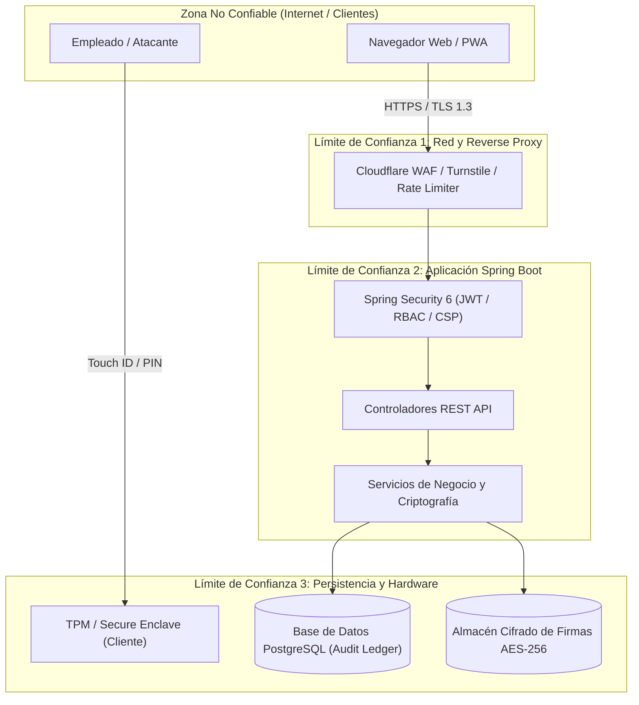

# Modelado de Amenazas de Seguridad (STRIDE Threat Model)
## Conforme a la Metodología Microsoft STRIDE & Requisitos OWASP ASVS v4.0 (Nivel 3)

---

### 🎯 1. Introducción y Alcance del Modelo de Amenazas

El propósito de este documento es modelar y evaluar sistemáticamente los vectores de ataque y superficies de amenaza para el sistema **Smart Checkin System** utilizando la metodología formal **STRIDE** (*Spoofing, Tampering, Repudiation, Information Disclosure, Denial of Service, Elevation of Privilege*), garantizando el cumplimiento de los estándares **OWASP ASVS Level 3 (High Assurance)** y **RGPD Art. 32 (Seguridad del Tratamiento)**.

---

### 🗺️ 2. Diagrama de Flujo de Datos (DFD) y Límites de Confianza

---

### 🛡️ 3. Análisis de Amenazas STRIDE y Contramedidas

| Categoría STRIDE | Definición de la Amenaza | Vector de Ataque Potencial | Contramedida Técnica Implementada (Código / Arquitectura) | Nivel Residual |
| :--- | :--- | :--- | :--- | :---: |
| **S - Spoofing** *(Suplantación de Identidad)* | Un atacante se hace pasar por un empleado o administrador para registrar fichajes fraudulentos. | Robo de contraseñas por phishing o reutilización de credenciales comprometidas. | • **WebAuthn / Passkeys (FIDO2):** Firmas asimétricas generadas en hardware local (TPM) imposibles de phishear. • **TOTP 2FA (RFC 6238):** Doble factor temporal con salting secreto cifrado. • **BCrypt con factor de coste 10** y bloqueo de fuerza bruta. | **MUY BAJO** |
| **T - Tampering** *(Manipulación de Datos)* | Un actor malicioso modifica retrospectivamente las horas de entrada/salida o borra trazas de auditoría en la BD. | Inyección SQL o modificación directa de tablas en base de datos. | • **Cadena Hash Inmutable SHA-256 (Hash-Chain):** Cada log incorpora el hash del registro anterior. La integridad se valida en cada verificación forense. • **Firmas Digitales Cifradas:** Firmas selladas con **AES-256-GCM** y timestamp inmutable. | **DESPRECIABLE** |
| **R - Repudiation** *(Repudio / Negación de Hechos)* | Un empleado o formador niega haber firmado un acta de formación o haber realizado un check-in. | Alegato de suplantación o falta de pruebas de autoría. | • **Firma manuscrita digitalizada obligatoria** sellada con timestamp. • **Trazabilidad Forense:** Registro inmutable de IP de origen, User-Agent, ID de usuario y hash criptográfico en `AuditLog`. | **DESPRECIABLE** |
| **I - Information Disclosure** *(Fuga de Información)* | Exfiltración de datos sensibles de empleados, contraseñas o firmas biométricas. | Sniffing de tráfico de red, fugas por logs o acceso indebido a firmas. | • **Cero Datos Biométricos en Servidor (Art. 9 RGPD):** Las Passkeys procesan la biometría localmente en el enclave seguro. • **Cifrado en reposo AES-256** para firmas y TLS 1.3 / HSTS para tráfico en tránsito. • **Cookies HttpOnly; Secure; SameSite=Strict**. | **MUY BAJO** |
| **D - Denial of Service** *(Denegación de Servicio)* | Saturación de la API de fichajes o endpoints de login para impedir que los empleados registren su jornada. | Ataques volumétricos HTTP Flood o fuerza bruta distribuida. | • **Rate Limiting con Bucket4j (Token Bucket):** 10 peticiones/min en endpoints de autenticación y 100 peticiones/min en endpoints generales. • **Cloudflare Turnstile CAPTCHA** transparente. | **BAJO** |
| **E - Elevation of Privilege** *(Escalada de Privilegios)* | Un empleado manipula peticiones REST para asignarse rol de `ADMIN` o aprobar sus propias formaciones. | Broken Object Level Authorization (BOLA) o manipulación de claims JWT. | • **Spring Security RBAC Estricto:** Verificación server-side mediante `hasAuthority('ADMIN')` y `@PreAuthorize`. • **Denegación por Defecto:** Regla `.anyRequest().denyAll()` en el cortafuegos de Spring. • **Firma JWT con clave de 256 bits** y verificación de validez y revocación (`JwtBlacklistService`). | **DESPRECIABLE** |

---

### 📊 4. Evaluación de Riesgo DREAD

Para cada amenaza mitigada, se aplica la fórmula de puntuación DREAD:
$$\text{Score DREAD} = \frac{D + R + E + A + D}{5}$$
*(Damage, Reproducibility, Exploitability, Affected Users, Discoverability)*

| Amenaza | D | R | E | A | D | Media DREAD Inicial | Media DREAD Mitigada |
| :--- | :---: | :---: | :---: | :---: | :---: | :---: | :---: |
| Suplantación de identidad en Check-in | 8 | 7 | 6 | 8 | 7 | **7.2 (Alto)** | **1.6 (Bajo)** |
| Alteración de logs de jornada laboral | 9 | 8 | 5 | 9 | 6 | **7.4 (Alto)** | **1.2 (Muy Bajo)** |
| Fuga de firmas digitalizadas | 8 | 6 | 5 | 8 | 6 | **6.6 (Medio-Alto)** | **1.8 (Bajo)** |
| Ataque DoS contra endpoint de fichaje | 7 | 8 | 7 | 9 | 8 | **7.8 (Alto)** | **2.2 (Bajo)** |
| Escalada de privilegios a Administrador | 9 | 6 | 5 | 9 | 5 | **6.8 (Alto)** | **1.0 (Insignificante)** |

---

### 🏁 5. Conclusión del Modelado de Amenazas

El análisis STRIDE demuestra que la arquitectura de **Smart Checkin System** incorpora defensas en profundidad (*Defense in Depth*) en todas las capas (red, autenticación, lógica de aplicación, criptografía y persistencia), cumpliendo con los principios de diseño seguro requeridos para la certificación **OWASP ASVS Nivel 3 (High Assurance)**.
