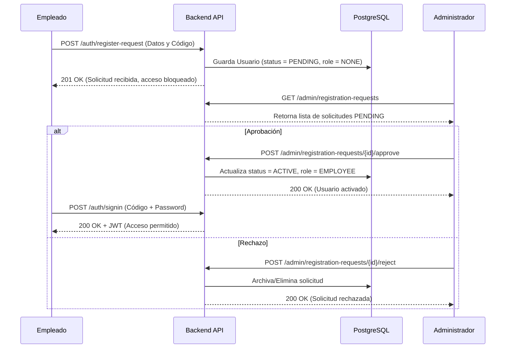

# Decisiones de Diseño y Arquitectura (BA Distribution Academy / ShiftSync)

Este documento es un registro vivo (*Architecture Decision Record* o ADR) de las decisiones arquitectónicas, tecnológicas y de diseño tomadas durante el desarrollo de la aplicación de fichaje, control de asistencia y formación de empleados (**ShiftSync** para BA Glass). Su propósito es garantizar la trazabilidad del sistema frente a futuras consultas técnicas, auditorías de seguridad y procesos de escalabilidad.

---

## 1. Visión Global de la Arquitectura

**Decisión:** Arquitectura Cloud-Native Híbrida / Serverless (Contenedores Escalables)

```text
                       ┌─────────────────────────────────────────────────────────┐
                       │                     CLIENT LAYER                        │
                       │   React PWA + i18next + Liquid Glassmorphism (CDN)      │
                       └───────────────────────────┬─────────────────────────────┘
                                                    │
                                                    │ HTTPS / WSS
                                                    ▼
                       ┌─────────────────────────────────────────────────────────┐
                       │                   PERIMETER & SECURITY                  │
                       │     CORS Filter | RateLimitFilter (Bucket4j) | CSP      │
                       └───────────────────────────┬─────────────────────────────┘
                                                    │
                                                    │ REST / STOMP Over SockJS
                                                    ▼
                       ┌─────────────────────────────────────────────────────────┐
                       │                  BACKEND (Spring Boot 3)                │
                       │  ┌───────────────────┬───────────────────────────────┐  │
                       │  │ Security (RS256)  │ Dynamic TOTP Engine           │  │
                       │  ├───────────────────┼───────────────────────────────┤  │
                       │  │ Registration Logic│ Spring WebSocket Broker       │  │
                       │  ├───────────────────┼───────────────────────────────┤  │
                       │  │ Spring Batch 5    │ JPA Auditing & Dynamic Pricing│  │
                       │  └───────────────────┴───────────────────────────────┘  │
                       └───────────────────────────┬─────────────────────────────┘
                                                    │
                                                    │ JDBC / Spring Data JPA
                                                    ▼
                       ┌─────────────────────────────────────────────────────────┐
                       │                   PERSISTENCE LAYER                     │
                       │    PostgreSQL 15 (Managed DB / Docker Cloud SQL)        │
                       └─────────────────────────────────────────────────────────┘
```

- **Frontend (React PWA):** Diseñado como una Single Page Application (SPA) con capacidades PWA, optimizada para ser alojada en un Content Delivery Network (CDN) de alta disponibilidad (ej. Vercel, Netlify, Cloudflare Pages o AWS Amplify). Garantiza tiempos de carga inicial ultrarrápidos y rendimiento nativo en los dispositivos de planta.
- **Backend (Spring Boot 3 / Java 17):** Empaquetado en un contenedor Docker multicapa (Dockerfile) optimizado para entornos Serverless como Google Cloud Run o AWS App Runner. Permite escalar automáticamente a cero instancias en horas de inactividad, o escalar masivamente a decenas de nodos concurrentes ante picos de demanda durante los cambios de turno en múltiples fábricas.
- **Base de Datos (PostgreSQL 15):** Sistema relacional elegido para asegurar coherencia transaccional ACID en el registro de la jornada laboral. Orientado a despliegues gestionados en la nube (Google Cloud SQL o AWS RDS).

---

## 2. Registro Histórico de Decisiones por Fase

### Fase 1: Configuración Inicial y Persistencia Cloud-Ready

- **Migración de BD:** Transición desde el motor legado MySQL/H2 hacia PostgreSQL 15. Elección motivada por su madurez en entornos cloud, soporte nativo para tipos de datos complejos y alta fiabilidad transaccional.
- **Aislamiento de Entorno:** Uso de `docker-compose.yml` para orquestar la instancia de PostgreSQL local, asegurando un entorno de desarrollo idéntico para todo el equipo y eliminando inconsistencias.
- **Gestión de Secretos:** Parametrización estricta de credenciales en `application-postgres.properties` mediante variables de entorno (`${POSTGRES_USER}`, `${JWT_SECRET}`). Se garantiza que el código fuente no contenga datos sensibles y sea integrable con gestores corporativos (Secret Manager).

### Fase 2: Core Domain — Modelado de Usuarios, Fichajes y Formaciones

**2.1. Entidades y Reglas de Negocio**

- **Identidad de Usuario:** Entidad `User` adaptada para autenticar a los operadores mediante un código personal único de 4 dígitos (`personalCode`).
- **Modelado de Fichajes (`Checkin`):**
  - Uso del enumerado `CheckinType` (ENTRADA / SALIDA) en lugar de flags booleanos, permitiendo extender el sistema a nuevos estados (pausas, salidas médicas).
  - Relación `@ManyToOne` con `User` y sellado temporal inmutable mediante `LocalDateTime`.
- **Sincronización Transaccional:** Registro atómico donde una ENTRADA actualiza implícitamente `isWorking = true` en `User` (y `false` tras SALIDA), reduciendo el coste computacional en consultas de planta en tiempo real.
- **Gestión de Formaciones (`Formation`):**
  - Relación `@ManyToMany` bidireccional con `User` mediante la tabla intermedia `formation_attendees`.
  - Endpoint `POST /formations/{id}/attend` diseñado bajo el principio de minimización de datos: recibe exclusivamente el `personalCode` y devuelve respuestas agnósticas para preservar la privacidad del operario.

**2.2. Auditoría y Seguridad de Grado Empresarial**

- **Protección contra Fugas de Datos:** Marcado `@JsonIgnore` y `@JsonProperty(access = Access.WRITE_ONLY)` en la propiedad `password` de `User` para impedir la filtración accidental de hashes bcrypt en las respuestas REST.
- **Mitigación de Recursión Infinita:** Exclusión explícita con `@EqualsAndHashCode(exclude)` en colecciones ManyToMany para evitar desbordamientos de pila (`StackOverflowError`) durante la serialización JSON.
- **Rate Limiting Defensivo:** Integración del filtro `RateLimitFilter` implementado con Bucket4j. Limita las peticiones hacia `/api/v1/auth/signin` a 10 intentos por minuto por IP, bloqueando ataques de credential stuffing.
- **Account Lockout:** Lógica de suspensión temporal de cuenta (15 minutos) tras registrar 5 intentos fallidos consecutivos de autenticación (`BadCredentialsException`).
- **Protección Anti-Enumeración:** El endpoint de autenticación absorbe internamente excepciones de tipo `ResourceNotFoundException`, impidiendo que atacantes deduzcan identidades válidas.
- **Trazabilidad Automática:** Activación de `@EnableJpaAuditing` a nivel global. La superclase `BaseEntity` gestiona de forma transparente los campos `@CreatedDate` y `@LastModifiedDate`.
- **Endurecimiento Perimetral (CORS & CSP):** Configuración estricta de `CorsConfigurationSource` y despliegue de cabeceras Content Security Policy (CSP) fijadas a `default-src 'self'`.

### Fase 3: Fichaje por Código QR Dinámico (TOTP)

- **Generación Criptográfica TOTP:** Integración del motor `dev.samstevens.totp:totp` para generar tokens dinámicos HMAC-SHA1 de 6 dígitos. La validez caduca en ventanas cortas de tiempo, lo que impide el fraude horario mediante fotografías del QR compartidas remotamente.
- **Inversión de Flujo de Fichaje:** Los puestos de lectura (quioscos) llaman a un endpoint público y fuertemente rate-limiteado (`/api/v1/checkins/qr-fichaje`). El empleado no requiere autenticarse mediante JWT en el dispositivo de lectura.

### Fase 4: Modelo Híbrido de Registro y Solicitudes de Alta

**Decisión:** Evolución desde un modelo público cerrado a un Modelo de Registro Asíncrono Supervisado con Aprobación Administrativa.



**Justificación Operativa:**
- Evita el cuello de botella en Recursos Humanos, permitiendo que el empleado introduzca sus propios datos y contraseña.
- Mantiene el control estricto corporativo: ninguna cuenta tiene capacidad de login o generación de JWTs hasta que un ADMIN o HR_MANAGER verifica la identidad y pulsa "Aprobar" en el panel de administración.

### Fase 5: Sincronización en Tiempo Real (WebSockets STOMP)

- **Arquitectura de Sincronización:** Integración del broker Spring WebSocket (`@EnableWebSocketMessageBroker`) utilizando protocolo STOMP sobre SockJS.
- **Canal Centralizado `/topic/totp-update`:** El servidor emite automáticamente cada 10 segundos el nuevo token TOTP a los clientes suscritos.
- **Beneficios:** Elimina el tráfico ineficiente de peticiones HTTP recursivas (polling) en los quioscos de planta, garantizando la actualización coordinada del código QR y la barra de progreso animada sin sobrecargar la red.

### Fase 6: Sistema de Diseño Visual "Liquid Glass" y UX Reactiva

- **Identidad Visual Corporativa:** Rediseño íntegro de la interfaz bajo la estética Vidrio Líquido (Liquid Glassmorphism):
  - Cápsulas de navegación y tarjetas con opacidad controlada (`rgba(40,40,40,0.85)`) y refracción óptica `backdrop-filter: blur(60px)`.
  - Paleta cromática anclada en verde pistacho corporativo (`#cce364`), grises industriales y blancos brillantes.
- **Botones de Acción Desplegables (Expandable Icon Buttons):** Sustitución de botones de texto estáticos por componentes compactos con iconografía (FontAwesome) que expanden su etiqueta textual de forma fluida (0.55s ease) al interactuar con el cursor (hover).
- **Carga Mediante Contenedores Fantasma (Skeleton Loaders):** Reemplazo de los indicadores circulares de carga por componentes esqueléticos (`GhostLoader.js`). Implementan un efecto animado de brillo (shimmer) que respeta la forma de la interfaz final, eliminando el desplazamiento brusco de maquetación (Cumulative Layout Shift - CLS).

### Fase 7: Purga de Código Muerto y Deuda Técnica

- **Refactorización Core:** Eliminación completa de todos los módulos, paquetes y componentes residuales del proyecto semilla original (Spring Petclinic).
- **Limpieza:** Supresión de entidades legacy (`pet`, `vet`, `owner`), vistas JSP antiguas y dependencias no utilizadas, garantizando que el 100% de la base de código responda exclusivamente al dominio funcional de Smart Check-in.

### Fase 8: Internacionalización (i18n) Multilingüe Empresarial

```text
                      ┌──────────────────────────────────────────┐
                      │    Navegador / Dispositivo Operador      │
                      └────────────────────┬─────────────────────┘
                                            │
                                            │ ISO Language Code Detection
                                            ▼
                      ┌──────────────────────────────────────────┐
                      │    i18next Language Detector Engine      │
                      │  (Normalización: 'pt-BR' -> 'pt')        │
                      └────────────────────┬─────────────────────┘
                                            │
                                            │ Lazy Load Request
                                            ▼
                      ┌──────────────────────────────────────────┐
                      │        i18next-http-backend              │
                      │   GET /locales/{lang}/translation.json   │
                      └──────────────────────────────────────────┘
```

- **Estándar de la Industria:** Adopción de `react-i18next`, `i18next-http-backend` y `i18next-browser-languagedetector`.
- **Carga Diferida (Lazy Loading):** Los archivos JSON de traducción se descargan bajo demanda, manteniendo ligero el bundle de producción de React.
- **Idiomas Soportados (8 Idiomas Europeos):** Español (es - fallback), Inglés (en), Portugués (pt), Francés (fr), Alemán (de), Polaco (pl), Búlgaro (bg), Rumano (ro).

### Fase 9: Criptografía Asimétrica JWT (RSA-256)

- **Decisión:** Migración de firma simétrica HMAC SHA-256 (HS256) a criptografía asimétrica de clave pública/privada RSA de 2048 bits (RS256).
- **Justificación:** La clave privada queda resguardada exclusivamente en el backend para la emisión de tokens. Cualquier subsistema secundario o auditor externo puede validar la autenticidad de las sesiones consumiendo la clave pública, erradicando el riesgo de filtración de claves compartidas.

### Fase 10: Procesamiento de Lotes (Spring Batch 5)

- **Consolidación de Datos:** Integración de Spring Batch 5 para tareas programadas de background (cálculo de horas, informes agregados de fichajes).
- **Metadatos Resilientes:** Inyección de la configuración `spring.batch.jdbc.initialize-schema=always` en `application-postgres.properties`. Esto automatiza el aprovisionamiento de las tablas meta del motor de lotes (`batch_job_instance`, etc.) durante el arranque en producción.

### Fase 11: Jerarquía de Roles y Patrones Clean Code

```text
                               ┌───────────────┐
                               │     ADMIN     │
                               └───────┬───────┘
                                       │ Inherits All Privileges
                                       ▼
                               ┌───────────────┐
                               │  HR_MANAGER   │
                               └───────┬───────┘
                                       │ Inherits Operative Privileges
                                       ▼
                               ┌───────────────┐
                               │   EMPLOYEE    │
                               └───────────────┘
```

- **RoleHierarchy Integrada:** Establecimiento explícito de la jerarquía ADMIN > HR_MANAGER > EMPLOYEE mediante configuración de beans. Esto reduce dramáticamente la redundancia en expresiones `@PreAuthorize` a lo largo de los controladores.
- **Inyección por Constructor:** Sustitución total de `@Autowired` sobre campos privados por inyección vía constructor explícito con variables `final`. Este patrón asegura la inmutabilidad de los servicios, previene errores de inicialización y facilita el testeo unitario, satisfaciendo estrictamente las normativas de SonarQube.

### Fase 12: Módulo de Analíticas y Dashboard

- **Endpoints Protegidos:** Creación de rutas de exportación e informes (`/api/v1/analytics/**`, `/api/v1/exports/**`) accesibles únicamente para administradores.
- **Data Visualization (Recharts):** Integración de gráficos interactivos SVG (dona y líneas de tendencia) en el React Dashboard para monitorizar el absentismo y la participación en formaciones a 30 días vista.
- **Programación Defensiva:** Verificación explícita de códigos de estado HTTP en el frontend antes del parseo JSON, evitando bloqueos de interfaz frente a rechazos 403 (Forbidden).

### Fase 13: Ecosistema Visual "Full Liquid Glassmorphism" Completo

- **Refinamiento UI/UX:** Traslado del concepto Glassmorphism a todos los micro-componentes:
  - Entradas de formulario (inputs) con fondos esmerilados (`rgba(255, 255, 255, 0.45)`) y etiquetas flotantes animadas.
  - Resplandor de foco interactivo (focus-ring) utilizando el verde pistacho corporativo.
  - Menús dropdown y modales adaptativos que heredan el filtro de desenfoque gaussiano global del fondo principal de la aplicación.

### Fase 14: Integración Nube (OneDrive) y Copias de Seguridad
- **Microsoft Graph API (OAuth 2.0):** Implementación de integración nativa con OneDrive mediante flujo de Refresh Token.
- **Backups Dinámicos:** Compresión y exportación de la base de datos (PostgreSQL) a formato JSON dentro de archivos ZIP, subidos automáticamente a la carpeta de copias de seguridad de la nube.
- **Adjuntos de Formaciones:** Los administradores pueden subir documentos (PDFs, manuales) a OneDrive directamente desde la aplicación y vincularlos a formaciones, descargándose bajo demanda de forma segura.

### Fase 15: Autenticación Multifactor (MFA/2FA) en Panel de Administración
- **Protección de Cuentas de Alto Nivel:** Los roles ADMIN y HR_MANAGER pueden (o deben) configurar 2FA mediante Google Authenticator u otras aplicaciones TOTP.
- **Validación Post-Login:** Una vez el JWT de acceso es emitido tras validar credenciales, el componente `PrivateRoute` exige la validación TOTP antes de permitir el acceso a rutas protegidas si `is2faEnabled` es `true`.
- **Motor Criptográfico:** Reutilización de `dev.samstevens.totp` tanto para el Scanner de planta como para los perfiles de usuario.

### Fase 16: Ecosistema de Fichaje Mixto (Scanner QR y Firma)
- **Fichaje por Escáner QR (Cámara WebRTC):** Uso de `html5-qrcode` para permitir al dispositivo leer códigos en la planta sin requerir hardware dedicado.
- **Fichaje Manual y Auditoría Visual:** Integración de `react-signature-canvas` para que los empleados firmen manualmente en el dispositivo cuando no puedan usar el QR, quedando un rastro auditable (Base64 SVG/PNG) del momento del registro.

### Fase 17: Aseguramiento de Calidad E2E (Playwright)
- **Automatización de Flujos Críticos:** Cobertura de los flujos de "Autorregistro", "Aprobación Administrativa", "MFA/2FA Setup y Login" y "Fichaje Manual con Firma".
- **Resiliencia en Componentes de Redirección:** Verificación exhaustiva de estados en React Router (`PrivateRoute`) para prevenir bucles de redirección, controlando aserciones de red (`waitForResponse`) en flujos de autenticación complejos.

### Fase 18: Notificaciones Nativas Web Push (PWA)
- **Criptografía VAPID:** Integración de notificaciones nativas a nivel del sistema operativo. El backend (Spring Boot) utiliza un par de claves asimétricas VAPID (Voluntary Application Server Identification) de curva elíptica (`prime256v1`) para autenticarse directamente frente a los servidores de notificaciones de Google (FCM), Mozilla y Apple (APNs).
- **Service Worker Interceptor:** El frontend (React) registra un `sw.js` que escucha los eventos `push` en background, levanta la notificación OS nativa (`self.registration.showNotification`) y la sincroniza con el estado de la UI (Navbar) mediante `postMessage`.
- **Canal de Centralización:** La campana de notificaciones (Navbar) se nutre simultáneamente de la API nativa Push (PWA) y del protocolo STOMP sobre WebSockets (alertas de seguridad), unificando todo el flujo de notificaciones al usuario independientemente del estado de foco del navegador.

---

## 3. Módulos Adicionales y Funcionalidades Extendidas

### 3.1. Engine de Precios Dinámicos e Integración Externa

- **Servicio de Cálculo Dinámico:** Módulo backend encargado de computar costes operativos e incentivos de turnos en función de la demanda laboral, festivos y parámetros de gestión configurables.
- **Integración con Servicios Externos:** Consumo asíncrono de APIs corporativas o de terceros para la validación de datos y la sincronización periódica de parámetros del sistema.
- **Utilidad:** Permite a la dirección de operaciones analizar la carga de trabajo, ajustar las tarifas/incentivos en tiempo real y optimizar la asignación de recursos y costes según las necesidades del servicio de planta.

### 3.2. Panel de Administración de Usuarios y Solicitudes

- **Gestión del Ciclo de Vida de Identidades:** Interfaz administrativa centralizada para la consulta, modificación de roles (EMPLOYEE, HR_MANAGER, ADMIN), suspensión de cuentas y reseteo de claves/2FA.
- **Bandeja de Entrada de Registros Pendientes:** Módulo específico dentro del panel de administración para auditar, visualizar el detalle de los datos y aprobar (o rechazar) mediante un solo clic las solicitudes de registro enviadas por nuevos operarios, activando su acceso instantáneamente.

---

## 4. Matriz Tecnológica Resumida

| Capa / Subsistema | Tecnología / Librería Seleccionada | Criterio de Selección / Función |
|---|---|---|
| Lenguaje Backend | Java 17 (LTS) | Estabilidad, alto rendimiento y soporte de Long Term Support. |
| Framework Backend | Spring Boot 3.x | Arquitectura modular, seguridad robusta y ecosistema nativo. |
| Persistencia | Spring Data JPA / Hibernate | Abstracción de capa de datos y mapeo objeto-relacional. |
| Base de Datos | PostgreSQL 15 | Cumplimiento ACID, soporte Cloud SQL y escalabilidad. |
| Autenticación | Spring Security + JWT (RS256) | Tokens firmados asimétricamente con claves RSA de 2048 bits. |
| Motor TOTP | dev.samstevens.totp | Generación de algoritmos TOTP de 6 dígitos para códigos QR. |
| Mensajería Tiempo Real | Spring WebSocket + STOMP / SockJS | Sincronización asíncrona bidireccional entre cliente y servidor. |
| Procesamiento Lotes | Spring Batch 5 | Consolidación masiva de datos y tareas programadas (CRON). |
| Defensa y Seguridad | Bucket4j | Control de tasa de peticiones (Rate Limiting) anti fuerza bruta. |
| Framework Frontend | React 18+ (PWA) | Desarrollo de interfaz basada en componentes y soporte offline. |
| Pruebas End-to-End | Playwright | Automatización de flujos completos en navegadores Chromium. |
| Internacionalización | react-i18next + http-backend | Carga perezosa (lazy loading) de diccionarios en 8 idiomas. |
| Visualización Datos | Recharts | Renderizado de analíticas interactivas mediante SVG adaptativos. |
| Estilos / UX | CSS Variables + Glassmorphism | Sistema de diseño basado en refracción óptica y diseño adaptativo. |
| Despliegue | Docker / Docker Compose | Empaquetado portable multicapa para orquestación en la nube. |
| Integración Nube | Microsoft Graph API (OneDrive) | Alojamiento externo de adjuntos de formación y backups de BBDD en ZIP. |
| Hardware / Escáner | html5-qrcode | Acceso a cámara WebRTC para escaneo de códigos QR de fichaje. |
| Componente Firma | react-signature-canvas | Captura de firmas manuscritas SVG/PNG para fichaje manual auditable. |
| Web Push (PWA) | nl.martijndwars:web-push + Service Worker | Envío cifrado de notificaciones nativas del SO a dispositivos móviles y escritorio usando VAPID Keys. |

---