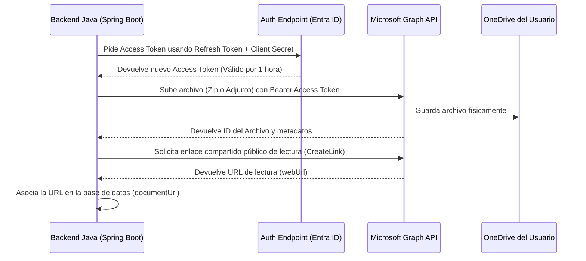

# Informe de Integración: API de OneDrive y Copias de Seguridad en la Nube

Este informe técnico detalla la arquitectura, el funcionamiento y el proceso de configuración de la integración de **Microsoft OneDrive (a través de Microsoft Graph API)** en el **Smart Check-in System**.

---

## 1. Contexto y Objetivos

El cliente solicitó incorporar dos nuevas funcionalidades relacionadas con la nube:
1. **Configuración de almacenamiento para copias de seguridad**: Un panel de administración que permita configurar una carpeta local o una cuenta en la nube para alojar copias de seguridad de la base de datos (empaquetadas en un archivo ZIP con formato JSON).
2. **Gestión de documentos de formación**: Capacidad para que los administradores suban archivos adjuntos (PDFs, guías, manuales, etc.) al crear/editar formaciones, de forma que los empleados tengan acceso a ellos en sus paneles para futuras referencias.

Se optó por realizar una **integración directa de API nativa** frente a carpetas sincronizadas en servidor, ya que ofrece un entorno mucho más profesional, controlado y seguro. La primera fase completada ha sido la integración de **OneDrive**.

---

## 2. Arquitectura de Integración (Microsoft Azure y Graph API)

La comunicación entre el Smart Check-in System y la nube de Microsoft se realiza a través de **Microsoft Graph API** (el punto de entrada unificado para los servicios de Microsoft 365). 

### Componentes Clave:
*   **Microsoft Entra ID (Inquilino / Tenant)**: Es la estructura de identidad que hospeda el registro de nuestra aplicación.
*   **Registro de Aplicación Multitenant**: La aplicación registrada se configuró para dar soporte a cuentas organizativas y **cuentas personales de Microsoft** (Live, Outlook, Hotmail, Gmail con cuenta Microsoft). Esto permite usar tanto cuentas corporativas como la cuenta gratuita del cliente.
*   **El inquilino especial `consumers`**: Para evitar que Microsoft busque licencias de SharePoint/OneDrive corporativas dentro de inquilinos de Azure vacíos, la URL de autenticación del backend apunta al endpoint `/consumers/`. Esto fuerza el enrutamiento de la API hacia el espacio de almacenamiento personal y gratuito del usuario final.
*   **Permisos de API delegados**:
    *   `Files.ReadWrite`: Permite leer, crear y actualizar archivos en el OneDrive del usuario.
    *   `offline_access`: Permite obtener un **Refresh Token** persistente. Esto evita que la aplicación pida credenciales en pantalla cada vez; se autentica de fondo de forma ilimitada.

---

## 3. Implementación y Flujo en el Backend (Java / Spring Boot)

Se crearon y modificaron varios componentes en el backend para dar soporte a la nube:

### A. Almacenamiento de Ajustes (`CloudSettings` y `CloudSettingsDTO`)
Definimos la entidad `CloudSettings` (de patrón Singleton en base de datos) para guardar de forma segura:
*   El tipo de proveedor (ej: `ONEDRIVE`).
*   Las claves `ClientId`, `ClientSecret`, `TenantId` (fijado en `consumers`) y el `RefreshToken`.
Se incorporó el uso de un **DTO** (`CloudSettingsDTO`) para separar la persistencia de la transferencia de datos en la API.

### B. Servicio de OneDrive (`OneDriveService.java`)
Es el motor de comunicación con Microsoft. Realiza tres tareas principales:
1.  **`getAccessToken`**: Envía un `POST` al endpoint de Microsoft pasándole el `refresh_token`, el `client_id`, el `client_secret` y el `scope=offline_access files.readwrite`. Devuelve un token de acceso temporal (válido por 1 hora).
2.  **`uploadFile` (Documentación)**: Toma un archivo binario subido por el administrador, genera un nombre único (usando UUID) y realiza un `PUT` a la API de Graph en `.../me/drive/root:/[nombre_archivo]:/content`. Posteriormente, llama al endpoint `createLink` para generar un enlace público anónimo y lo devuelve.
3.  **`uploadBackup` (Copia de seguridad)**: Sube el volcado de datos comprimido en ZIP dentro de la ruta `/backups/[fecha_copia].zip`.

### C. Motor de Copias de Seguridad (`DatabaseBackupService.java`)
*   Recupera de la base de datos todos los listados de **Usuarios**, **Formaciones**, **Asistencias** y **Auditorías**.
*   Los convierte a formato JSON estructurado mediante la librería `ObjectMapper`.
*   Comprime el JSON resultante en memoria utilizando un flujo de salida ZIP (`ZipOutputStream`).
*   Llama a `OneDriveService` para subir el archivo `.zip` resultante a la carpeta `/backups` del OneDrive del usuario.

### D. Controladores y Seguridad
*   `CloudSettingsRestController.java`: Endpoint protegido para que únicamente los administradores (`ADMIN`) puedan leer o modificar las credenciales y forzar copias de seguridad manualmente.
*   `FormationRestController.java`: Modificado para soportar peticiones Multipart (`@RequestPart`), permitiendo recibir el archivo del documento junto con los datos del formulario JSON de la formación.

---

## 4. Vistas e Interfaz Frontend Modificadas (React)

La UI se actualizó para incorporar controles accesibles para el administrador y los usuarios:

*   **Pantalla de Ajustes de la Nube (`CloudSettingsAdmin.js`)**:
    *   Ubicada en el menú de Administración.
    *   Formulario para seleccionar proveedor y guardar las credenciales de Azure (`ClientId`, `ClientSecret`, `TenantId`, `RefreshToken`).
    *   Incluye el botón **"Forzar copia de seguridad"** para realizar un volcado y subida manual al instante.
*   **Edición/Creación de Formaciones (`FormationEditAdmin.js`)**:
    *   Permite cargar un documento de formación (PDF, Word, imágenes) desde el ordenador local.
    *   Muestra una barra de previsualización y el estado del archivo.
*   **Detalles y Dashboard (`FormationDetailsAdmin.js` y `UserDashboard.js`)**:
    *   Comprueban si el campo `documentUrl` de la formación tiene un enlace guardado en la base de datos.
    *   Si existe el enlace, pintan el botón **"Ver Documentación"**. Al pulsarlo, abre una nueva pestaña del navegador directamente al visor oficial de OneDrive.

---

## 5. Guía de Configuración para el Cliente Final (Despliegue)

Para desplegar la aplicación y que guarde los datos en el OneDrive de la empresa del cliente, el administrador del cliente debe seguir estos pasos en su cuenta de Microsoft:

1.  **Registrar la aplicación**:
    *   Entrar en el centro de administración de **[Microsoft Entra](https://entra.microsoft.com/)** de su organización.
    *   Ir a **Identidad** > **Aplicaciones** > **Registros de aplicaciones** > **Nuevo registro**.
    *   *Nombre*: Smart Checkin App.
    *   *Tipo de cuentas*: Seleccionar la **3ª opción** (Cuentas en cualquier directorio y cuentas personales de Microsoft).
    *   *URI de redirección (Web)*: `https://login.microsoftonline.com/common/oauth2/nativeclient`.
2.  **Obtener las Claves**:
    *   Copiar el **Id. de aplicación (cliente)** de la pantalla de información general.
    *   Ir a **Certificados y secretos** > **Nuevo secreto de cliente** > Copiar el **Valor** del secreto generado.
3.  **Configurar Permisos**:
    *   Ir a **Permisos de API** > **Agregar un permiso** > **Microsoft Graph** > **Permisos delegados**.
    *   Añadir `Files.ReadWrite` y `offline_access`.
    *   Hacer clic en **"Conceder consentimiento de administrador para [Organización]"**.
4.  **Generar el Refresh Token inicial**:
    *   Hacer que el administrador abra en su navegador la siguiente dirección (sustituyendo el ClientID por el suyo):
        `https://login.microsoftonline.com/consumers/oauth2/v2.0/authorize?client_id=[CLIENT_ID]&response_type=code&redirect_uri=https://login.microsoftonline.com/common/oauth2/nativeclient&response_mode=query&scope=offline_access%20Files.ReadWrite`
    *   Iniciar sesión, aceptar el consentimiento y copiar el código `?code=[CODIGO]` de la barra de direcciones de la página en blanco de Microsoft.
    *   Intercambiar ese código por el `refresh_token` definitivo.
5.  **Pegar en la Web**:
    *   Introducir el Client ID, Client Secret, Tenant ID (`consumers`) y el Refresh Token en el formulario de la aplicación Smart Checkin y pulsar Guardar.
