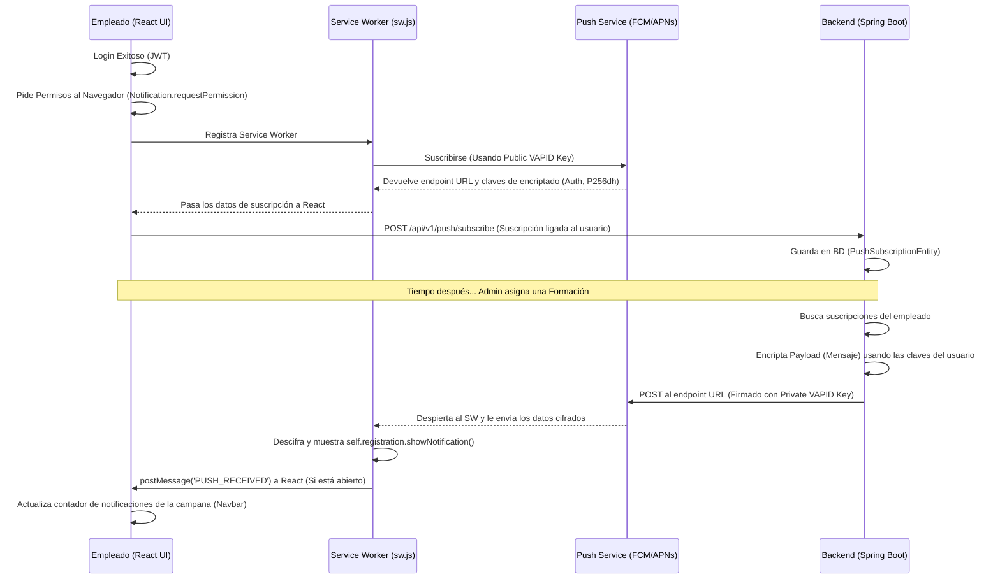

# Notificaciones Push (PWA) y Arquitectura VAPID

Este documento detalla la implementación técnica, la arquitectura de seguridad y los flujos de comunicación utilizados para el envío de notificaciones nativas a través del protocolo Web Push (PWA) en ShiftSync.

---

## 1. El Problema a Resolver
En aplicaciones web clásicas, la única manera de notificar a un usuario es cuando éste tiene la pestaña abierta y conectada mediante WebSockets o Long Polling. 
Con **Web Push**, podemos enviar una notificación nativa (como si fuera una app instalada de Android, iOS o Escritorio) **incluso si el usuario tiene el navegador cerrado o la pestaña en segundo plano**.

Para lograrlo, el navegador inscribe un pequeño script de fondo llamado **Service Worker** que es capaz de "despertarse" al recibir una señal de los servidores de Apple/Google/Mozilla, mostrar el mensaje visual al usuario, y volver a dormirse.

---

## 2. El Protocolo Web Push y el Rol de VAPID

### 2.1. ¿Qué es VAPID?
VAPID son las siglas de *Voluntary Application Server Identification*. Es una especificación estándar de IETF (RFC 8292).
Sirve para que nuestro Backend (Spring Boot) se autentique criptográficamente ante los servidores de distribución push de los navegadores (Push Services, como FCM para Chrome o APNs para Safari).

### 2.2. ¿Por qué es necesario VAPID?
Si nuestro Backend enviara peticiones anónimas de notificación a Google/Apple para que las redirigieran al móvil de un empleado, estos servidores nos bloquearían para prevenir *spam*.
VAPID genera un par de **Claves Asimétricas de Curva Elíptica (prime256v1)**:
- **Clave Pública (Public Key):** Se le envía al navegador (React) y este, a su vez, se la pasa a Google/Apple cuando el usuario pulsa "Permitir notificaciones".
- **Clave Privada (Private Key):** Nunca sale del backend. Se usa para firmar digitalmente un JWT cada vez que disparamos un evento Push hacia Google/Apple, demostrando matemáticamente que somos los dueños de esa aplicación.

Gracias a VAPID, no necesitamos registrarnos en Google Firebase ni configurar certificados de Apple de forma manual; el protocolo es libre, universal y descentralizado.

---

## 3. Flujo de Implementación en ShiftSync



---

## 4. Componentes Clave de la Arquitectura

### 4.1. Backend (Spring Boot)
- **`PushNotificationController.java`**: Endpoint REST que recibe la suscripción del navegador (el endpoint del usuario, y las claves `P256dh` y `Auth`). Asocia esta suscripción al usuario autenticado (extraído del SecurityContext).
- **`PushSubscriptionEntity.java`**: Modelo JPA para persistir los tokens de notificación en PostgreSQL. Se define una relación `@ManyToOne` con `User`.
- **`PushNotificationService.java`**: Utiliza la librería `nl.martijndwars:web-push` y el motor `BouncyCastle`. Encripta el mensaje, firma la petición web HTTP con la clave VAPID privada y envía el POST asíncrono al Push Service del cliente.
  - Implementa resiliencia: Si el servidor devuelve un error HTTP 410 (Gone), significa que el empleado bloqueó las notificaciones o desinstaló el navegador, con lo cual el backend borra ese endpoint inútil de la BD automáticamente.

### 4.2. Frontend (React / PWA)
- **`sw.js` (Service Worker)**: Ubicado en la carpeta `public/` para tener *scope* sobre todo el dominio. Tiene un listener del evento `push` que extrae el JSON entrante y construye la alerta nativa visual. Adicionalmente, utiliza la API `clients.matchAll()` para enviar un mensaje a la aplicación de React abierta advirtiendo de que llegó algo nuevo, ideal para refrescar tablas dinámicas.
- **`NotificationBell.js`**: El componente alojado en el `AppNavbar`. Consolida la recepción híbrida de notificaciones. Es el encargado de pedir al navegador el `Notification.requestPermission()`. Si se acepta, hace el registro y comunica con `/api/v1/push/subscribe`.

---

## 5. Gestión y Configuración de Claves (application.properties)

Para el entorno de producción y desarrollo, las claves VAPID se configuran en el `application.properties`:

```properties
app.vapid.public.key=BDfU...
app.vapid.private.key=X-1r...
app.vapid.subject=mailto:admin@baglass.com
```
- *`app.vapid.subject`*: Obligatorio por el estándar VAPID. Es un punto de contacto (mail o URL) para que Google o Mozilla puedan contactar a los desarrolladores en caso de que su aplicación empiece a emitir volúmenes abusivos o defectuosos de notificaciones push.
